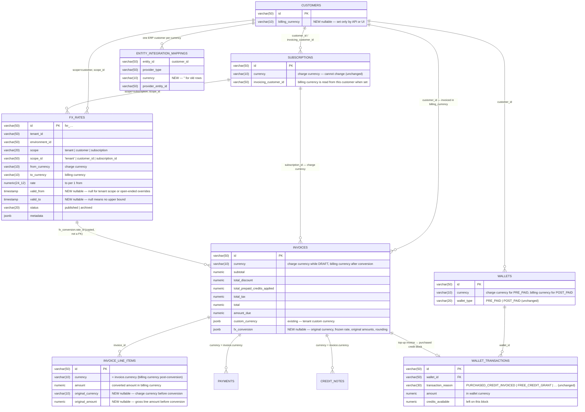
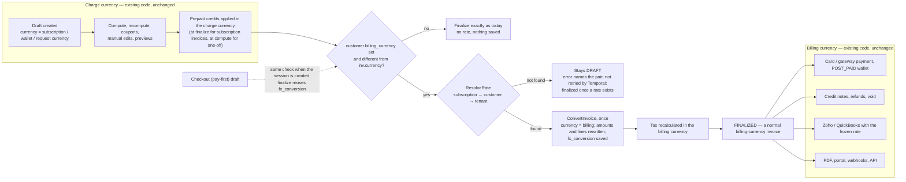
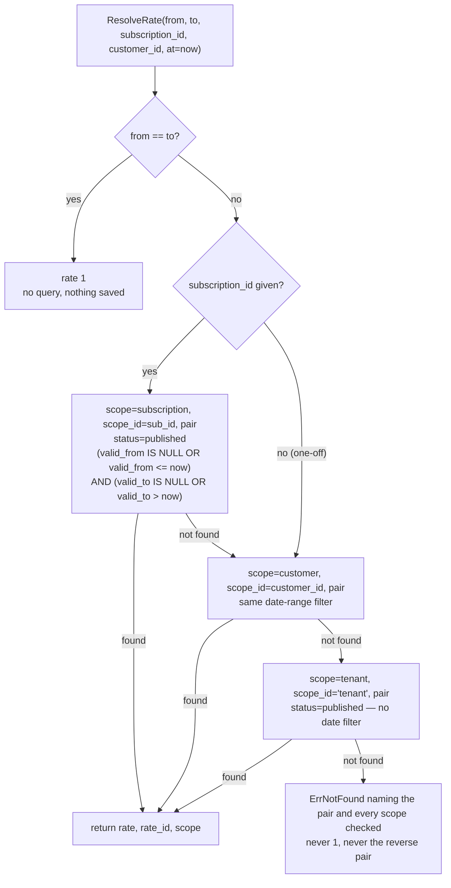
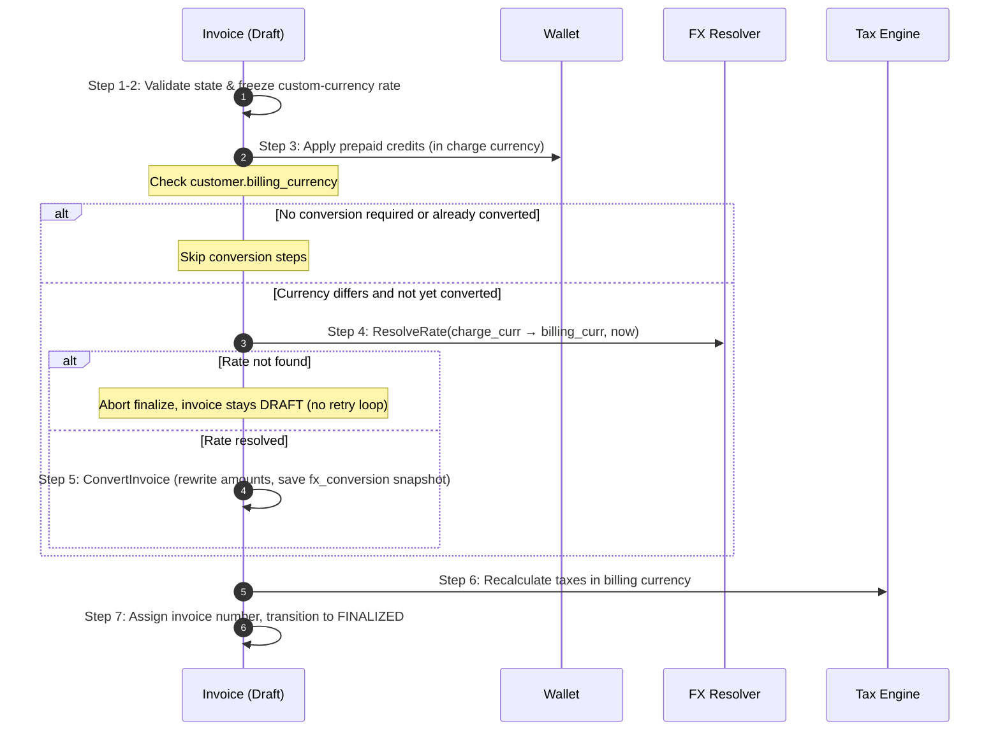
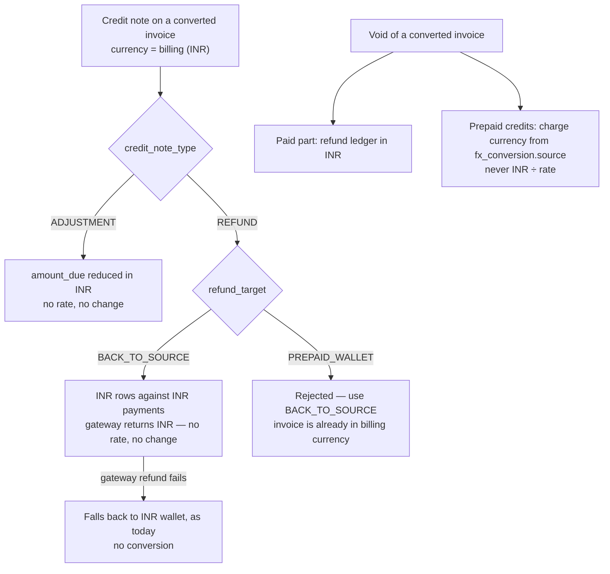
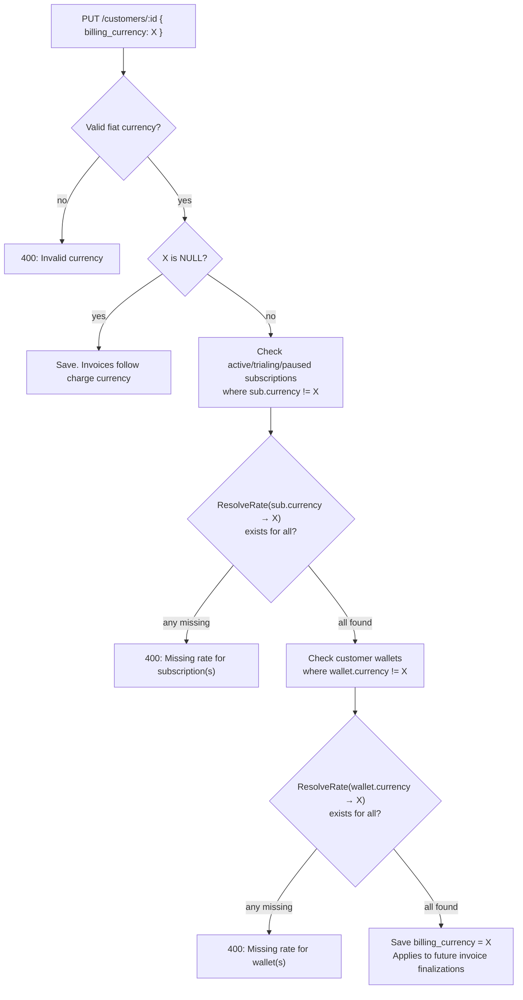
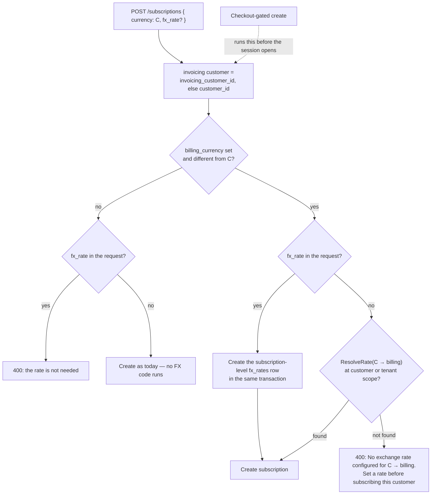
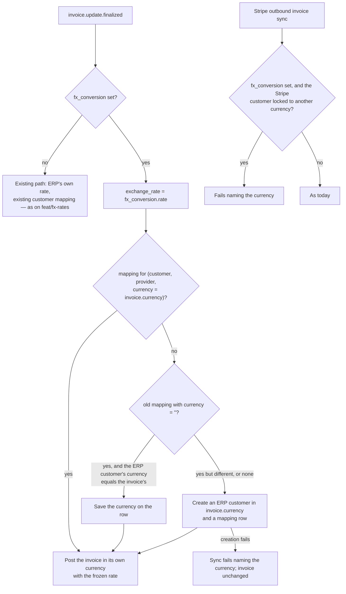

# Adaptive Multi-Currency — Billing Currency and FX Conversion — Design ERD

Status: **Proposed**
Date: 2026-09-26
Author: Paras Aghija
Ticket: FLE-1383
PRD: [`docs/prds/adaptive-multi-currency-prd.md`](../prds/adaptive-multi-currency-prd.md)
Related: [Tenant custom currency](2026-08-27-FLE-1201-tenant-custom-currency.md), [Refund architecture](2026-08-28-refund-architecture-erd.md)

---

## 1. Problem statement

Today an invoice is issued in whatever currency the subscription is priced in. A customer with a USD
subscription and an EUR subscription gets invoices in two currencies. To bill an Indian customer in
INR, a tenant has to rebuild the plan with INR prices and keep both price lists in sync by hand.

**Goal.** A customer can have a **billing currency**. Every invoice for that customer is issued in
it. A subscription keeps its own currency, the **charge currency**, and its invoice is built in the
charge currency exactly as today. At finalization, if the two differ, the invoice is converted once
at a rate the tenant configured. The rate is saved on the invoice and never changes after that.

**Non-goals.**

- Live market rates.
- Deriving `inr → usd` from a `usd → inr` rate.
- A Flexprice payment record in a currency other than its invoice's (gateway-level presentment currency is fine).
- Changing a finalized invoice.
- Changing a subscription's currency.

**Existing customers are not affected.**

| Customer | Result | FX code that runs |
| --- | --- | --- |
| No billing currency. This is every customer today | Same as today | None. Finalize reads the customer, finds no billing currency and continues on the existing path |
| Billing currency equals the subscription currency | Same as today | None. Same read, the currencies match |
| Billing currency differs from the subscription currency | Invoice converted at finalization | Rate lookup and conversion |

Conversion starts only when someone sets a billing currency on a customer and it differs from the
currency they are charged in. §3.8 lists every code path this design touches.

**Scope.** §3 covers invoice conversion. §4 details wallet interactions (prepaid deduction and invoice-backed top-ups). All conversions occur on the invoice layer.

---

## 2. ERD



### 2.1 Schema changes

| Table | Change | Why |
| --- | --- | --- |
| `customers` | Add `billing_currency`, nullable | The currency the customer is invoiced in. NULL keeps today's behaviour |
| `fx_rates` | New table | Rates the tenant configures, at tenant, customer or subscription scope. `valid_from` and `valid_to` allow time-scoped overrides at customer and subscription scope; both are null for tenant-level fixed rates |
| `invoices` | Add `fx_conversion`, nullable jsonb | The frozen rate and the original amounts. NULL means never converted |
| `invoice_line_items` | Add `original_currency` and `original_amount`, nullable | Preserves pre-conversion currency and gross amount directly on each line item for exact PDF rendering, display, and API consumers without reverse-math or rounding drift |
| `entity_integration_mappings` | Add `currency`, default `''`, and add it to the unique index | Zoho and QuickBooks need one ERP customer per currency |

`wallet_transactions` is not changed. Lines are converted at the invoice's rate and retain their original charge currency/amount in `original_currency` and `original_amount`. Wallet credits go in and out in the wallet's own currency; the FX conversion is entirely on the invoice side. No backfill anywhere.

### 2.2 `customers.billing_currency`

| Column | Type | Constraints | Default | Purpose |
| --- | --- | --- | --- | --- |
| `billing_currency` | `varchar(10)` | Optional, Nullable | `NULL` | Invoicing currency for this customer. When `NULL`, invoices follow the subscription/charge currency (existing behaviour). |

- Set explicitly via API or UI (never auto-populated by the system).
- Stored lowercased (e.g. `inr`, `usd`, `eur`).
- Evaluated from the invoicing customer (`invoice.customer_id`). For child subscriptions billed to a parent entity, the parent's billing currency applies.

### 2.3 `fx_rates`

#### Table Schema

| Column | Type | Nullable | Description |
| --- | --- | --- | --- |
| `id` | `varchar(50)` | No | Primary Key with prefix `fxr_` (immutable) |
| `tenant_id` | `varchar(50)` | No | Tenant identifier (from BaseMixin) |
| `environment_id` | `varchar(50)` | No | Environment identifier (from EnvironmentMixin) |
| `scope` | `varchar(20)` | No | Rate hierarchy scope: `tenant`, `customer`, or `subscription` |
| `scope_id` | `varchar(50)` | No | Target entity ID (`'tenant'` for tenant scope, `customer_id`, or `subscription_id`) |
| `from_currency` | `varchar(10)` | No | Charge currency code (e.g. `usd`) |
| `to_currency` | `varchar(10)` | No | Billing currency code (e.g. `inr`) |
| `rate` | `numeric(24,12)` | No | Target currency units per 1 source currency unit |
| `valid_from` | `timestamp` | Yes | Start of validity. `NULL` = unbounded lower bound (always `NULL` for tenant scope) |
| `valid_to` | `timestamp` | Yes | Exclusive end of validity. `NULL` = open-ended |
| `status` | `varchar(20)` | No | Lifecycle status: `published` or `archived` |
| `metadata` | `jsonb` | Yes | Arbitrary key-value metadata |

#### Database Indexes

| Index Name | Columns | Type | Condition / Purpose |
| --- | --- | --- | --- |
| `idx_fx_rate_tenant_live` | `(tenant_id, environment_id, scope, scope_id, from_currency, to_currency)` | **UNIQUE** Partial | `status = 'published' AND scope = 'tenant'`<br/>Guarantees exactly one active base rate per currency pair at tenant level. |
| `idx_fx_rate_override` | `(tenant_id, environment_id, scope, scope_id, from_currency, to_currency, valid_from)` | Non-unique B-tree | Overlap is verified in the service layer. Speeds up date-ranged resolution for customer and subscription overrides. |

#### Scope & Override Rules

- **Tenant Baseline (`scope = 'tenant'`):**
  - Serves as the fallback rate across the entire tenant. `scope_id` is set to `'tenant'`.
  - Always active without date bounding (`valid_from` and `valid_to` are both `NULL`).
  - Exactly one published rate is permitted per currency pair (`idx_fx_rate_tenant_live`).

- **Customer & Subscription Overrides (`scope = 'customer' | 'subscription'`):**
  - **Prerequisite Base Rate:** An active tenant-level rate for the same `from → to` pair must exist before an override can be created.
  - **Optional Time-Scoping:** Overrides can be open-ended (permanent) or constrained to an active validity window `[valid_from, valid_to)`.
  - **Non-Overlap Condition:** Multiple overrides may exist for the same entity and currency pair, provided their validity periods do not overlap.

- **Historical Invoice Protection:**
  - Finalized invoices permanently snapshot their conversion rate and amounts in `invoice.fx_conversion`. Modifying rates in `fx_rates` only affects future draft invoice finalizations.

### 2.4 `fx_rates` — sample rows

The table below illustrates the three scope levels and the two override modes (permanent and
time-scoped). All rows belong to the same tenant and environment.

| id | scope | scope_id | from | to | rate | valid_from | valid_to | status | notes |
| --- | --- | --- | --- | --- | --- | --- | --- | --- | --- |
| `fxr_tnt_001` | `tenant` | `tenant` | `usd` | `inr` | `83.00` | `null` | `null` | `published` | Base rate for all customers. No date bounds — always active while published |
| `fxr_tnt_002` | `tenant` | `tenant` | `eur` | `inr` | `89.50` | `null` | `null` | `published` | Separate base rate for EUR → INR |
| `fxr_cust_001` | `customer` | `cust_acme` | `usd` | `inr` | `84.50` | `null` | `null` | `published` | Permanent customer override — no date bounds. Acme always gets 84.50 instead of 83 |
| `fxr_cust_002` | `customer` | `cust_globex` | `usd` | `inr` | `85.00` | `2026-11-01` | `2026-11-30` | `published` | Time-scoped override for November only. Outside this window, Globex falls back to the tenant rate (83) |
| `fxr_cust_003` | `customer` | `cust_globex` | `usd` | `inr` | `86.00` | `2026-12-01` | `null` | `published` | Future open-ended override for Globex starting December. Active alongside `fxr_cust_002` with no overlap |
| `fxr_sub_001` | `subscription` | `subs_pro` | `usd` | `inr` | `82.00` | `null` | `2026-10-31` | `published` | Subscription-level override active until end of October, then falls back to customer or tenant rate |

### 2.5 `invoices.fx_conversion`

`invoices.fx_conversion` is an immutable `jsonb` snapshot populated during finalization when a charge-currency draft converts into a billing-currency invoice.

#### Snapshot Data Structure

| Property | Type | Description |
| --- | --- | --- |
| `charge_currency` | `string` | Original currency of the charge / subscription (e.g. `usd`) |
| `billing_currency` | `string` | Final invoice currency (e.g. `inr`) |
| `rate` | `numeric string` | Frozen exchange rate used for conversion (`to_currency` per 1 `from_currency`) |
| `rate_id` | `string` | ID of the `fx_rates` record applied (audit reference; never re-queried) |
| `scope` | `string` | Scope level that resolved: `subscription`, `customer`, or `tenant` |
| `converted_at` | `ISO 8601 string` | Timestamp when the conversion took place |
| `source` | `object` | Snapshot of original amounts in `charge_currency` before tax |
| `source.subtotal` | `numeric string` | Original pre-discount subtotal in charge currency |
| `source.total_discount` | `numeric string` | Original discounts in charge currency |
| `source.total_prepaid_credits_applied` | `numeric string` | Original prepaid credits applied in charge currency |
| `source.net` | `numeric string` | Original pre-tax net (`subtotal − discount − credits`) |
| `rounding_adjustment` | `numeric string` | Fractional residual adjustment absorbed by a line item |
| `rounding_line_item_id` | `string` | ID of line item adjusted to guarantee line sums equal invoice net |

- NULL means the invoice was never converted. Every reader checks this first.
- Written once, at conversion, in the same transaction as the converted amounts.
- `invoice.currency` is the charge currency while the invoice is a draft and the billing currency
  after conversion. `fx_conversion.charge_currency` keeps the original.


Screens, APIs, and PDF templates read `line.original_amount` and `line.original_currency` directly (§2.6) rather than reverse-calculating `amount ÷ rate`, ensuring exact values without floating-point drift or residual distortion.

**Persistence.** The invoice repository lists columns by hand in `Create`, `CreateWithLineItems`
and `Update`, and the in-memory test store copies fields one by one. `custom_currency` was lost on
write twice because of this
([tenant-custom-currency §4 step 3](2026-08-27-FLE-1201-tenant-custom-currency.md)). Add
`fx_conversion` in all of them, add a round-trip test, and make `Update` keep the value, never
clear it.

### 2.6 `invoice_line_items` — original amounts

To ensure PDFs, customer portals, and external APIs can display the original pre-conversion charges without division rounding errors or residual distortion, two optional fields are added to `invoice_line_items`:

| Column | Type | Constraints | Default | Purpose |
| --- | --- | --- | --- | --- |
| `original_currency` | `varchar(10)` | Optional, Nullable | `NULL` | Pre-conversion currency of the line item (e.g. `usd`). Populated only on converted invoices; `NULL` for normal unconverted invoices. |
| `original_amount` | `numeric(20,8)` | Optional, Nullable | `NULL` | Pre-conversion gross amount of the line item in `original_currency` (e.g. `5.00`). Populated only on converted invoices. |

During `ConvertInvoice`:
1. `line.original_currency` is stamped with the draft's charge currency (e.g. `usd`).
2. `line.original_amount` is stamped with the draft's pre-conversion `line.amount` (e.g. `5.00`).
3. `line.currency` is updated to the customer's `billing_currency` (e.g. `inr`).
4. `line.amount` is updated to the converted billing amount (e.g. `415.00`).

### 2.7 `entity_integration_mappings.currency`

Zoho and QuickBooks lock a customer to one currency once transactions exist. To support multi-currency sync without collisions, the mapping table is extended:

| Column | Type | Default | Constraints | Description |
| --- | --- | --- | --- | --- |
| `currency` | `varchar(10)` | `''` | Immutable | The currency bound to this provider entity. Empty for generic entities and legacy rows. |

The unique constraint is updated to include `currency`:
`(tenant_id, environment_id, entity_type, entity_id, provider_type, currency)` WHERE `status = 'published'`. This allows one ERP customer per currency.

Invoice, plan and price mappings store `''`. New customer mappings store the currency they were
created for. Old customer mappings keep `''` and are handled in §7.2.

---

## 3. Invoice conversion

The draft stays in the charge currency. Finalization converts it once. Everything before the
conversion and everything after it is existing code.



### 3.1 Rate lookup

Resolution follows a strict bottom-up precedence: **Subscription Override → Customer Override → Tenant Default**.

| Precedence | Scope | Filter Criteria | Date Bounding |
| --- | --- | --- | --- |
| 1 (Highest) | `subscription` | `scope = 'subscription' AND scope_id = subscription_id AND pair = (from, to)` | Active at `now`: `(valid_from IS NULL OR valid_from <= now) AND (valid_to IS NULL OR valid_to > now)` |
| 2 (Medium) | `customer` | `scope = 'customer' AND scope_id = customer_id AND pair = (from, to)` | Active at `now`: `(valid_from IS NULL OR valid_from <= now) AND (valid_to IS NULL OR valid_to > now)` |
| 3 (Baseline) | `tenant` | `scope = 'tenant' AND scope_id = 'tenant' AND pair = (from, to)` | Fixed: No date bounds; single active row enforced by unique index |



- At most three indexed lookups. No cache.
- `at_time` is always `now` — callers never pass a date. The invoice's `fx_conversion.converted_at`
  already records when resolution happened; that is the audit anchor.
- A `usd → inr` rate is never used for `inr → usd`. The error names the missing direction.
- Tenant-scope rate: no date filter — a single live row is enforced by the unique index (`scope_id = 'tenant'`).
- Override (customer/subscription): one active row at any point in time, enforced by the service-layer
  overlap check at create time, not by a database constraint.
- `GET /v1/fx-rates/resolve` calls the same function, so a preview always matches the invoice.

### 3.2 Draft: no change

Every draft is created in the currency its caller passes, as today:

| Entry point | Currency passed | Where |
| --- | --- | --- |
| Subscription billing cycle | `sub.Currency` | [`CreateDraftInvoiceForSubscription`, invoice.go:411-438](../../internal/ee/service/invoice.go#L411) |
| Subscription create or renew, opening invoice | `subscription.Currency` | [invoice.go:2248-2276](../../internal/ee/service/invoice.go#L2248) |
| One-off / API | `req.Currency` | [`CreateInvoice`, invoice.go:346-389](../../internal/ee/service/invoice.go#L346) |
| Wallet top-up | `w.Currency` | [wallet.go:1158-1202](../../internal/ee/service/wallet.go#L1158) |
| Plan change settlement, net charge | `sub.Currency` | [`buildNettedProrationInvoiceRequest`, line_item_proration.go:378-409](../../internal/ee/service/line_item_proration.go#L378) |
| Old plan's usage on plan change | `currentSub.Currency` | [subscription_change_v2.go:1141-1178](../../internal/ee/service/subscription_change_v2.go#L1141) |
| Quantity change proration | `sub.Currency` | [subscription_modification_quantity.go:1018-1052](../../internal/ee/service/subscription_modification_quantity.go#L1018) |

Compute, recompute, coupons, line reconciliation, previews and wallet balance reads all work on
charge-currency amounts and are not changed. The API can show a billing-currency estimate on a draft
(§6.3). It is calculated on read and never saved.

### 3.3 Finalization pipeline

Conversion occurs inside the finalized invoice transaction under row lock:



| Step | Action | Currency State | Notes |
| --- | --- | --- | --- |
| 1–2 | Gate checks & custom-currency freeze | Charge Currency | Unchanged |
| 3 | Apply prepaid credits & discounts | Charge Currency | Prepaid wallet debited in charge currency |
| 4 | Check `billing_currency` & `ResolveRate` | Evaluation | Missing rate leaves invoice in `DRAFT` |
| 5 | **ConvertInvoice** | **Charge → Billing** | Rewrites line items and invoice totals; writes `fx_conversion` |
| 6 | Recalculate Taxes | Billing Currency | Recomputes tax rates directly in billing currency |
| 7 | Numbering & Finalization | Billing Currency | Publishes `invoice.update.finalized` |


### 3.4 Conversion and rounding mathematics

To ensure external accounting systems (QuickBooks, Zoho) and customer-facing PDFs balance perfectly without cent drift:

1. **Pre-tax Net Conversion (Source of Truth):**
   $$\text{net}_{\text{billing}} = \text{Round}(\text{net}_{\text{charge}} \times \text{Rate}, \text{precision}_{\text{billing}})$$
2. **Line Item Conversion:**
   Each line amount, discount, and credit is converted and rounded to billing precision.
3. **Residual Absorption:**
   $$\text{residual} = \text{net}_{\text{billing}} - \sum \text{line\_net}_{\text{billing}}$$
   Any non-zero residual is allocated to the line item with the largest net absolute value. The adjustment is recorded in `rounding_adjustment` and `rounding_line_item_id`.
4. **Original Line Stamping:**
   Before updating `line.amount` and `line.currency` to the converted values, each line item stamps `line.original_currency = charge_currency` and `line.original_amount = pre_conversion_amount`.

The net is converted once, and the lines are forced to add up to it. So the PDF, the portal and the
ERPs, which all add up lines, always match the saved total.

**Example.** Three lines, `usd → jpy` at 149.37. JPY has no decimals.

| | Source | × 149.37 | Rounded |
| --- | --- | --- | --- |
| Line A | 33.33 | 4978.50 | 4979 |
| Line B | 33.33 | 4978.50 | 4979 |
| Line C | 33.34 | 4979.99 | 4980 |
| Sum of lines | 100.00 | | 14938 |
| **Net** | 100.00 | 14937.00 | **14937** |

The difference is −1, so line C becomes 4979 and the lines add up to 14937. The invoice records
`rounding_adjustment: -1` and `rounding_line_item_id` = line C. For currencies with two decimals the
difference is usually zero, and at most ±0.01.

| Field | Converted |
| --- | --- |
| `subtotal`, `total_discount`, `total_prepaid_credits_applied`, `total`, `amount_due` | Yes |
| Line `amount`, `line_item_discount`, `invoice_level_discount`, `prepaid_credits_applied` | Yes |
| `total_tax` | Recalculated in step 8 |
| `amount_paid`, `amount_remaining` | No. `amount_paid` must be 0 when converting, so `amount_remaining` = `amount_due` after step 7 |
| `adjustment_amount`, `refunded_amount` | No. Zero on a draft, in the billing currency afterwards |
| Line `quantity` | No |
| Line `price_unit_amount` (price-unit feature) | No. It is in the price unit, not a currency |

### 3.5 After finalization

A converted invoice is a normal INR invoice. Code after finalization needs no FX logic:

| Flow | Behaviour | Why it already works |
| --- | --- | --- |
| Card or gateway payment | Charges INR | Payment currency must equal invoice currency, checked in three places ([payment.go:249](../../internal/ee/service/payment.go#L249), [payment_processor.go:641](../../internal/ee/service/payment_processor.go#L641), [:739](../../internal/ee/service/payment_processor.go#L739)) |
| `POST_PAID` wallet payment | Only a postpaid wallet matching `inv.Currency` (INR) can pay | `GetWalletsForPayment` matches `inv.Currency` |
| `PRE_PAID` wallet | Never pays invoices. Already applied before conversion | `GetWalletsForPayment` only picks postpaid wallets |
| Balance of a USD prepaid wallet | Counts the draft while it is USD. Stops once it is INR, by which time the wallet was already debited | `GetUnpaidInvoicesToBePaid` matches `inv.Currency` |
| Credit notes and refunds | INR, with today's limits | §3.6 |
| Void | Prepaid credits go back in the charge currency from `fx_conversion.source`; paid part via refund ledger in billing currency | `voidInvoice` reads `fx_conversion.source.total_prepaid_credits_applied` |
| Zoho, QuickBooks | INR invoice with the frozen rate | §7 |
| Recalculating a finalized invoice | Voids it and creates a new charge-currency draft, which converts at its own finalize | [`RecalculateInvoice`, invoice.go:3883](../../internal/ee/service/invoice.go#L3883). `RecalculateInvoiceV2` works on drafts only |

A customer with USD and EUR subscriptions gets two INR invoices, each converted on its own. Never a
mixed-currency invoice.

### 3.6 Credit notes and refunds

A credit note is always in its invoice's currency. A converted invoice is INR, so its credit notes
are INR and today's refund limits apply in INR. No new columns on `credit_notes`,
`credit_note_line_items` or `refunds`. No conversion happens here — the invoice is already in the
billing currency.

| Path | Currency and limit | Rate used |
| --- | --- | --- |
| Adjustment credit note (unpaid invoice) | INR. Reduces `amount_due`. Limit: `total − adjustment_amount − amount_paid` | None |
| Refund credit note, `BACK_TO_SOURCE` | INR rows against INR payments. Limit: `amount_paid − refunded_amount`. Gateway returns INR | None |
| Refund credit note, `PREPAID_WALLET` | Rejected on a converted invoice. Use `BACK_TO_SOURCE` | None |
| Gateway refund fails, falls back to a wallet | Falls back to a billing-currency (INR) wallet, as today | None |
| Void | Paid part in INR via refund ledger. Prepaid credits in the charge currency from `fx_conversion.source.total_prepaid_credits_applied` | None. Uses saved amounts |



**Creating a credit note from a USD amount.** Support may think "refund one month, $100". The
credit note line request accepts an optional `source_amount`. The service converts it at the
invoice's frozen rate, never a new rate, into the INR `amount`, which is saved and checked against
the existing per-line limit. The credit note response includes the invoice's `fx_conversion`, read
from the invoice.

### 3.7 Relation to tenant custom currency

`invoices.custom_currency` (FLE-1201) converts a tenant-defined unit, for example `mac`, into fiat.
It is set when the draft is created, so that invoice is fiat for its whole life
([invoice.go:299-313](../../internal/ee/service/invoice.go#L299),
[:1086-1100](../../internal/ee/service/invoice.go#L1086)). `fx_conversion` converts fiat to fiat at
finalization. The two use separate columns and separate code.

| Subscription currency | Customer billing currency | Draft currency | At finalize |
| --- | --- | --- | --- |
| `usd` | none or `usd` | `usd` | As today |
| `usd` | `inr` | `usd` | FX `usd → inr` |
| `mac` (custom) | none | `default_fiat_currency` (`usd`), `custom_currency` set | Custom rate frozen. No FX |
| `mac` (custom) | `inr` | `usd`, `custom_currency` set | Custom rate `mac → usd` frozen, **then** FX `usd → inr` |

The last row is two steps, each saved on its own object. No tenant uses this combination today.

---

## 4. Wallets and invoice conversion

Wallets are not changed by this design. The rule is simple:

> **A wallet balance is never converted. Credits go in and come out in the wallet's own currency.**

FX conversion is entirely on the invoice side. The wallet only interacts with conversion at two points:

### 4.1 Prepaid credits applied before conversion

Prepaid credits reduce the charge-currency draft before `ConvertInvoice` runs (finalize step 3).
The wallet is debited in its own currency (the subscription's charge currency). Only the remaining
net is converted. This is existing behaviour — no change.

```
Invoice draft: $100 (usd)
Prepaid wallet: $20 debited
Net after credits: $80 (usd)
ConvertInvoice at rate 83 → ₹6,640 (inr)
customer pays ₹6,640
```

### 4.2 Cross-currency top-ups (PURCHASED_CREDIT_INVOICED)

A purchased top-up creates a one-off invoice in the wallet currency. That invoice goes through the
normal `ConvertInvoice` flow at finalization. The wallet receives credits in the wallet currency
after the invoice is paid. No new code in the wallet service.

```
Customer (billed INR) tops up 300 USD credits:
  1. Top-up invoice: currency=usd, total=$300        ← existing
  2. ConvertInvoice → currency=inr, total=₹30,000    ← existing conversion flow
  3. Customer pays ₹30,000                            ← existing
  4. Wallet += $300 credits                           ← existing (tx.Amount, never the invoice total)
```

The wallet transaction has no FX fields. The invoice carries `fx_conversion` as usual.

### 4.3 Void of a converted invoice

Void returns prepaid credits in the charge currency using `fx_conversion.source.total_prepaid_credits_applied`
from the invoice — never by dividing the billing amount by the rate. The paid portion (in billing
currency) is returned via the refund ledger as today. This is the only code change in the void path.


## 5. Guardrails

All checks run in the service layer. They return `ierr.ErrValidation`, or `ErrNotFound` for a
missing rate, with a hint naming the currency pair and the IDs involved.

### 5.1 Configuring rates

| Rule | Enforced in |
| --- | --- |
| **Valid input.** `from ≠ to`, `rate > 0`, both codes valid. With custom currencies configured, a custom code may be `from` but never `to`. For `scope = tenant`, `scope_id` is set to `'tenant'`; for `scope = customer`, `scope_id` is `customer_id`; for `scope = subscription`, `scope_id` is `subscription_id` and the subscription's currency must equal `from_currency`. If `valid_from` and `valid_to` are both set, `valid_from` must be before `valid_to` | `FXRateService.Create` |
| **Tenant scope: one live rate per pair.** `scope_id` is set to `'tenant'`. A second `POST` for the same pair returns `409`. Use `PUT` to update the existing rate | `idx_fx_rate_tenant_live`, plus a pre-check for a clear error |
| **Override scope: no overlapping periods.** Before inserting or updating a customer- or subscription-scope rate, the service checks that no other published row for the same scope/pair has an overlapping `[valid_from, valid_to)` window. Overlap uses null-safe logic: `null valid_from` = −∞, `null valid_to` = +∞. A `409` is returned if an overlap is found | `FXRateService.Create / Update` |
| **Override requires a tenant base rate.** A customer- or subscription-scope rate can only be created if a published tenant-scope rate exists for the same `from → to` pair. Rejected with a clear error if the base is missing | `FXRateService.Create` |
| **Standard transactional updates.** `PUT / PATCH` updates the rate row directly (`rate`, `valid_from`, `valid_to`, `metadata`, `status`). Finalized invoices are completely unaffected because they freeze rates in `fx_conversion`. Overrides re-verify non-overlap when dates change | `FXRateService.Update` |
| **No delete that strands a subscription.** `DELETE` is refused if a live subscription or open draft would be left with no active rate for its pair at the current time. The error lists up to 20 of them | `FXRateService.Delete`, using the same lookup with that row excluded |
| **Tenant and environment isolation.** A staging rate never applies in production | Mixins and query filters |

### 5.2 Setting or changing a billing currency

When a customer's `billing_currency` is set or updated to a non-null currency `X`:

| Rule | Enforced in | Description |
| --- | --- | --- |
| **Valid fiat currency** | `CustomerService.Create / Update` | If custom currencies are configured, `billing_currency` must be a valid fiat currency code. |
| **All active subscriptions must have resolvable rates** | `CustomerService.Update` | If the customer has active, trialing, or paused subscriptions where `sub.currency != X`, `ResolveRate(sub.currency, X)` must be resolvable for each one. Rejects listing all missing pairs. |
| **All customer wallets must have resolvable rates** | `CustomerService.Update` | For every wallet owned by the customer where `wallet.currency != X`, `ResolveRate(wallet.currency, X)` must be resolvable. Rejects listing all missing pairs. |
| **Clearing is allowed** | `CustomerService.Update` | Setting `billing_currency = NULL` is always permitted and returns future invoices to the charge currency. |
| **Applies going forward** | Invoice Finalization | Finalized invoices are frozen and never change. Open drafts convert at their own finalization. |

> [!TIP] The recommended practice is to set `billing_currency` at customer creation time, so that ERP
> syncs always start with the correct currency. When updating an existing customer with active subscriptions
> or wallets, all necessary FX conversion rates must already be configured.



### 5.3 Subscriptions

| Rule | Enforced in | Description |
| --- | --- | --- |
| **Rate must exist at subscription creation** | `createSubscription` / `CheckoutSessionService` | If the invoicing customer has `billing_currency` set and `billing_currency != sub.currency`, an active rate must be resolvable (`ResolveRate(sub.currency, billing_currency)`), or passed inline via `fx_rate` in the request payload. Otherwise rejected (400): *"No exchange rate configured for USD → INR. Set a rate before subscribing this customer."* Placed alongside the existing `EnforceCurrency` check. |
| **Subscription currency is strictly immutable** | Existing | `subscription.currency` is strictly immutable once created. Plan change v2 requires the target plan in the same currency. Changing a subscription's currency requires canceling and creating a new subscription. |
| **Plan change, addons, and proration** | Existing | Invoices are generated as charge-currency drafts and converted at finalize. |



### 5.4 Invoices

| Rule | Enforced in |
| --- | --- |
| **No rate at finalize means no finalize.** The invoice stays `DRAFT`, nothing is written, and the error names the pair and the scopes checked. Never use a rate of 1 and never guess. Logged at `Error` with `invoice_id`, `from`, `to`. The error is marked `ErrInvalidOperation`, so `FinalizeInvoiceActivity` does not retry it ([invoice_activities.go:163-169](../../internal/temporal/activities/invoice/invoice_activities.go#L163)). The scheduled finalizer (`IsFinalizationDue`) picks the draft up once a rate exists | Finalize, step 5 |
| **Convert once.** If `fx_conversion` is set, skip. It is saved under the row lock, in the same transaction as the amounts | Finalize, step 4 |
| **No payment before conversion.** A one-off invoice created with `amount_paid > 0` or a paid status, for a customer whose billing currency differs, is rejected. A payment recorded against a draft is rejected when the draft is not yet converted and the customer's billing currency differs: *"Finalize the invoice first; it will be issued in INR."* Today payments on drafts are allowed, because the checks only look at paid, voided and currency ([payment.go:228-260](../../internal/ee/service/payment.go#L228)). Checkout drafts are already converted and take payment normally | `CreateInvoice`; `validateInvoicePaymentEligibility` |
| **A converted checkout draft is frozen.** `RecalculateInvoiceV2`, manual line edits and `ComputeInvoice` reject it. It can be voided | Those entry points |
| **Conversion checks itself.** `amount_paid` is 0; lines add up to the net; `subtotal − discount − credits = net`; a non-zero net never becomes zero; an all-zero invoice, such as a trial start, converts to zeros | `ConvertInvoice` |
| **One charge currency per invoice.** The grouped-invoicing merge ([billing.go:1870-1900](../../internal/ee/service/billing.go#L1870)) adds every child's lines to the parent with no currency check. When the invoicing customer has a billing currency, a child in a different currency is left out of the parent invoice, logged, and billed on its own invoice | Grouped-invoice merge |
| **Tax in the billing currency.** Tax is recalculated after conversion and replaces the charge-currency `tax_applied` rows. Tax associations are found by entity, not currency ([`PrepareTaxRatesForInvoice`, tax.go:972](../../internal/ee/service/tax.go#L972)), and are percentages, so nothing needs converting. The currency passed in only sets the default inclusive or exclusive behaviour for associations without one ([invoice.go:4033-4041](../../internal/ee/service/invoice.go#L4033)); after conversion that is the billing currency, which is intended | Finalize, step 8 |
| **One-off invoices follow the billing currency.** The request currency is the charge currency. For a customer billed in INR, a USD request produces an INR invoice. One-off invoices finalize immediately, so a missing rate fails the create call | `CreateInvoice` |

### 5.5 Wallets

| Rule | Enforced in | Description |
| --- | --- | --- |
| **Unrestricted wallet creation** | `CreateWallet` | Wallets can be created in any currency without restriction. |
| **Prepaid credit application** | Finalize step 3 | Debited strictly in the subscription's charge currency before invoice conversion (§4.1). |
| **Postpaid settlement matching** | `GetWalletsForPayment` | Settles automatically only if the postpaid wallet currency exactly matches `invoice.currency` (billing currency post-conversion). |
| **Void restitution** | `voidInvoice` | Prepaid credits return to the charge-currency wallet via `fx_conversion.source.total_prepaid_credits_applied` (§4.3). |

### 5.6 Payments, credit notes and refunds

| Rule | Enforced in | Description |
| --- | --- | --- |
| **Payment currency matches invoice** | Payment Service | Payments are accepted strictly in the invoice's final currency (`invoice.currency`). |
| **Credit note currency matches invoice** | `CreditNoteService` | Credit notes are issued in the invoice's currency with standard limits. |
| **Prepaid wallet refund target rejected** | `FinalizeCreditNote` | On converted invoices, `PREPAID_WALLET` target is rejected. Must use `BACK_TO_SOURCE` (§3.6). |

### 5.7 Integrations

| Rule | Enforced in | Description |
| --- | --- | --- |
| **Sync with frozen invoice rate** | ERP Invoice Sync | Outbound ERP sync sends `invoice.currency` and uses `fx_conversion.rate` (§7.1). |

---

## 6. API surface

Same pattern as `/taxes/rates` ([router.go:527-545](../../internal/api/router.go#L527)): a
`v1Private` group, writes gated on a new `types.EntityFXRate`, and `@x-scope` on every handler.

### 6.1 FX rates

```
POST   /v1/fx-rates              create                                   write
GET    /v1/fx-rates              list — from, to, scope, scope_id, status read
POST   /v1/fx-rates/search       filter body, paginated                   read   (@x-scope "read")
GET    /v1/fx-rates/:id          get                                      read
PUT    /v1/fx-rates/:id          update rate, validity dates, metadata, or status  write
DELETE /v1/fx-rates/:id          archive, see §5.1                        delete
GET    /v1/fx-rates/resolve      from, to, customer_id?, subscription_id? read
```

```jsonc
// POST /v1/fx-rates
{
  "scope": "customer",                 // tenant | customer | subscription
  "scope_id": "cust_01J…",             // "tenant" for tenant scope
  "from_currency": "usd",
  "to_currency": "inr",
  "rate": "83.000000",
  "metadata": { "source": "Q4 contract" }
}
// 201
{
  "id": "fxr_01J…", "scope": "customer", "scope_id": "cust_01J…",
  "from_currency": "usd", "to_currency": "inr", "rate": "83",
  "status": "published", "valid_from": null, "valid_to": null,
  "created_at": "…", "updated_at": "…", "metadata": { … }
}

// PUT /v1/fx-rates/fxr_01J…   { "rate": "85.000000" }
// 200 → returns updated fx_rates record.

// GET /v1/fx-rates/resolve?from=usd&to=inr&customer_id=cust_01J…&subscription_id=subs_01J…
// 200
{ "rate": "83", "rate_id": "fxr_01J…", "scope": "customer", "from_currency": "usd", "to_currency": "inr" }
// 404
{ "error": "no FX rate configured for usd → inr",
  "hint": "Set a rate for usd → inr at the subscription, customer or tenant level",
  "details": { "scopes_tried": ["subscription:subs_01J…", "customer:cust_01J…", "tenant:tenant"] } }

// DELETE that would strand a subscription → 409
{ "error": "fx rate fxr_01J… is still required",
  "details": { "dependants": [ { "subscription_id": "subs_01J…", "customer_id": "cust_01J…", "pair": "usd→inr" } ] } }
```

`resolve` shows which rate a customer will actually get, using the same function as finalize.
Webhooks: `fx_rate.created`, `fx_rate.updated`, `fx_rate.deleted`,
registered in `internal/types/webhook.go` with payload builders in
`internal/webhook/payload/factory.go`.

### 6.2 Customers and subscriptions

```jsonc
// POST /v1/customers, PUT /v1/customers/:id — new optional field
{ "billing_currency": "inr" }            // null clears it
// Customer response
{ "id": "cust_…", "billing_currency": "inr", … }
// 400 when a subscription or wallet has no rate
{ "error": "billing currency cannot be set to inr",
  "hint": "No FX rate configured for usd → inr. Set required rates first.",
  "details": {
    "missing": [
      { "from": "usd", "to": "inr", "subscription_id": "subs_01J…" },
      { "from": "eur", "to": "inr", "wallet_id": "wal_01J…" }
    ]
  }
}
```

```jsonc
// POST /v1/subscriptions — new optional field. Creates a subscription-level rate in the same transaction.
{ "customer_id": "cust_…", "plan_id": "plan_…", "currency": "usd",
  "fx_rate": { "rate": "84.5" } }   // from = subscription currency, to = customer's billing currency

// Subscription response: new block, calculated on read, not saved. Null when no conversion applies.
{ "id": "subs_…", "currency": "usd",
  "billing": { "billing_currency": "inr", "fx_rate": "84.5", "fx_rate_id": "fxr_…", "scope": "subscription" } }
```

- `fx_rate` on create exists because a subscription-level rate cannot be created before the
  subscription exists. It is rejected when there is nothing to convert.
- The `billing` block needs a customer read and a rate lookup, so it is returned on
  `GET /v1/subscriptions/:id` only, not on list or search.
- Deleting a customer or subscription archives its scoped `fx_rates` rows in the same operation.

### 6.3 Invoices

```jsonc
// GET /v1/invoices/:id — converted invoice
{
  "id": "inv_…", "currency": "inr", "subtotal": "8300.00", "total": "9794.00", "amount_due": "9794.00",
  "fx_conversion": {
    "charge_currency": "usd", "billing_currency": "inr", "rate": "83", "rate_id": "fxr_…",
    "scope": "customer", "converted_at": "2026-10-01T00:05:12Z",
    "source": { "subtotal": "100.00", "total_discount": "0", "total_prepaid_credits_applied": "0", "net": "100.00" },
    "rounding_adjustment": "0"
  },
  "line_items": [
    {
      "id": "ili_…",
      "display_name": "Token Usage - $0.05/token",
      "quantity": "100.00",
      "amount": "8300.00",
      "currency": "inr",
      "original_amount": "100.00",     // populated on converted invoices; null otherwise
      "original_currency": "usd"
    }
  ]
}

// GET /v1/invoices/:id — draft of a customer billed in another currency (nothing saved)
{ "id": "inv_…", "invoice_status": "DRAFT", "currency": "usd", "total": "100.00",
  "billing_currency_estimate": { "currency": "inr", "rate": "83", "total": "8300.00", "resolvable": true } }
// … or, when no rate exists:
{ "billing_currency_estimate": { "currency": "inr", "resolvable": false, "missing": { "from": "usd", "to": "inr" } } }
```

`billing_currency_estimate` lets the dashboard warn that a draft will fail to finalize. It is
returned only when the customer's billing currency differs from the draft's, and the same applies to
`GetPreviewInvoice` ([invoice.go:2363](../../internal/ee/service/invoice.go#L2363)) and subscription
previews.

**Where the frozen rate is shown.**

| Surface | Shows | How |
| --- | --- | --- |
| `GET /v1/invoices/:id`, list, search | `fx_conversion` on invoice, and `original_amount` / `original_currency` on line items | `InvoiceResponse` and `InvoiceLineItemResponse` gain the fields |
| Invoice webhooks: `invoice.update.finalized`, `invoice.update.payment`, `invoice.update.voided`, `invoice.update` | Same block | The payload builder wraps the `GetInvoice` response ([payload/invoice.go:27-72](../../internal/webhook/payload/invoice.go#L27)), so no builder change |
| Invoice PDF | Converted amounts with original charge details (e.g. ₹8,300.00 converted from $100.00 @ 83.00) at summary and line level | Reads `line.original_amount` and `line.original_currency` directly for lines; reads `fx_conversion` for totals — zero reverse-math |
| Customer portal | Same as the PDF | Reads the API |
| Zoho, QuickBooks | Invoice in its own currency with `exchange_rate` = the frozen rate | §7.1 |

The invoice list filter `currency` filters on the saved (billing) currency. A new filter
`charge_currency` reads `fx_conversion->>'charge_currency'`.

### 6.4 Permissions and MCP

Add `types.EntityFXRate` in [rbac.go:72-106](../../internal/types/rbac.go#L72). Roles use wildcards,
so `roles.json` does not change. `@x-scope "read"` on `search` and `resolve`, `"write"` on create
and update, `"delete"` on delete.

### 6.5 Wallets

No new wallet API endpoints are introduced. Wallet operations (`TopUpWallet`, `GetBalance`, etc.) retain their existing request/response contracts (§4).

---

## 7. Integration sync



### 7.1 Send the frozen rate

On `feat/fx-rates`, Zoho and QuickBooks already receive the invoice currency and a rate taken from
the ERP itself (Zoho `settings/currencies`, QuickBooks `exchangerate`). After this change a converted
invoice sends its own frozen rate:

| Invoice State | Outbound Rate Sent to ERP | ERP Field Target |
| --- | --- | --- |
| Converted (`fx_conversion` is set) | `fx_conversion.rate` (frozen rate) | Zoho: `exchange_rate`<br/>QuickBooks: `ExchangeRate` |
| Unconverted (`fx_conversion` is `NULL`) | ERP's own currency rate (existing behaviour) | Native ERP rate lookup |

One branch in `ResolveInvoiceCurrency` (Zoho) and one around `GetExchangeRate` (QuickBooks). The
fallback is required: no invoice that exists today has `fx_conversion`.

**Release note.** For converted invoices, the ERP ledger rate becomes the tenant's configured rate,
not the ERP's market rate. A tenant who reconciles against the ERP's rate will see it change on the
first converted invoice.

### 7.2 One ERP customer per currency

With `currency` on the mapping (§2.5), invoice sync finds the ERP customer like this:

| Step | Lookup Condition | Resolution Action |
| --- | --- | --- |
| **1. Exact Currency Match** | `(customer_id, provider, currency = invoice.currency)` exists | Use existing mapped ERP customer entity. |
| **2. Legacy Row Upgrade** | Legacy row exists with `currency = ''` | Query ERP customer currency. If it matches `invoice.currency`, stamp `currency` on the mapping row and use it. If different, proceed to Step 3. |
| **3. Create New Mapping** | No compatible ERP customer found | Create new ERP customer (e.g. *"Acme Corp (INR)"*) and insert new mapping record for `invoice.currency`. |

- Old rows are upgraded as they are used, and nothing is posted to the wrong currency.
- The new ERP customer's name includes the currency, for example *"Acme Corp (INR)"*.
- `GetOrCreateZohoCustomer` and `GetOrCreateQuickBooksCustomer` already take a currency on
  `feat/fx-rates`. Only the mapping lookup changes.
- This runs only for invoices with `fx_conversion`. Other invoices find their ERP customer exactly as
  today.

### 7.3 Stripe outbound invoice sync

`SyncInvoiceToStripe` runs on `invoice.update.finalized` and creates the invoice in Stripe in the
line items' currency ([stripe/invoice_sync.go:49-140](../../internal/integration/stripe/invoice_sync.go#L49)).
Stripe locks a customer to one currency once it has an invoice, so a converted INR invoice for a
customer whose Stripe invoices are in USD is rejected. This design does not create per-currency Stripe
customers: the sync fails and names the currency, and the invoice is unchanged. Tenants using Stripe
outbound sync should set a billing currency only on customers with no Stripe invoice history until
this is added.

---

## 8. Failure modes

| Failure | Behavior |
| --- | --- |
| Billing currency equals charge currency | Skipped. No rate, nothing saved |
| Customer has no billing currency | Skipped. Invoice in the charge currency, as today |
| No rate at any scope at finalize | Finalize fails, draft stays, error names the pair and scopes, logged at `Error`, not retried by Temporal. Rare, because subscription create, billing-currency change and rate delete all check first |
| No rate at subscription create, billing-currency change or one-off create | Rejected before anything is written, naming the pair |
| A non-zero net converts to zero | `ErrInternal`: the rate is too small for the billing currency's precision. Finalize fails |
| Rate updated while a draft is open | The draft resolves the rate active at its finalize. Checkout drafts keep the rate shown to the customer |
| Rate updated after finalization | No effect. The invoice has its own frozen copy in `fx_conversion` |
| Finalize retried after conversion | `fx_conversion` is set, so it is reused. Never looked up or converted again |
| Void of a converted invoice | Prepaid credits returned in the charge currency from the saved amounts. Paid part in the billing currency |
| Finalized converted invoice recalculated | Voided and replaced by a new charge-currency draft that converts at its own finalize |
| Customer deleted after the draft was created | Treated as no billing currency, Info log, invoice finalizes in the charge currency |
| Payment recorded against a draft not yet converted | Rejected before anything is written. Finalize first, then pay in the billing currency |
| ERP customer in another currency, and creating a new one fails | Sync fails naming the currency. Invoice unchanged |
| Stripe customer locked to another currency | Stripe sync fails naming the currency. Nothing else changes |

---

## 9. Test coverage

Extend `invoice_test.go`, `subscription_test.go`, `customer_test.go`, `wallet_test.go` and
`refund_test.go`. Add `fx_rate_test.go` and `fx_convert_test.go`.

### 9.1 Existing customers

| Case | Expected |
| --- | --- |
| Customer with no billing currency, invoice finalized | No `fx_rates` query (checked on the repo mock). Invoice identical to today |
| Billing currency equals charge currency | Same as above |
| Every path in §3.8, customer with no billing currency | No new branch runs, checked per path with a spy on `fx_rates` and the customer read |
| Offline payment on a draft, customer with no billing currency | Accepted, as today |

### 9.2 Rate lookup

| Case | Expected |
| --- | --- |
| `from == to` | Rate 1, no query |
| Tenant rate only | Found at tenant scope |
| Environment and customer rates | Customer rate wins |
| Environment, customer and subscription rates | Subscription rate wins |
| Only an archived row | Not found |
| Same tenant, other environment | Not found at any scope |
| Only the reverse pair exists | Not found. Error names the requested direction |
| No subscription id (one-off) | Subscription scope skipped, customer rate wins |
| `resolve` and finalize on the same data | Same rate and scope |

### 9.3 Conversion

| Case | Expected |
| --- | --- |
| Lines add up exactly | No rounding adjustment |
| Difference of ±1 (JPY example in §3.4) | Largest line absorbs it; `rounding_adjustment` and `rounding_line_item_id` saved on the invoice |
| Three-decimal currency (KWD) | Rounded to 3 decimals; all checks pass |
| Negative line (credit line on a settlement invoice) | Size used to pick the largest line; sign kept |
| Discounts and prepaid credits present | `subtotal − discount − credits == net` after conversion |
| Rate too small for the precision | `ErrInternal`, nothing written |

### 9.4 Invoice lifecycle

| Case | Expected |
| --- | --- |
| Different billing currency, rate exists | Invoice in the billing currency, `fx_conversion` saved, tax in the billing currency |
| Different billing currency, no rate | Finalize fails, invoice still DRAFT, nothing partly written |
| Same, through `FinalizeInvoiceActivity` | Non-retryable error; finalized by `IsFinalizationDue` after a rate is added |
| Finalize retried after conversion | Same row, no second conversion |
| Checkout draft | Converted at session creation; finalize reuses it; recompute rejected |
| USD prepaid wallet, USD subscription, INR billing | Credits debited in USD before conversion; remainder converted; wallet balance read correct before and after finalize |
| Void of that invoice | USD credits back to the USD wallet from the saved amounts; paid INR to an INR wallet |
| Two subscriptions (USD, EUR), INR billing | Two INR invoices, each with its own `fx_conversion` |
| Custom-currency subscription (`mac`), INR billing | `custom_currency` frozen `mac → usd`, then `fx_conversion` `usd → inr` |
| Rate replaced between compute and finalize | Draft uses the new rate; a finalized invoice does not change |

### 9.5 Guardrails

| Case | Expected |
| --- | --- |
| Subscription create, different currency, no rate | Rejected, pair named |
| Same with `fx_rate` in the request | Created; subscription-level rate exists |
| Set billing currency, an active subscription has no rate | Rejected, all missing pairs listed |
| Set billing currency, customer has a wallet with no rate | Rejected, missing pair named |
| Create wallet in any currency | Allowed without restriction |
| One-off with `amount_paid > 0`, customer billed in another currency | Rejected at creation |
| Offline payment on a USD draft of a customer billed in INR | Rejected |
| Delete the only rate a live subscription needs | 409 listing the subscription. Deleting an overridden rate works |

### 9.6 Credit notes

| Case | Expected |
| --- | --- |
| Adjustment credit note on a converted invoice | INR; `amount_due` reduced in INR; limit checked in INR |
| Refund credit note, `BACK_TO_SOURCE`, invoice paid ₹8,300 | One INR gateway row for ₹8,300; no rate looked up |
| Refund credit note with `PREPAID_WALLET` on a converted invoice | Rejected; customer instructed to use `BACK_TO_SOURCE` |
| Line with `source_amount: 50.00`, invoice converted at 83 | Saved `amount` ₹4,150.00 from the frozen rate, even if the live rate is now 85 |
| `source_amount` that converts to more than the line's INR amount | Rejected by the existing per-line limit |
| Credit note response | Includes the invoice's `fx_conversion`; nothing new saved |

### 9.7 Integration sync

| Case | Expected |
| --- | --- |
| Converted invoice → Zoho or QuickBooks | Invoice's rate sent, not the ERP's |
| Invoice never converted | ERP's rate, as today |
| Customer mapped in USD, INR invoice | New ERP customer created and mapped with `currency = inr` |
| Old mapping whose ERP currency matches the invoice | Currency saved on the row, mapping reused |

### 9.8 Buying credits and wallet interactions

| Case | Expected |
| --- | --- |
| Customer billed in INR buys $300 for a USD wallet, rate 100 | Top-up invoice created for ₹30,000 in INR with `fx_conversion`; after payment, wallet is credited with +$300 (no rate saved on wallet transaction) |
| Same, pay-first checkout | Payment link in INR for ₹30,000; draft converted at checkout session creation; wallet +$300 credited upon successful payment |
| Same, no rate | Top-up invoice finalization fails; wallet untouched |
| Same-currency top-up (INR wallet, INR billing) | No conversion, normal path |
| $330 of usage against $300 prepaid USD wallet at cycle end | $300 debited in USD before conversion; remaining $30 converts at active rate to INR; invoice issued in INR |
| Credit note on converted invoice with `BACK_TO_SOURCE` | Refund row created in INR against the original INR payment; gateway refunds INR |
| Credit note on converted invoice with `PREPAID_WALLET` | Rejected; customer instructed to use `BACK_TO_SOURCE` |
| Gateway refund fails on converted invoice | Fallback creates/credits a billing-currency (INR) wallet as today |

### 9.9 Regression

| Case | Expected |
| --- | --- |
| Invoices where customer has no `billing_currency` | Behaves exactly as today; invoice currency equals charge currency |
| Rate updated while drafts exist | Unfinalized drafts finalize using the active rate at finalization time; finalized invoices are unchanged |

---

## 10. Database migration

| Step | Change | Reversible |
| --- | --- | --- |
| 1 | `CREATE TABLE fx_rates` with `idx_fx_rate_tenant_live` (partial unique: `status = 'published' AND scope = 'tenant'`) and `Idx_fx_rate_override` (non-unique, for customer/subscription lookups). No `superseded_by_id` column | Yes. Nothing reads it |
| 2 | `ALTER TABLE customers ADD COLUMN billing_currency varchar(10) NULL` | Yes. Nullable and unused until set |
| 3 | `ALTER TABLE invoices ADD COLUMN fx_conversion jsonb NULL` | Yes |
| 4 | `ALTER TABLE entity_integration_mappings ADD COLUMN currency varchar(10) NOT NULL DEFAULT ''`, and recreate the unique index with it. Ent does not drop the old index, so write the drop by hand as `V5__settings_unique_published_only.up.sql` did | Yes |
| 5 | `ALTER TABLE invoice_line_items ADD COLUMN original_currency varchar(10) NULL, ADD COLUMN original_amount numeric(20,8) NULL` | Yes. Nullable and unused until conversion |
| 6 | Deploy the code. Nothing changes for any customer until a `billing_currency` is set | Setting a billing currency is what changes that customer's next invoice |

Run `make generate-ent` and `make generate-migration`, then check the SQL is only additive statements
and one index swap. Build the new unique index with `CREATE UNIQUE INDEX CONCURRENTLY` before
dropping the old one. `ADD COLUMN … NULL` does not rewrite the table in Postgres, so nothing locks
`customers` or `invoices` for long.

## 11. Decisions log

| Decision | Rationale |
| --- | --- |
| Draft stays in the charge currency; convert once at finalization | PRD requirement. Compute, coupons, credits, previews and wallet balance reads need no change, and a draft never carries a second currency to keep in sync |
| Convert after prepaid credits and discounts, before tax | Credits are used in the currency they are held in, so only the remainder crosses the rate. Tax must be in the invoice currency for GST and for the `tax_applied` rows sent to ERPs |
| Checkout drafts convert at session creation | The customer pays before finalize, so the price shown must already be in the billing currency and must not move |
| Convert the net once; the largest line absorbs rounding | Lines always add up to the total, so the PDF, portal and ERPs match. Same rule as `calculateTaxBreakdown` |
| `fx_conversion` on invoice, original amounts on line items | The invoice carries the frozen rate snapshot, while each line item preserves its pre-conversion amount and currency directly for exact display and PDF rendering without rounding drift |
| A jsonb column, not an `fx_rates_applied` table | Every reader reads the invoice. Nothing in the PRD converts a payment or a usage record. Same shape as `custom_currency` |
| Separate from `custom_currency` | Custom currency is set at draft creation and keeps the invoice fiat. FX changes the invoice currency at finalization. Merging would put a live second currency on every draft |
| One `fx_rates` table with three scopes | One lookup path, and `resolve` returns exactly what finalize uses. A tenant default in `settings` plus overrides in a table would need two lookups and a merge |
| No effective dates on rates | The PRD uses fixed rates. History is in archived rows and on each invoice. Dates can be added later without changing the lookup |
| Rates are directly editable in `fx_rates` | `fx_rates` is a purely transactional table; audit is decoupled. Finalized invoices are protected by freezing their conversion snapshot in `invoice.fx_conversion`, so editing a rate never alters historical billing data |
| `numeric(24,12)` for the rate | Holds both 25,000 (USD→VND) and 0.00004 (VND→USD). Existing rate columns are too narrow |
| No live-rate or feed columns | Out of scope. A feed later changes the lookup, not the table |
| Rates looked up at conversion time, not copied onto customers or subscriptions | Replacing the environment rate reaches every customer without an override. The tax engine copies at creation and cannot do this |
| No reverse-pair lookup | Tenants set each direction on purpose. Inverting rounds and may not match what finance agreed |
| Back-to-source refunds use no rate | The invoice, payment and credit note are all INR, and the gateway returns what it captured. A new rate could ask for more than was paid. While rates are fixed, this matches the PRD's wording |
| A wallet balance is never converted | Credits go in and out in the wallet's own currency. Cross-currency top-ups convert via the top-up invoice, and credits reduce usage before conversion |
| Per-currency ERP customer only for converted invoices | Existing invoices and customers keep today's sync behaviour |

---
