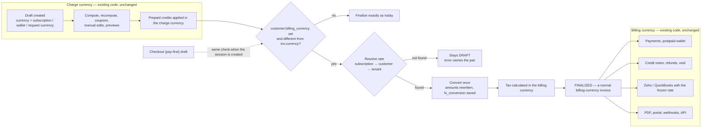
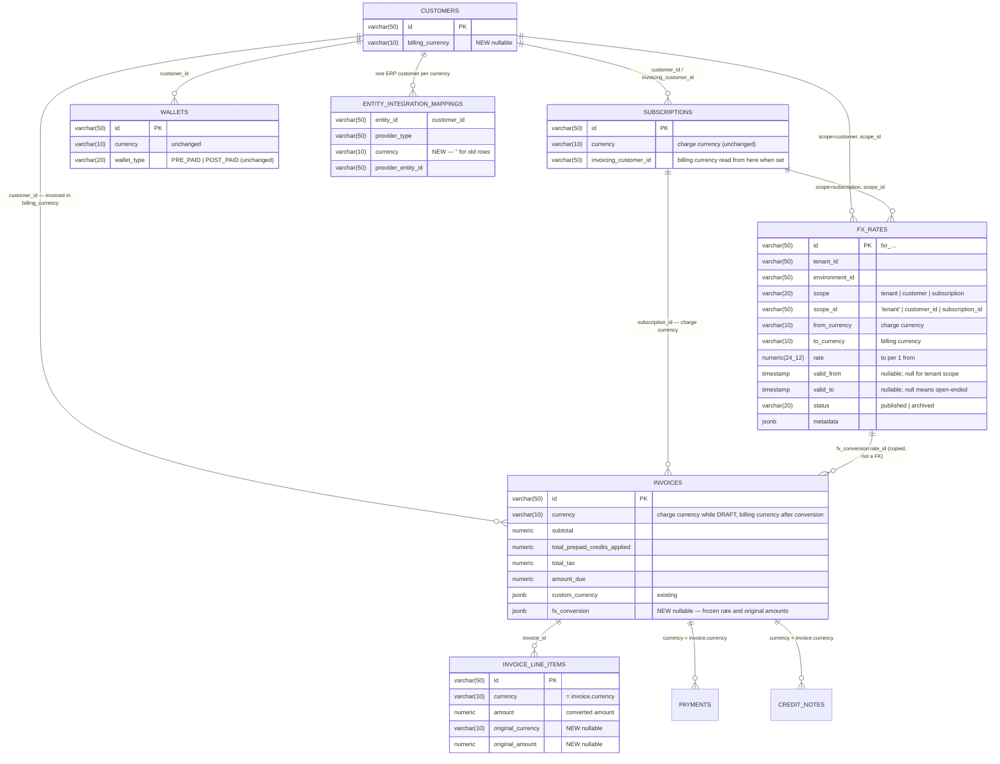
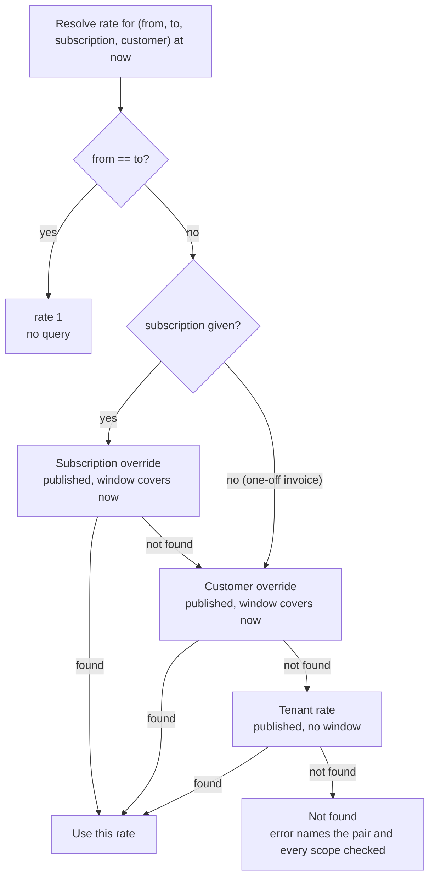
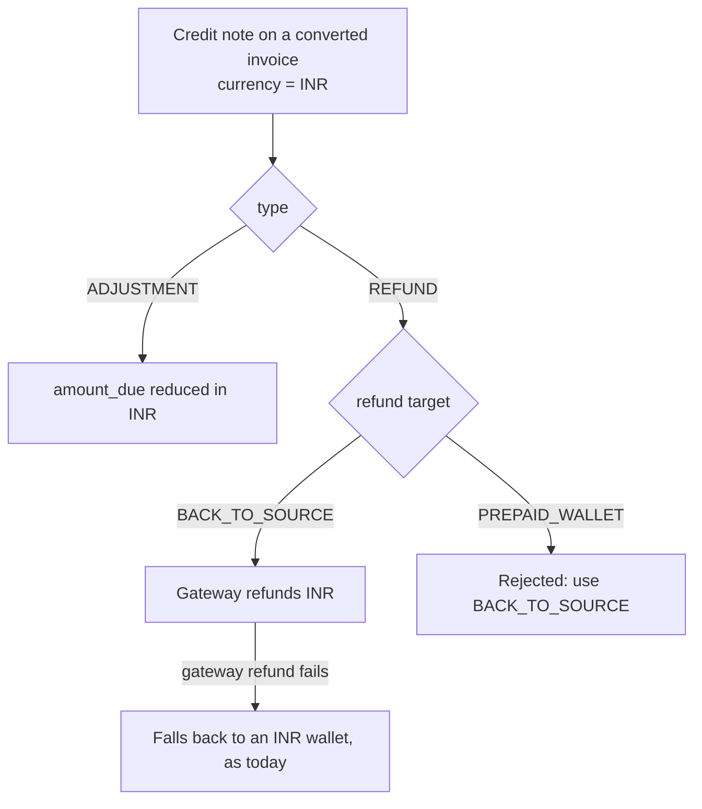
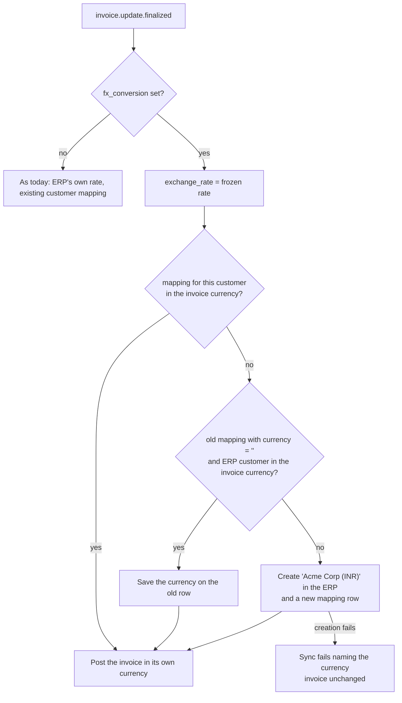
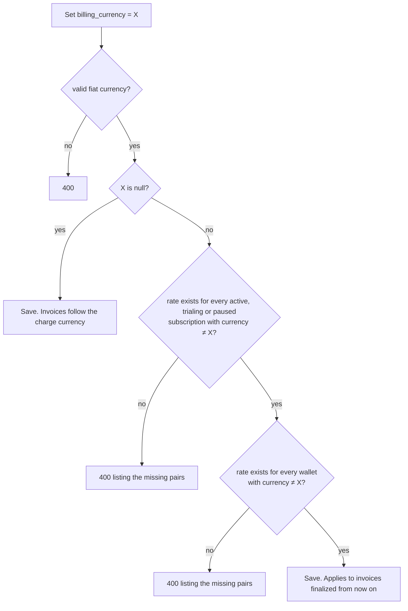
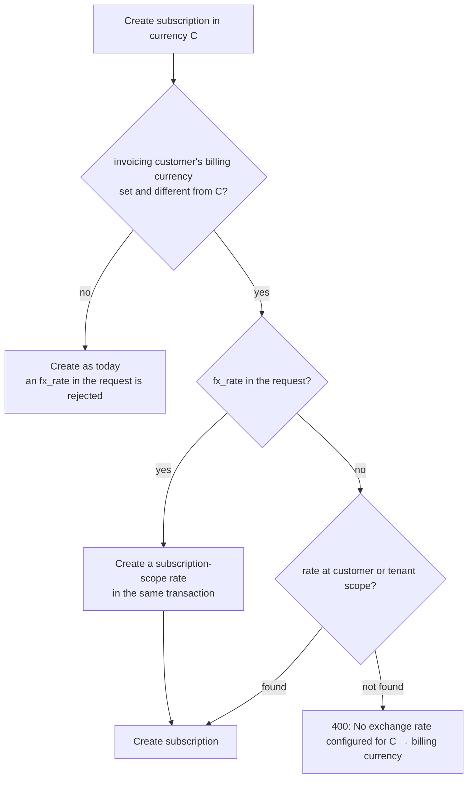

# Adaptive Multi-Currency — Billing Currency and FX Conversion — Design ERD

Status: **Proposed**
Date: 2026-09-26 · Revised 2026-09-29
Author: Paras Aghija
Ticket: FLE-1383
PRD: [`docs/prds/adaptive-multi-currency-prd.md`](../prds/adaptive-multi-currency-prd.md)
Related: [Tenant custom currency](2026-08-27-FLE-1201-tenant-custom-currency.md), [Refund architecture](2026-08-28-refund-architecture-erd.md)

---

## 1. Overview

### 1.1 Problem

Today an invoice is issued in whatever currency the subscription is priced in. A customer with a USD
subscription and an EUR subscription gets invoices in two currencies. To bill an Indian customer in
INR, a tenant has to rebuild the plan with INR prices and keep both price lists in sync by hand.

### 1.2 Goal

A customer can have a **billing currency**. Every invoice for that customer is issued in it. A
subscription keeps its own **charge currency**, and its invoice is built in that currency exactly as
today. At finalization, if the two differ, the invoice is converted once at a rate the tenant
configured. The rate is saved on the invoice and never changes after that.

### 1.3 Non-goals

- Live market rates.
- Deriving `inr → usd` from a `usd → inr` rate.
- A Flexprice payment record in a currency other than its invoice's (gateway-level presentment currency is fine).
- Changing a finalized invoice.
- Changing a subscription's currency.

**Deferred from the PRD.** Refund credit notes into a prepaid wallet on a converted invoice, cash
refund of unused credits at the purchase rate, moving a prepaid balance into a postpaid wallet, and
showing a wallet balance in the billing currency. See open question 2.

### 1.4 Terms

| Term | Meaning |
| --- | --- |
| Charge currency | The currency a plan, price or subscription is priced in. Unchanged by this design |
| Billing currency | The currency a customer is invoiced in. New, optional, set only by API or UI |
| FX rate | A fixed rate the tenant configures. `to = from × rate`. `usd → inr` at 83 means $1 = ₹83 |
| Converted invoice | An invoice whose draft was in the charge currency and was converted to the billing currency at finalization |
| Frozen rate | The rate saved on a converted invoice. Never changes, whatever happens to `fx_rates` later |

### 1.5 Existing customers are not affected

| Customer | Result | FX code that runs |
| --- | --- | --- |
| No billing currency. This is every customer today | Same as today | None. Finalize reads the customer, finds no billing currency and continues on the existing path |
| Billing currency equals the subscription currency | Same as today | None. Same read, the currencies match |
| Billing currency differs from the subscription currency | Invoice converted at finalization | Rate lookup and conversion |

Conversion starts only when someone sets a billing currency that differs from the charge currency.
Appendix A lists every code path this design touches and what each does when no billing currency is
set.

---

## 2. Solution at a glance

The draft stays in the charge currency. Finalization converts it once. Everything before the
conversion and everything after it is existing code.

**Worked example.** Acme is billed in INR and subscribes to a USD plan. The tenant rate for
`usd → inr` is 83. Acme has a $20 prepaid USD wallet. GST is 18%.

| Stage | Currency | Subtotal | Prepaid credits | Net | Tax | Total |
| --- | --- | --- | --- | --- | --- | --- |
| Draft | USD | $100.00 | $20.00 | $80.00 | — | — |
| After conversion at 83 | INR | ₹8,300.00 | ₹1,660.00 | ₹6,640.00 | — | — |
| Finalized | INR | ₹8,300.00 | ₹1,660.00 | ₹6,640.00 | ₹1,494.00 | ₹8,134.00 |

- The USD wallet is debited $20 in USD. It is never converted.
- The invoice saves `fx_conversion`: charge `usd`, billing `inr`, rate 83, source net $80.
- Each line keeps its original USD amount next to the converted INR amount.
- Tax is 18% of ₹8,300. As today, tax is calculated on the subtotal less discounts, before prepaid credits.
- Acme pays ₹8,134.00. Zoho or QuickBooks receives an INR invoice with exchange rate 83.

---

## 3. Data model

### 3.1 ERD

### 3.2 Schema changes

| Table | Change | Why |
| --- | --- | --- |
| `customers` | Add `billing_currency`, nullable | The currency the customer is invoiced in. NULL keeps today's behaviour |
| `fx_rates` | New table | Rates the tenant configures, at tenant, customer or subscription scope |
| `invoices` | Add `fx_conversion`, nullable jsonb | The frozen rate and the original amounts. NULL means never converted |
| `invoice_line_items` | Add `original_currency`, `original_amount`, nullable | Each line's pre-conversion amount, shown exactly on the PDF and API |
| `entity_integration_mappings` | Add `currency`, default `''`, and add it to the unique index | Zoho and QuickBooks need one ERP customer per currency |

Wallets and wallet transactions are not changed. No backfill anywhere.

### 3.3 `customers.billing_currency`

| Column | Type | Default | Notes |
| --- | --- | --- | --- |
| `billing_currency` | `varchar(10)`, nullable | `NULL` | Set only by API or UI. Stored lowercase. NULL means invoices follow the charge currency |

It is read from the customer being invoiced, `invoice.customer_id`. For a child subscription billed
to a parent, the parent's billing currency applies.

### 3.4 `fx_rates`

| Column | Type | Nullable | Notes |
| --- | --- | --- | --- |
| `id` | `varchar(50)` | No | Prefix `fxr_` |
| `tenant_id`, `environment_id` | `varchar(50)` | No | From the base mixins |
| `scope` | `varchar(20)` | No | `tenant`, `customer` or `subscription` |
| `scope_id` | `varchar(50)` | No | `'tenant'`, a `customer_id` or a `subscription_id` |
| `from_currency` | `varchar(10)` | No | Charge currency, for example `usd` |
| `to_currency` | `varchar(10)` | No | Billing currency, for example `inr` |
| `rate` | `numeric(24,12)` | No | `to_currency` units per 1 `from_currency` unit |
| `valid_from` | `timestamp` | Yes | Start of the window. Always NULL for tenant scope |
| `valid_to` | `timestamp` | Yes | End of the window, exclusive. NULL means open-ended |
| `status` | `varchar(20)` | No | `published` or `archived` |
| `metadata` | `jsonb` | Yes | Free-form, for example the contract reference |

| Index | Columns | Type |
| --- | --- | --- |
| `idx_fx_rate_tenant_live` | `tenant_id, environment_id, scope, scope_id, from_currency, to_currency` | Unique, partial on `status = 'published' AND scope = 'tenant'` |
| `idx_fx_rate_override` | same columns plus `valid_from` | Non-unique. Serves customer and subscription lookups |

**Scope rules**

- **Tenant rate.** The default for a currency pair across the tenant. No validity window. Exactly one
  published row per pair.
- **Customer and subscription overrides.** Need a published tenant rate for the same pair. Can be
  permanent or limited to a `[valid_from, valid_to)` window. Several overrides may exist for one
  entity and pair as long as their windows do not overlap.
- **Edits.** A rate row can be edited in place. Finalized invoices are not affected, because each one
  keeps its own frozen rate in `fx_conversion`.

**Sample rows** (one tenant, one environment)

| scope | scope_id | pair | rate | valid_from | valid_to | Meaning |
| --- | --- | --- | --- | --- | --- | --- |
| `tenant` | `tenant` | usd → inr | 83.00 | — | — | Default for every customer |
| `tenant` | `tenant` | eur → inr | 89.50 | — | — | Default for EUR |
| `customer` | `cust_acme` | usd → inr | 84.50 | — | — | Acme always gets 84.50 |
| `customer` | `cust_globex` | usd → inr | 85.00 | 2026-11-01 | 2026-12-01 | Globex gets 85 in November only |
| `customer` | `cust_globex` | usd → inr | 86.00 | 2026-12-01 | — | Globex gets 86 from December onward |
| `subscription` | `subs_pro` | usd → inr | 82.00 | — | 2026-11-01 | This subscription gets 82 until November |

### 3.5 `invoices.fx_conversion`

A jsonb snapshot written once, at conversion, in the same transaction as the converted amounts. NULL
means the invoice was never converted, and every reader checks that first.

| Field | Meaning |
| --- | --- |
| `charge_currency` | Original currency of the draft, for example `usd` |
| `billing_currency` | Currency the invoice was issued in, for example `inr` |
| `rate` | The frozen rate |
| `rate_id` | The `fx_rates` row used. For reference only; never read again |
| `scope` | Where the rate was found: `subscription`, `customer` or `tenant` |
| `converted_at` | When the conversion ran |
| `source.subtotal`, `source.total_discount`, `source.total_prepaid_credits_applied`, `source.net` | Original amounts in the charge currency, before tax |
| `rounding_adjustment`, `rounding_line_item_id` | The rounding difference and the line that absorbed it (§5.3) |

`invoice.currency` holds the charge currency while the invoice is a draft and the billing currency
after conversion.

The invoice repository lists columns by hand in `Create`, `CreateWithLineItems` and `Update`, and
the in-memory test store copies fields one by one. `custom_currency` was lost on write twice because
of this. Add `fx_conversion` to all of them with a round-trip test, and make `Update` keep the value,
never clear it.

### 3.6 `invoice_line_items` original amounts

| Column | Type | Notes |
| --- | --- | --- |
| `original_currency` | `varchar(10)`, nullable | The line's currency before conversion. NULL on invoices that were never converted |
| `original_amount` | `numeric(20,8)`, nullable | The line's gross amount before conversion |

The PDF, portal and API read these directly, so the original amount per line is exact. No screen
divides by the rate.

### 3.7 `entity_integration_mappings.currency`

Zoho and QuickBooks lock a customer to one currency once it has transactions. Today the mapping
allows one ERP customer per Flexprice customer per provider, so a customer billed in two currencies
over time has nowhere to sync the second one.

| Column | Type | Default | Notes |
| --- | --- | --- | --- |
| `currency` | `varchar(10)` | `''` | The currency the ERP entity is bound to. `''` for invoice, plan and price mappings, and for old rows |

The unique index becomes `(tenant_id, environment_id, entity_type, entity_id, provider_type, currency)`
on published rows. How old rows are handled is in §8.2.

---

## 4. Rate resolution

- The most specific scope wins: subscription, then customer, then tenant.
- A window covers `now` when `valid_from` is NULL or not after `now`, and `valid_to` is NULL or after
  `now`.
- Resolution always uses the current time. `fx_conversion.converted_at` records when it happened.
  See open question 1.
- At most three indexed lookups. No cache.
- A `usd → inr` rate is never used for `inr → usd`, and a missing rate is never treated as 1.
- `GET /v1/fx-rates/resolve` calls the same function, so a preview always matches the invoice.

---

## 5. Invoice lifecycle

### 5.1 Draft: no change

Every draft is created in the currency its caller passes, as today:

| Entry point | Draft currency |
| --- | --- |
| Subscription billing cycle | Subscription currency |
| Subscription create or renew, opening invoice | Subscription currency |
| One-off invoice API | Request currency |
| Wallet top-up | Wallet currency |
| Plan change settlement | Subscription currency |
| Old plan's usage on plan change | Subscription currency |
| Quantity change proration | Subscription currency |

Compute, recompute, coupons, previews and wallet balance reads all work on charge-currency amounts
and are not changed. The API can show a billing-currency estimate on a draft (§10.3). It is
calculated on read and never saved.

### 5.2 Finalization

Conversion runs inside the existing finalize transaction, under the invoice row lock. Steps 4 to 5
are new.

| Step | Action | Currency | Notes |
| --- | --- | --- | --- |
| 1 | Checkout gate, confirm still DRAFT | Charge | Existing |
| 2 | Freeze custom-currency rate | Charge | Existing |
| 3 | Apply prepaid credits and discounts | Charge | Existing. The wallet is debited in its own currency |
| 4 | **Check billing currency, resolve rate** | — | Skip to 6 if no billing currency, if it matches, or if `fx_conversion` is already set. Missing rate: stop, invoice stays DRAFT |
| 5 | **Convert** | Charge → billing | Rewrites invoice and line amounts, stamps line originals, saves `fx_conversion` |
| 6 | Calculate tax | Billing | Existing, now also for converted one-off invoices |
| 7 | Invoice number, mark FINALIZED, publish `invoice.update.finalized` | Billing | Existing |

**Why this order.** Credits and discounts come first, so only the remainder crosses the rate. Tax
comes after, so an INR invoice carries INR tax, as GST and the ERPs require.

**Checkout (pay-first) drafts.** The customer pays before finalization, so steps 4 and 5 run when the
checkout session is created. The payment link shows the INR amount, and finalization skips
conversion because `fx_conversion` is already set. The converted draft cannot be recomputed after
that.

**Retries.** `fx_conversion` is saved in the same transaction as the amounts, and step 4 skips it
when set, so a retried finalize never converts twice.

### 5.3 Conversion and rounding

1. Convert the net once: `net_billing = round(net_charge × rate)`. This is what the customer owes
   before tax.
2. Convert each line's amount, discounts and credits, and round each one.
3. If the lines do not add up to `net_billing`, add the difference to the line with the largest
   amount and record it in `rounding_adjustment` and `rounding_line_item_id`.
4. Stamp each line's `original_currency` and `original_amount` before overwriting its amount.

This keeps the lines equal to the total, so the PDF, portal and ERPs, which all add up lines, match
the saved invoice.

**Example.** Three lines, `usd → jpy` at 149.37. JPY has no decimals.

| | Source | × 149.37 | Rounded | After adjustment |
| --- | --- | --- | --- | --- |
| Line A | $33.33 | 4978.50 | ¥4,979 | ¥4,979 |
| Line B | $33.33 | 4978.50 | ¥4,979 | ¥4,979 |
| Line C | $33.34 | 4979.99 | ¥4,980 | ¥4,979 |
| **Total** | $100.00 | 14937.00 | ¥14,938 | **¥14,937** |

The invoice records `rounding_adjustment: -1` on line C. For two-decimal currencies the difference is
usually zero and at most ±0.01.

| Field | Converted? |
| --- | --- |
| `subtotal`, `total_discount`, `total_prepaid_credits_applied`, `total`, `amount_due` | Yes |
| Line `amount`, `line_item_discount`, `invoice_level_discount`, `prepaid_credits_applied` | Yes |
| `total_tax` | Calculated in step 6 |
| `amount_paid`, `amount_remaining` | No. `amount_paid` is 0 when converting (§9.4), so `amount_remaining` equals `amount_due` |
| `adjustment_amount`, `refunded_amount` | No. Zero on a draft |
| Line `quantity`, `price_unit_amount` | No. Not money in a currency |

### 5.4 After finalization

A converted invoice is a normal INR invoice. Code after finalization needs no FX logic:

| Flow | Behaviour |
| --- | --- |
| Card or gateway payment | Charges INR. Payment currency must equal invoice currency, as today |
| Postpaid wallet payment | Only a postpaid wallet in INR can pay |
| Prepaid wallet | Never pays invoices. Already applied before conversion |
| Credit notes and refunds | In INR (§7) |
| Void | Prepaid credits go back in the charge currency (§6.3) |
| Zoho, QuickBooks, Stripe | §8 |
| Recalculating a finalized invoice | Voids it and creates a new charge-currency draft, which converts at its own finalize |

A customer with USD and EUR subscriptions gets two INR invoices, each converted on its own.

### 5.5 Tenant custom currency

`invoices.custom_currency` (FLE-1201) converts a tenant-defined unit, for example `mac`, into fiat at
draft creation. `fx_conversion` converts fiat to fiat at finalization. They are separate columns and
separate code.

| Subscription currency | Billing currency | At finalize |
| --- | --- | --- |
| `usd` | none or `usd` | As today |
| `usd` | `inr` | FX `usd → inr` |
| `mac` (custom) | none | Custom rate `mac → usd` frozen, as today |
| `mac` (custom) | `inr` | Custom rate `mac → usd` frozen, then FX `usd → inr` |

---

## 6. Wallets

**A wallet balance is never converted.** Credits go in and come out in the wallet's own currency.
All conversion happens on invoices. Wallets and wallet transactions have no new fields.

### 6.1 Prepaid credits

Credits reduce the draft in the charge currency before conversion (§5.2, step 3). Only the remainder
is converted.

| | USD wallet | Invoice |
| --- | --- | --- |
| Before finalize | $20 balance | Draft $100 |
| Step 3 | −$20 | Net $80 |
| Step 5 at 83 | unchanged | ₹6,640 |

### 6.2 Top-ups across currencies

A purchased top-up already creates an invoice in the wallet currency. That invoice converts like any
other, and the wallet receives its credits in its own currency after payment. No wallet code
changes.

| Step | Wallet (USD) | Top-up invoice |
| --- | --- | --- |
| Customer billed in INR buys $300 of credits, rate 100 | Pending +$300 | Draft $300 |
| Invoice finalized | Pending +$300 | ₹30,000 |
| Customer pays ₹30,000 | +$300 | Paid |

The credits come from the pending wallet transaction, never from the invoice total, so the
conversion cannot change them.

### 6.3 Void

Voiding a converted invoice returns two amounts separately:

- The paid part goes back in INR through the refund ledger, as today.
- The prepaid credits go back to the USD wallet using `fx_conversion.source.total_prepaid_credits_applied`,
  never the INR amount divided by the rate.

Today both go back as one amount in the invoice currency. This is the only change in the void path.

---

## 7. Credit notes and refunds

A credit note is always in its invoice's currency, so credit notes on a converted invoice are INR and
today's limits apply in INR. No new columns on `credit_notes`, `credit_note_line_items` or `refunds`,
and no rate is used.

| Path | Result |
| --- | --- |
| Adjustment credit note | Reduces `amount_due` in INR |
| Refund, `BACK_TO_SOURCE` | Gateway refunds the INR payment |
| Refund, `PREPAID_WALLET` | Rejected on converted invoices. Deferred, see open question 2 |
| Gateway refund fails | Falls back to an INR wallet, as today |

**Credit note from a USD amount.** Support may think "refund one month, $100". A credit note line can
take an optional `source_amount`. It is converted at the invoice's frozen rate, never a new rate, and
checked against the existing per-line limit.

---

## 8. Integrations

### 8.1 Frozen rate in the ERP

| Invoice | Rate sent to Zoho (`exchange_rate`) and QuickBooks (`ExchangeRate`) |
| --- | --- |
| Converted | The frozen rate from `fx_conversion` |
| Not converted | The ERP's own rate, as today |

**Release note.** For converted invoices, the ERP ledger uses the tenant's configured rate, not the
ERP's market rate.

### 8.2 One ERP customer per currency

This runs only for converted invoices. Every other invoice finds its ERP customer exactly as today.

| Step | Condition | Action |
| --- | --- | --- |
| 1 | A mapping exists for this customer in the invoice currency | Use it |
| 2 | An old mapping with `currency = ''` exists and its ERP customer is in the invoice currency | Save the currency on that row and use it |
| 3 | Otherwise | Create an ERP customer named with the currency, for example "Acme Corp (INR)", and a mapping row |

### 8.3 Stripe outbound invoice sync

Stripe locks a customer to one currency once it has an invoice. A converted INR invoice for a Stripe
customer with USD history is rejected by Stripe. This design does not create per-currency Stripe
customers: the sync fails, names the currency and leaves the invoice unchanged. See open question 3.

---

## 9. Guardrails

All checks run in the service layer. Errors name the currency pair and the IDs involved.

### 9.1 Configuring rates

| Rule | Detail |
| --- | --- |
| Valid input | `from ≠ to`, `rate > 0`, valid codes. A custom currency can be `from` but never `to`. For subscription scope, the subscription's currency must equal `from` |
| One tenant rate per pair | A second tenant rate for the same pair returns `409`. Update the existing one instead |
| Override needs a tenant rate | A customer or subscription rate is rejected if no tenant rate exists for the pair |
| No overlapping override windows | Checked on create and update. A missing `valid_from` counts as the beginning of time and a missing `valid_to` as the end. Overlap returns `409` |
| No delete that strands a subscription | Refused if a live subscription or open draft would be left with no rate. The error lists up to 20 of them |
| Tenant and environment isolation | A staging rate never applies in production |

### 9.2 Setting a billing currency

- Subscriptions are checked where the customer is the subscriber or the invoicing customer.
- Wallets are checked because their top-ups convert into the billing currency (§6.2).
- Clearing it back to NULL is always allowed.
- Finalized invoices never change. Open drafts use the value at their own finalize.
- Recommended practice: set it when creating the customer, so ERP sync starts in the right currency.

### 9.3 Creating a subscription

- The same check runs before a checkout session opens, so a customer is never shown a price that
  cannot be invoiced.
- Subscription currency cannot change. Plan change keeps the same currency.
- Plan changes, addons and proration need no new check. Their invoices convert at finalize.

### 9.4 Invoices

| Rule | Detail |
| --- | --- |
| No rate means no finalize | The invoice stays DRAFT and nothing is written. Never a rate of 1, never a guess. Logged at `Error`. Marked as an invalid-operation error, so Temporal does not retry it. The scheduled finalizer picks the draft up once a rate exists |
| Convert once | Skipped when `fx_conversion` is already set |
| No payment before conversion | A payment on an unconverted draft is rejected when the customer's billing currency differs: "Finalize the invoice first; it will be issued in INR." Same for a one-off invoice created as already paid. Today payments on drafts are allowed |
| Converted checkout draft is frozen | Recompute and manual line edits are rejected. Void is allowed |
| Conversion checks itself | Lines add up to the net; a non-zero net never converts to zero; an all-zero invoice converts to zeros |
| One charge currency per invoice | Grouped invoicing merges child lines with no currency check today. When the invoicing customer has a billing currency, a child in a different currency is billed on its own invoice |
| Tax in the billing currency | Tax is recalculated after conversion. Tax rates are percentages found by entity, so nothing converts |
| One-off invoices follow the billing currency | A USD request for a customer billed in INR produces an INR invoice. A missing rate fails the create call |

### 9.5 Wallets, payments and credit notes

| Rule | Detail |
| --- | --- |
| Wallets can be created in any currency | No new restriction. See open question 4 |
| Postpaid wallets pay only matching invoices | A postpaid wallet pays an invoice only when their currencies match |
| Payment currency equals invoice currency | As today |
| Credit notes are in the invoice currency | As today |
| No refund to a prepaid wallet on a converted invoice | Use `BACK_TO_SOURCE` (§7) |

---

## 10. API

New endpoints follow the `/taxes/rates` pattern: a private group, writes gated on a new `EntityFXRate`
permission, and `@x-scope` on every handler.

### 10.1 FX rates

| Method | Path | Purpose |
| --- | --- | --- |
| `POST` | `/v1/fx-rates` | Create a rate |
| `GET` | `/v1/fx-rates` | List, filtered by pair, scope, scope_id, status |
| `POST` | `/v1/fx-rates/search` | Filtered, paginated search |
| `GET` | `/v1/fx-rates/:id` | Get one |
| `PUT` | `/v1/fx-rates/:id` | Update rate, validity window, metadata or status |
| `DELETE` | `/v1/fx-rates/:id` | Archive. Refused if it would strand a subscription |
| `GET` | `/v1/fx-rates/resolve` | Show which rate a customer or subscription gets now. Same function as finalize |

Create body: `scope`, `scope_id`, `from_currency`, `to_currency`, `rate`, optional `valid_from`,
`valid_to`, `metadata`.

Webhooks: `fx_rate.created`, `fx_rate.updated`, `fx_rate.deleted`.

### 10.2 Customers and subscriptions

| Resource | Change |
| --- | --- |
| Customer create and update | New optional `billing_currency`. `null` clears it |
| Customer response | New `billing_currency` |
| Subscription create | New optional `fx_rate: { rate }`. Creates a subscription-scope rate in the same transaction. Rejected when there is nothing to convert |
| Subscription `GET /:id` response | New `billing` block: billing currency, rate, rate id, scope. Calculated on read, not on list or search |

Deleting a customer or subscription archives its scoped rates.

### 10.3 Invoices

| Field | Where | Notes |
| --- | --- | --- |
| `fx_conversion` | Invoice | The snapshot in §3.5. Null on invoices never converted |
| `original_currency`, `original_amount` | Line item | Null on invoices never converted |
| `billing_currency_estimate` | Draft invoice and previews | `{ currency, rate, total, resolvable }`. Calculated on read. Shown only when the billing currency differs from the draft's. `resolvable: false` tells the dashboard the draft will fail to finalize |
| `charge_currency` | Invoice list filter | New filter on the original currency |

**Where the frozen rate is visible**

| Surface | Shows |
| --- | --- |
| Invoice API and webhooks | `fx_conversion` and line original amounts. Webhooks wrap the invoice response, so no builder change |
| PDF and customer portal | "₹8,300.00 (converted from $100.00 at 83.00)" on totals and on each line |
| Zoho and QuickBooks | The invoice in its own currency with the frozen rate (§8.1) |

### 10.4 Error responses

| Case | Status | Message names |
| --- | --- | --- |
| No rate for a pair (`resolve`, subscription create, one-off invoice) | 404 / 400 | The pair and every scope checked |
| Setting a billing currency with missing rates | 400 | Every missing pair, with the subscription or wallet id |
| Second tenant rate for a pair, or overlapping override windows | 409 | The existing rate id |
| Deleting a rate that is still needed | 409 | Up to 20 dependent subscriptions or drafts |
| Payment on an unconverted draft | 400 | The billing currency the invoice will be issued in |

---

## 11. Failure modes

| Failure | Behaviour |
| --- | --- |
| No rate at finalize | Invoice stays DRAFT, error names the pair, not retried. Rare, because subscription create, billing-currency changes and rate deletes check first |
| Non-zero net converts to zero | Internal error: the rate is too small for the currency's precision. Finalize fails |
| Rate edited while a draft is open | The draft uses the rate valid at its finalize. Checkout drafts keep the rate shown to the customer |
| Rate edited after finalize | No effect. The invoice keeps its frozen rate |
| Finalize retried after conversion | Conversion skipped |
| Customer deleted after the draft was created | Treated as no billing currency; the invoice finalizes in the charge currency |
| ERP customer creation fails | Sync fails naming the currency; invoice unchanged |
| Stripe customer locked to another currency | Stripe sync fails naming the currency |

---

## 12. Test plan

Extend `invoice_test.go`, `subscription_test.go`, `customer_test.go`, `wallet_test.go` and
`refund_test.go`. Add `fx_rate_test.go` and `fx_convert_test.go`.

### 12.1 Existing customers

| Case | Expected |
| --- | --- |
| No billing currency, invoice finalized | No `fx_rates` query. Invoice identical to today |
| Billing currency equals charge currency | Same |
| Every path in Appendix A, no billing currency | No new branch runs |
| Payment on a draft, no billing currency | Accepted, as today |

### 12.2 Rates and resolution

| Case | Expected |
| --- | --- |
| `from == to` | Rate 1, no query |
| Tenant rate only | Tenant rate used |
| Tenant and customer rates | Customer rate wins |
| Tenant, customer and subscription rates | Subscription rate wins |
| Customer override outside its window | Falls back to the tenant rate |
| Two customer overrides with back-to-back windows | The one covering now is used |
| Overlapping override windows | Rejected with 409 |
| Override with no tenant rate for the pair | Rejected |
| Second tenant rate for the same pair | Rejected with 409 |
| Only an archived row | Not found |
| Other environment | Not found |
| Only the reverse pair exists | Not found; error names the requested direction |
| One-off invoice, no subscription | Subscription scope skipped |
| `resolve` and finalize on the same data | Same rate and scope |

### 12.3 Conversion

| Case | Expected |
| --- | --- |
| Lines add up exactly | No rounding adjustment |
| JPY example in §5.3 | Line C absorbs −1; recorded on the invoice |
| Three-decimal currency (KWD) | Rounded to 3 decimals |
| Negative line | Absolute size picks the largest line; sign kept |
| Discounts and prepaid credits | `subtotal − discount − credits = net` after conversion |
| Line originals | `original_currency` and `original_amount` equal the draft's values |
| Rate too small for the precision | Error, nothing written |

### 12.4 Invoice lifecycle

| Case | Expected |
| --- | --- |
| Billing currency differs, rate exists | Invoice in the billing currency, `fx_conversion` saved, tax in the billing currency |
| Billing currency differs, no rate | Stays DRAFT, nothing written, not retried by Temporal; finalized once a rate is added |
| Finalize retried | No second conversion |
| Checkout draft | Converted at session creation; finalize reuses it; recompute rejected |
| Worked example in §2 | Wallet −$20 in USD; invoice total ₹8,134.00 |
| Void of that invoice | $20 back to the USD wallet; paid INR through the refund ledger |
| USD and EUR subscriptions, INR billing | Two INR invoices, each with its own `fx_conversion` |
| Custom-currency subscription, INR billing | `mac → usd` frozen, then `usd → inr` |
| Rate edited between compute and finalize | Draft uses the new rate; finalized invoices unchanged |

### 12.5 Guardrails

| Case | Expected |
| --- | --- |
| Subscription create, no rate | Rejected, pair named |
| Same with `fx_rate` in the request | Created with a subscription-scope rate |
| Set billing currency, a subscription has no rate | Rejected, missing pairs listed |
| Set billing currency, a wallet has no rate | Rejected, missing pairs listed |
| Payment on an unconverted draft, billing currency differs | Rejected |
| One-off invoice created as paid, billing currency differs | Rejected |
| Delete the only rate a subscription needs | 409 listing the subscription |

### 12.6 Wallets and credit notes

| Case | Expected |
| --- | --- |
| Customer billed in INR buys $300 for a USD wallet, rate 100 | ₹30,000 invoice; wallet +$300 after payment |
| Same, pay-first checkout | Payment link for ₹30,000; wallet +$300 after payment |
| Same, no rate | Top-up invoice cannot finalize; wallet unchanged |
| Adjustment credit note | INR, limit checked in INR |
| Refund `BACK_TO_SOURCE` on a ₹8,300 invoice | One INR gateway refund; no rate used |
| Refund `PREPAID_WALLET` on a converted invoice | Rejected |
| Credit note line with `source_amount: 50`, frozen rate 83 | Saved as ₹4,150 even if the live rate is now 85 |

### 12.7 Integrations

| Case | Expected |
| --- | --- |
| Converted invoice to Zoho or QuickBooks | Frozen rate sent |
| Invoice never converted | ERP's own rate, as today |
| Customer mapped in USD, INR invoice | New ERP customer and mapping with `currency = inr` |
| Old mapping whose ERP customer is already in the invoice currency | Currency saved on the row; mapping reused |

---

## 13. Rollout

### 13.1 Migration

| Step | Change | Reversible |
| --- | --- | --- |
| 1 | Create `fx_rates` with its two indexes | Yes. Nothing reads it |
| 2 | Add `customers.billing_currency`, nullable | Yes |
| 3 | Add `invoices.fx_conversion`, nullable | Yes |
| 4 | Add `invoice_line_items.original_currency` and `original_amount`, nullable | Yes |
| 5 | Add `entity_integration_mappings.currency` with default `''` and rebuild the unique index. Build the new index concurrently, then drop the old one by hand, since Ent does not drop it | Yes |
| 6 | Deploy the code | Nothing changes until a customer gets a billing currency |

All changes are additive, with no backfill. Nullable columns do not rewrite large tables in Postgres.

### 13.2 PR order

1. Schema, types and repositories, with round-trip tests. No behaviour change.
2. FX rate service and API, with the §9.1 rules.
3. Customer billing currency, with the §9.2 checks.
4. Conversion in finalize, tax for converted invoices, and the draft estimate. **This is the release.**
5. Subscription create check and inline rate.
6. Checkout drafts.
7. Void split and the refund-to-wallet block.
8. PDF and portal.
9. Zoho and QuickBooks sync. Merge `feat/fx-rates` first.
10. Swagger, SDKs and dashboard.

PRs 1 to 3 can reach production first. They change nothing on their own and let tenants set up rates
before conversion is switched on.

---

## 14. Decisions log

| Decision | Rationale |
| --- | --- |
| Draft stays in the charge currency; convert once at finalize | Compute, coupons, credits and previews need no change, and a draft never carries two currencies |
| Convert after credits and discounts, before tax | Credits are used in their own currency, and tax must be in the invoice currency |
| Checkout drafts convert at session creation | The customer pays before finalize, so the price shown must already be in INR and must not move |
| Convert the net once; the largest line absorbs rounding | Lines always add up to the total, so PDF, portal and ERPs match. Same rule as tax breakdowns |
| Rate snapshot on the invoice, original amounts on lines | The invoice holds one rate for all lines; lines keep exact originals for display |
| jsonb snapshot, not an applied-rates table | Every reader reads the invoice. Same shape as `custom_currency` |
| Separate from `custom_currency` | Custom currency applies at draft creation, FX at finalize. Merging would put a live second currency on every draft |
| One `fx_rates` table with three scopes | One lookup path, so `resolve` matches finalize exactly |
| Validity windows on overrides only | Negotiated customer rates are often time-bound; the tenant default is not. Keeps the tenant rate a single row |
| Rates are editable in place | Finalized invoices keep their own frozen rate, so editing never changes billed history |
| Resolve at conversion time, not copied onto customers | Updating the tenant rate reaches every customer without an override |
| No reverse-pair lookup | Each direction is a deliberate commercial rate; inverting can disagree with what finance agreed |
| `numeric(24,12)` | Holds both 25,000 (USD→VND) and 0.00004 (VND→USD) |
| No live-rate feed | Out of scope. A feed later changes the lookup, not the table |
| Back-to-source refunds use no rate | The payment, invoice and credit note are all INR; the gateway returns what it took |
| A wallet balance is never converted | $1 of USD credit always buys $1 of USD usage. Conversion happens only on invoices |
| Per-currency ERP customer only for converted invoices | Existing invoices keep today's sync behaviour |

---

## 15. Open questions

1. **Which date picks a time-limited rate?** Resolution uses the finalize time. An October invoice
   finalized on 1 November would use a November-only override. Should resolution use the invoice's
   period end instead?
2. **Deferred PRD scope.** The PRD expects refunds into a prepaid wallet on converted invoices (at the
   rate at refund time), cash refunds of unused credits at the purchase rate, prepaid to postpaid
   moves, and wallet balances shown in the billing currency. This design defers all four. Confirm
   with product that launch does not need them.
3. **Stripe customers.** Should per-currency Stripe customers be added, like the ERPs, before tenants
   using Stripe sync can set a billing currency on customers with Stripe history?
4. **Postpaid wallets in another currency.** Wallet creation is unrestricted, so a postpaid wallet
   not in the billing currency can never pay that customer's invoices. Reject it at creation, or
   allow it on purpose?
5. **Deleting a tenant rate that overrides depend on.** Overrides require a tenant rate at creation.
   Should deleting the tenant rate be blocked while overrides for the pair exist?

---

## Appendix A — Code paths touched

Every path below behaves exactly as today for a customer with no billing currency.

| Path | New behaviour runs when |
| --- | --- |
| `performFinalizeInvoiceActions` | Billing currency is set and differs from the draft currency |
| `RecalculateTaxesOnInvoice` | The invoice has `fx_conversion` |
| `CreateComputedDraftInvoice` (checkout) | Billing currency differs from the draft currency |
| `CreateInvoice` (one-off) | Billing currency differs from the request currency |
| `validateInvoicePaymentEligibility` | Draft not yet converted and billing currency differs |
| `createSubscription`, checkout create | Invoicing customer's billing currency differs from the subscription currency |
| `CustomerService.Create/Update` | Request contains `billing_currency` |
| Void | The invoice has `fx_conversion` |
| `FinalizeCreditNote`, wallet target | The invoice has `fx_conversion` |
| Grouped-invoice merge | Invoicing customer has a billing currency |
| Zoho, QuickBooks, Stripe sync | The invoice has `fx_conversion` |
| Invoice, customer, subscription responses | Always, but new fields are null |

## Appendix B — Codebase anchors

| Topic | Location |
| --- | --- |
| Finalize | [`performFinalizeInvoiceActions`, invoice.go:1057](../../internal/ee/service/invoice.go#L1057) |
| Prepaid credits at finalize | [invoice.go:1121](../../internal/ee/service/invoice.go#L1121); [`ApplyCreditsToInvoice`, credit_adjustment.go:207](../../internal/ee/service/credit_adjustment.go#L207) |
| One-off credits and coupons | [`applyCreditsAndCouponsToInvoice`, invoice.go:4877](../../internal/ee/service/invoice.go#L4877) |
| Draft creation | [`CreateEmptyDraftInvoice`, invoice.go:185](../../internal/ee/service/invoice.go#L185); [`CreateDraftInvoiceForSubscription`, invoice.go:411](../../internal/ee/service/invoice.go#L411) |
| Checkout drafts | [`CreateComputedDraftInvoice`, invoice.go:391](../../internal/ee/service/invoice.go#L391) |
| Wallet top-up invoice | [wallet.go:1158](../../internal/ee/service/wallet.go#L1158) |
| Postpaid wallet payments | [`GetWalletsForPayment`, wallet_payment.go:124](../../internal/ee/service/wallet_payment.go#L124) |
| Payment currency checks | [payment.go:228](../../internal/ee/service/payment.go#L228); [payment_processor.go:641](../../internal/ee/service/payment_processor.go#L641), [:739](../../internal/ee/service/payment_processor.go#L739) |
| Void refund amount | [invoice.go:1444](../../internal/ee/service/invoice.go#L1444); [`PrepareRefundsForVoidedInvoice`, refund.go:84](../../internal/ee/service/refund.go#L84) |
| Refunds to wallet or source | [refund.go:286](../../internal/ee/service/refund.go#L286) |
| Subscription create checks | [`createSubscription`, subscription.go:74](../../internal/ee/service/subscription.go#L74) |
| Grouped invoicing merge | [billing.go:1870](../../internal/ee/service/billing.go#L1870) |
| Tax rates for invoices | [`PrepareTaxRatesForInvoice`, tax.go:972](../../internal/ee/service/tax.go#L972) |
| Temporal finalize retry policy | [invoice_activities.go:163](../../internal/temporal/activities/invoice/invoice_activities.go#L163) |
| Invoice webhook payload | [payload/invoice.go:27](../../internal/webhook/payload/invoice.go#L27) |
| PDF data | [domain/pdf/model.go:11](../../internal/domain/pdf/model.go#L11) |
| Stripe invoice sync | [stripe/invoice_sync.go:49](../../internal/integration/stripe/invoice_sync.go#L49) |
| ERP mapping unique key | [entityintegrationmapping.go:71](../../ent/schema/entityintegrationmapping.go#L71) |
| Router pattern | [router.go:527](../../internal/api/router.go#L527) |
| Custom currency | [design](2026-08-27-FLE-1201-tenant-custom-currency.md); [`custom_currency.go`](../../internal/types/custom_currency.go) |
