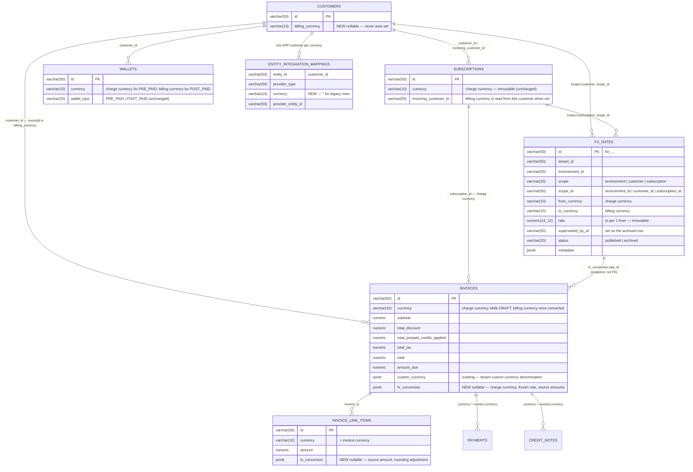

# Adaptive Multi-Currency — Phase 1: Billing Currency & FX Conversion — ERD

Status: **Proposed**
Date: 2026-09-26
Issue: FLE-1383
PRD: [`docs/prds/adaptive-multi-currency-prd.md`](../prds/adaptive-multi-currency-prd.md)
Phase 2: [`2026-09-26-FLE-1383-adaptive-multi-currency-phase2-erd.md`](2026-09-26-FLE-1383-adaptive-multi-currency-phase2-erd.md)

---

## 1. Scope

One nullable column on `customers`, one new table, one nullable jsonb column on `invoices` and on
`invoice_line_items`, and one new step inside invoice finalization.

A customer may be given a **billing currency**. Every invoice for that customer is issued in it.
An invoice whose charges are priced in another currency is **converted once, at finalization**, at
a rate the tenant configured, and the rate is frozen onto the invoice. Nothing else in the product
changes denomination: plans, prices, subscriptions, wallets, usage and entitlements stay in the
**charge currency** exactly as today.

**Design in one line:** the draft is the charge-currency document; finalization turns it into the
billing-currency document, exactly once, and records how.

### 1.1 The three populations that must not notice

| Customer | Path | FX code reached |
| --- | --- | --- |
| `billing_currency` is NULL (every customer on day one) | Unchanged | **None.** One nullable read at finalize, then the existing path |
| `billing_currency` equals the subscription's currency | Unchanged | **None.** Same read, `IsMatchingCurrency` short-circuit |
| `billing_currency` differs from the subscription's currency | Converted at finalize | Rate resolution and `ConvertInvoice` |

The first two rows are the whole existing customer base. They touch no new table, write no new
column and resolve no rate. That is enforced structurally: the only new work on the finalize path
is guarded by a single `if` (§4.2 step 2), and no other path reads `fx_rates` at all.

### 1.2 Phasing — what the split buys, and where the line goes

The ask was: Phase 1 invoices without touching prepaid wallets; Phase 2 plugs the prepaid deduction
in. Reading the code changes what the line should be.

**Prepaid credits are already applied in the charge currency, before any rate exists.** For a
subscription invoice, `performFinalizeInvoiceActions` restores the denomination, calls
`ApplyCreditsToInvoice` — which matches `PRE_PAID` wallets on the invoice's *denomination* currency
and debits them there — and only then computes `Total`
([invoice.go:1121-1141](../../internal/ee/service/invoice.go#L1121)). Under this design the draft
*is* the charge-currency document, so that step runs on charge-currency amounts against a
charge-currency wallet and finishes before the FX step begins (§4.2). The PRD's "apply prepaid
credits, then convert only the residual" is therefore not new code; it is the existing order with
one step appended. There is no FX-aware wallet arithmetic to get wrong, which is what the "don't
touch prepaid wallets in Phase 1" instinct was guarding against.

What *is* new, and what genuinely deserves its own phase, is **money crossing the rate through a
wallet**:

| Money movement | Why it is different | Phase |
| --- | --- | --- |
| Cycle invoice offsets usage with prepaid credits | Charge currency in, charge currency out. Existing code, existing order | **1** — unchanged behaviour |
| Downgrade / cancellation net credit into the wallet | Charge currency (`TopUpWalletForProratedCharge` with `sub.Currency`). Existing | **1** — unchanged behaviour |
| Plan / addon credit grants | Charge currency. Existing | **1** — unchanged behaviour |
| **Purchased top-up** of a charge-currency wallet by a customer billed in another currency | Customer pays INR, wallet receives USD. The rate must be stamped on the credit block and honoured at refund | **2** |
| **Refund credit note → wallet** on a converted invoice | INR document, USD wallet: divide at the rate resolved at refund time | **2** |
| Refund of unused credits (purchased or granted) to cash | Purchased at the stamped block rate; granted at the rate resolved at refund time. No cash refund of wallet credits exists today | **2** |
| Balance shown in the billing currency | Display only | **2** |
| Prepaid → postpaid migration with conversion | New operation | **2** |

**Recommendation: draw the line there.** Phase 1 ships conversion for every invoice and leaves every
wallet path exactly as it is; it adds two guards so that no money crosses the rate through a wallet
until Phase 2 (§5, G24 and G30). Phase 2 lifts those guards and adds the stamping, refund and
display work.

**The stricter variant, if "no prepaid interaction at all" is preferred.** One extra guard at the
single place prepaid wallets are picked or created —
`EnsurePrepaidWallet` / `TopUpWalletForProratedCharge` / `CreateWallet` — rejecting a `PRE_PAID`
wallet whose currency differs from a set `billing_currency`. Its cost is that a customer billed
cross-currency cannot then hold *any* charge-currency wallet: plans with credit grants cannot be
sold to them, an immediate downgrade with a net credit has nowhere to put it (must be scheduled at
period end), and a credit-note refund cannot go to a wallet. All of that reappears in Phase 2.
The guard is one function and is easy to add; this document does not include it because it removes
working behaviour to protect against a risk the ordering already removes. If the team wants it,
add it as G24b and the rest of this document stands.

**Is phasing required at all?** No — nothing in Phase 2 changes the schema or the finalize step,
and the top-up stamp is a copy of the invoice's `fx_conversion` onto a wallet transaction. It is a
release-risk choice, not a technical dependency: Phase 1 is the invoice-side feature, verifiable
by reading invoices; Phase 2 is the first release in which a customer's wallet balance and their
gateway charge disagree in currency, which wants its own test pass and its own release note. Two
PRs on one schema, a fortnight apart, is the right shape.

### 1.3 Not in scope, either phase

Live market rates; inverse-rate derivation; a payment in a currency other than the invoice's;
restating a finalized invoice; changing a subscription's charge currency; a tax reference rate
separate from the commercial rate (PRD open question — §11).

---

## 2. Data model

### 2.1 ERD



### 2.2 `customers.billing_currency`

```go
// ent/schema/customer.go
field.String("billing_currency").
    SchemaType(map[string]string{"postgres": "varchar(10)"}).
    Optional().
    Nillable().
    Comment("currency this customer is invoiced in; null means invoices follow the charge currency"),
```

Nullable, and **never written by the system**. The dropped September ERD had the first invoice
set it; the PRD now says it is set explicitly or not at all, which is simpler and keeps the
`NULL → unchanged path` guarantee exact (§1.1). No backfill. `varchar(10)` matches
`subscriptions.currency` and `wallets.currency`.

The value is read from the **invoiced** customer — `invoice.customer_id`, which
`CreateDraftInvoiceForSubscription` already sets from `sub.GetInvoicingCustomerID()`. A child
subscription billed to a parent converts into the *parent's* billing currency, and rate resolution
at customer scope uses the parent's id. The subscriber's own `billing_currency` is not consulted.

### 2.3 `fx_rates`

```go
// ent/schema/fxrate.go

var (
    Idx_fx_rate_live_key = "idx_fx_rate_live_key"
    Idx_fx_rate_pair     = "idx_fx_rate_pair"
)

// BaseMixin gives tenant_id + status; EnvironmentMixin gives environment_id.
// A rate never leaves the environment it was written in.
func (FXRate) Mixin() []ent.Mixin {
    return []ent.Mixin{baseMixin.BaseMixin{}, baseMixin.EnvironmentMixin{}}
}

func (FXRate) Fields() []ent.Field {
    return []ent.Field{
        field.String("id").SchemaType(pg("varchar(50)")).Unique().Immutable(),

        field.String("scope").
            GoType(types.FXRateScope("")).
            SchemaType(pg("varchar(20)")).NotEmpty().Immutable(),
        // customer_id, subscription_id, or the environment_id for scope=environment.
        // Never null, so the live-key index is a real uniqueness guarantee.
        field.String("scope_id").SchemaType(pg("varchar(50)")).NotEmpty().Immutable(),

        field.String("from_currency").SchemaType(pg("varchar(10)")).NotEmpty().Immutable(),
        field.String("to_currency").SchemaType(pg("varchar(10)")).NotEmpty().Immutable(),

        // to_currency units per 1 from_currency unit. Immutable: a change is a new row.
        field.Other("rate", decimal.Decimal{}).SchemaType(pg("numeric(24,12)")).Immutable(),

        // Set on the archived row by the supersede transaction.
        field.String("superseded_by_id").SchemaType(pg("varchar(50)")).Optional().Nillable(),

        field.JSON("metadata", map[string]string{}).Optional().SchemaType(pg("jsonb")),
    }
}

func (FXRate) Indexes() []ent.Index {
    return []ent.Index{
        // exactly one live rate per (env, scope, scope_id, pair)
        index.Fields("tenant_id", "environment_id", "scope", "scope_id", "from_currency", "to_currency").
            Unique().
            StorageKey(Idx_fx_rate_live_key).
            Annotations(entsql.IndexWhere("((status)::text = 'published'::text)")),
        index.Fields("tenant_id", "environment_id", "from_currency", "to_currency", "status").
            StorageKey(Idx_fx_rate_pair),
    }
}
```

```go
// internal/types/fx_rate.go
type FXRateScope string

const (
    FXRateScopeEnvironment  FXRateScope = "environment"
    FXRateScopeCustomer     FXRateScope = "customer"
    FXRateScopeSubscription FXRateScope = "subscription"
)

// internal/types/uuid.go
UUID_PREFIX_FX_RATE = "fxr"
```

**Why one table and three scopes, not a setting plus a table.** The tenant-wide rate could live in
`settings` (`fx_rate_config`) with only overrides in a table. Then resolution reads two stores with
two cache behaviours, and "what rate applies to this customer" is answered by merging them. One
table with `scope = environment` keeps resolution a single indexed query per level and makes the
`resolve` endpoint (§6.1) trivially truthful.

**Why no `effective_from` / `effective_to`.** PRD: rates are fixed values the company sets. Nobody
asked to schedule a rate change, and windows bring overlap validation and a "which of two live
rows" rule. A rate is current until superseded; history is the archived rows plus, for anything
that matters, the rate frozen on each invoice. Windows can be added later without touching
resolution's shape — they narrow the same query.

**Why `rate` is immutable.** Editing a rate in place loses the answer to "what was the rate on the
10th". `PUT` archives the current row, inserts the new one and links them, in one transaction
(§6.1). Because every invoice snapshots its rate (§2.4), there is no path by which a rate change
reaches a finalized invoice — PRD R6 holds mechanically.

**Why `numeric(24,12)`.** `wallets.conversion_rate` and `price_units.conversion_rate` are far
narrower. USD→VND is ~25,000; VND→USD is ~0.00004, which needs the decimals.

**Why no `rate_mode` / feed columns.** The PRD removed live rates from scope. Shipping unused
columns "for later" is how `tax_associations.priority` ended up stored, validated and never read.
If a feed arrives, it is a new `source` on the resolver, not a change to this table.

### 2.4 `invoices.fx_conversion` and `invoice_line_items.fx_conversion`

```go
// internal/types/fx_conversion.go

// FXConversion is written exactly once, when a draft in the charge currency becomes
// the billing-currency document. Everything in Source is in ChargeCurrency and is
// pre-tax; every amount column on the row is in BillingCurrency.
type FXConversion struct {
    ChargeCurrency  string          `json:"charge_currency"`
    BillingCurrency string          `json:"billing_currency"`
    Rate            decimal.Decimal `json:"rate"`     // billing units per 1 charge unit
    RateID          string          `json:"rate_id"`  // fx_rates row used; snapshot, never re-read
    Scope           FXRateScope     `json:"scope"`    // where the rate was found
    ConvertedAt     time.Time       `json:"converted_at"`
    Source          FXSourceAmounts `json:"source"`
}

type FXSourceAmounts struct {
    Subtotal                   decimal.Decimal `json:"subtotal"`
    TotalDiscount              decimal.Decimal `json:"total_discount"`
    TotalPrepaidCreditsApplied decimal.Decimal `json:"total_prepaid_credits_applied"`
    Net                        decimal.Decimal `json:"net"` // subtotal − discount − credits, pre-tax
}

type FXLineConversion struct {
    ChargeCurrency              string          `json:"charge_currency"`
    Rate                        decimal.Decimal `json:"rate"`
    SourceAmount                decimal.Decimal `json:"source_amount"`
    SourceLineItemDiscount      decimal.Decimal `json:"source_line_item_discount"`
    SourceInvoiceLevelDiscount  decimal.Decimal `json:"source_invoice_level_discount"`
    SourcePrepaidCreditsApplied decimal.Decimal `json:"source_prepaid_credits_applied"`
    RoundingAdjustment          decimal.Decimal `json:"rounding_adjustment"` // residual absorbed by this line, usually 0
}
```

```go
// ent/schema/invoice.go, ent/schema/invoice_line_item.go
field.JSON("fx_conversion", &types.FXConversion{}).Optional().SchemaType(pg("jsonb")),
field.JSON("fx_conversion", &types.FXLineConversion{}).Optional().SchemaType(pg("jsonb")),
```

`NULL` means "this invoice was never converted" and is the test every read path uses. There is no
`charge_currency` column: `invoice.currency` *is* the charge currency until conversion and the
billing currency after, and `fx_conversion.charge_currency` records the former. Reporting on
converted invoices filters on `fx_conversion IS NOT NULL`.

Both repositories enumerate columns by hand in `Create`, `CreateWithLineItems` and `Update`, and
the in-memory stores copy structs field by field. `custom_currency` was dropped on write twice for
that reason ([tenant-custom-currency §4 step 3](2026-08-27-FLE-1201-tenant-custom-currency.md)).
`fx_conversion` needs the same three edits and a round-trip test, and `Update` must be
set-or-keep, never clear.

**Why not an `fx_rates_applied` table.** The dropped ERD proposed one, keyed by entity, to grow
into payments and usage records later. Nothing in the PRD converts a payment or a usage record, and
the two consumers of the snapshot — the invoice API/PDF and the accounting sync — read the invoice.
A jsonb beside the amounts it explains is the shape `custom_currency` already uses and the one
readers expect. If a second entity ever needs a snapshot, it gets its own column of the same type
(Phase 2 does exactly this for `wallet_transactions`).

### 2.5 Why not reuse `custom_currency`

`invoices.custom_currency` is live: `CreateEmptyDraftInvoice` sets it when the subscription
currency is a tenant-defined code, and `performFinalizeInvoiceActions` freezes its rate
([invoice.go:299-313](../../internal/ee/service/invoice.go#L299), [:1086-1100](../../internal/ee/service/invoice.go#L1086)).
It answers a different question — "what is this tenant-invented unit worth in fiat" — and it
answers it from **draft creation**, so `invoice.currency` is fiat for the whole lifetime and the
custom amounts are a denomination beside it. FX answers "what is this fiat worth in that fiat" and
answers it **at finalization**, so `invoice.currency` changes. Folding the second into the first
would mean every draft carrying a live projected billing-currency total, re-projected on each
compute, which is precisely the machinery the PRD's "draft stays in the charge currency" avoids.

They compose as follows, and the composition is the only place both are read:

| Subscription currency | Customer billing currency | Draft currency | Finalize |
| --- | --- | --- | --- |
| `usd` | NULL or `usd` | `usd` | unchanged |
| `usd` | `inr` | `usd` | FX `usd → inr` |
| `mac` (custom) | NULL | `default_fiat_currency` (`usd`), `custom_currency` set | custom rate frozen; no FX |
| `mac` (custom) | `inr` | `usd`, `custom_currency` set | custom rate frozen `mac → usd`, **then** FX `usd → inr` |

The last row is two hops through the fiat pivot. The dropped ERD wanted a single `mac → inr`
factor from `fiat_conversion_factors`; that would make the invoice's frozen `custom_currency.rate`
inconsistent with its currency and put FX logic inside custom currency's freeze. Two hops, each
recorded on its own object, is legible and needs no change to the custom-currency code. It is also
a corner no tenant is in today.

### 2.6 `entity_integration_mappings.currency`

Zoho and QuickBooks lock a customer to one currency once it has transactions. The mapping table's
unique key is `(tenant, env, entity_type, entity_id, provider_type)`
([entityintegrationmapping.go:71-74](../../ent/schema/entityintegrationmapping.go#L71)) — one ERP
customer per Flexprice customer per provider. A customer whose billing currency changes needs a
second ERP customer for the new currency (PRD "Changing a customer's billing currency").

```go
field.String("currency").
    SchemaType(pg("varchar(10)")).
    Default("").
    Immutable().
    Comment("currency this provider entity is bound to; empty for entities that carry no currency and for rows written before FLE-1383"),
```

The unique index gains `currency`. Invoice, plan and price mappings write `""`. Customer mappings
written after this ships carry the invoice currency they were created for. Legacy customer rows
carry `""` and are resolved by §7.2.

---

## 3. Rate resolution

```
ResolveRate(ctx, from, to, subscriptionID, customerID) → (rate, rateID, scope) | ErrNotFound

1. IsMatchingCurrency(from, to)   → rate 1, scope identity. No query, no snapshot.

2. For level in [subscription, customer, environment]:
       skip subscription level when subscriptionID is empty (one-off invoices)
       SELECT … FROM fx_rates
        WHERE tenant_id = ctx.TenantID AND environment_id = ctx.EnvironmentID
          AND scope = level AND scope_id = id(level)
          AND from_currency = from AND to_currency = to
          AND status = 'published'
        LIMIT 1                                        -- Idx_fx_rate_live_key
   → first hit wins.

3. Nothing → ierr.NewErrorf("no FX rate configured for %s → %s", from, to).
       WithHintf("Set a rate for %s → %s at the subscription, customer or environment level").
       WithReportableDetails({from, to, scopes_tried: [...ids]}).
       Mark(ierr.ErrNotFound)
```

Three point lookups at worst, each fully covered by the live-key index. Determinism needs no
tie-break: the partial unique index makes "the live row for this key" a single row.

**No inverse derivation.** A `usd → inr` rate does not answer an `inr → usd` question. Inverting
rounds, and a finance team that set one direction deliberately did not consent to the other. The
error names the direction that is missing.

**Resolution is at conversion time, not copy-down.** The tax engine copies associations onto
customers and subscriptions at creation, so a later tenant-level change never reaches them. A rate
is a live fact: superseding the environment rate must affect the next invoice of every customer
without their own override, and the live-key index is what makes the read cheap enough to do every
time. There is no cache; three indexed reads per converted finalize is the whole cost.

`resolve` (§6.1) calls this function. The preview and the invoice cannot disagree because there is
one function.

---

## 4. Invoice lifecycle

### 4.1 Draft — unchanged

Every draft is created with the currency its caller hands in, exactly as today:

| Entry point | Currency handed in | Where |
| --- | --- | --- |
| Subscription cycle | `sub.Currency` | [`CreateDraftInvoiceForSubscription`, invoice.go:411-438](../../internal/ee/service/invoice.go#L411) |
| Subscription create / renew opening invoice | `subscription.Currency` | [invoice.go:2248-2276](../../internal/ee/service/invoice.go#L2248) |
| One-off / API | `req.Currency` | [`CreateInvoice`, invoice.go:346-389](../../internal/ee/service/invoice.go#L346) |
| Wallet top-up | `w.Currency` | [wallet.go:1158-1202](../../internal/ee/service/wallet.go#L1158) |
| Plan-change settlement (net charge) | `sub.Currency` | [`buildNettedProrationInvoiceRequest`, line_item_proration.go:378-409](../../internal/ee/service/line_item_proration.go#L378) |
| Outgoing-plan usage on plan change | `currentSub.Currency` | [subscription_change_v2.go:1141-1178](../../internal/ee/service/subscription_change_v2.go#L1141) |
| Quantity-change proration | `sub.Currency` | [subscription_modification_quantity.go:1018-1052](../../internal/ee/service/subscription_modification_quantity.go#L1018) |

Compute, recompute, coupons, line reconciliation, previews and the ongoing-balance read all run
on charge-currency amounts against charge-currency wallets and subscriptions, and none of them are
modified. A draft's `currency` is the charge currency and its `fx_conversion` is NULL.

The API may show a **billing-currency estimate** on a draft (§6.3). It is computed on read from the
draft's `total` and whatever rate resolves now, and is never stored.

### 4.2 Finalization — the one new step

`performFinalizeInvoiceActions` ([invoice.go:1057-1216](../../internal/ee/service/invoice.go#L1057)),
already under `GetForUpdate`, with the FX step inserted after the charge-currency totals and before
tax:

```
1.  checkout gate; still DRAFT                                     existing
2.  custom-currency rate freeze                                    existing
3.  subscription invoices: restore denomination, apply prepaid     existing — charge currency
    credits (wallet debit), Total = Subtotal − Discount − Credits,
    capture + project custom currency
── NEW ──────────────────────────────────────────────────────────────────────────
4.  billing := customer(inv.CustomerID).BillingCurrency
    if billing == "" || IsMatchingCurrency(billing, inv.Currency)  → skip to 7   (F1, F2)
    if inv.FXConversion != nil                                     → skip to 7   (F8: already converted, e.g. checkout draft)
5.  rate := ResolveRate(inv.Currency → billing, inv.SubscriptionID, inv.CustomerID)
    err → return it. Nothing written; invoice stays DRAFT.                       (F3)
6.  ConvertInvoice(inv, lines, rate)                                             (§4.3)
    → inv.Currency = billing; every amount column and every line rewritten;
      fx_conversion written on the invoice and each line
── END NEW ──────────────────────────────────────────────────────────────────────
7.  AmountRemaining = AmountDue − AmountPaid; persist invoice + lines   existing
8.  RecalculateTaxesOnInvoice                                           existing, widened: runs for any
                                                                        invoice with fx_conversion, not only
                                                                        subscription invoices
9.  invoice number; zero-total shortcut; auto_completed; FINALIZED;     existing
    invoice.update.finalized
```

**Where in the order, and why.** After step 3 so that prepaid credits and discounts are netted in
the charge currency (PRD: "the rate is applied to the final net — after prepaid credits, discounts
and adjustments"). One-off and credit-type invoices apply prepaid credits and coupons at compute
time instead ([`applyCreditsAndCouponsToInvoice`, invoice.go:4877-4917](../../internal/ee/service/invoice.go#L4877));
that is still in the charge currency and still before step 4, so the same statement holds for them. Before tax so that tax is computed on billing-currency taxable values, which is
what an INR GST invoice has to show and what the tax engine's `tax_applied` rows, sent to the ERPs,
have to carry. One-off invoices compute tax at draft time in the charge currency; step 8 recomputes
it in the billing currency for them too, replacing the charge-currency `tax_applied` rows. The
conversion snapshot is therefore **pre-tax** and `Source.Net` is the taxable base.

**Pay-first drafts convert earlier.** A checkout session
(`source_type = checkout`; payment-gated subscription create, addon attach, quantity change) takes
payment on a draft's amount and finalizes after. The payment link must be in the billing currency
and the invoice must finalize to the amount that was paid. So `CreateComputedDraftInvoice` runs
steps 4–6 on the computed draft **at session creation**, persisting `fx_conversion`, and step 4's
"already converted" branch makes finalize honour it. The rate is frozen when the customer is shown
the price, which is the only correct moment for a pay-first flow. A converted draft is not
recomputable or editable (G18).

**Retry safety.** Steps 4–6 are idempotent by construction: `fx_conversion IS NOT NULL` is the
guard, and it is written in the same transaction as the amounts it explains. A finalize activity
that fails after step 6 and retries lands in the F8 branch.

### 4.3 `ConvertInvoice` — the arithmetic

```go
// internal/ee/service/fx_convert.go
func ConvertInvoice(inv *invoice.Invoice, lines []*invoice.InvoiceLineItem, r ResolvedRate) error
```

```
conv(x)  = RoundToCurrencyPrecision(x × r.Rate, billing)

for each line:
    amount_b        = conv(amount_c)
    line_disc_b     = conv(line_item_discount_c)
    inv_disc_b      = conv(invoice_level_discount_c)
    prepaid_b       = conv(prepaid_credits_applied_c)
    line_net_b      = amount_b − line_disc_b − inv_disc_b − prepaid_b

net_c     = subtotal_c − total_discount_c − total_prepaid_credits_applied_c
net_b     = conv(net_c)                                     ← authoritative: what the customer owes pre-tax
residual  = net_b − Σ line_net_b
if residual ≠ 0: the line with the largest |line_net_b| gets amount_b += residual,
                 fx_conversion.rounding_adjustment = residual

subtotal_b                      = Σ amount_b               (after absorption)
total_discount_b                = Σ (line_disc_b + inv_disc_b)
total_prepaid_credits_applied_b = Σ prepaid_b
→ subtotal_b − total_discount_b − total_prepaid_credits_applied_b == net_b, exactly

total_b = net_b (tax is added by step 8); amount_due_b = total_b
if net_c ≠ 0 and net_b == 0 → ErrInternal "rate underflows billing-currency precision"   (F6)
```

**Why the net is authoritative and lines absorb.** The customer pays `net_b + tax`. If the net were
derived from independently rounded lines, two invoices for identical usage could differ by a paisa
depending on how the lines split — and the PDF, the customer portal and the ERP all re-add lines and
would disagree with the stored total. Converting the net once, then forcing the lines to sum to it,
keeps every document that re-adds lines equal to the total. The largest line absorbs because that
is the smallest relative distortion, and it is the policy `calculateTaxBreakdown` already uses.

**Worked example** — three lines, `usd → jpy` at 149.37 (precision 0):

| | source | × 149.37 | rounded |
| --- | --- | --- | --- |
| line A | 33.33 | 4978.50 | 4979 |
| line B | 33.33 | 4978.50 | 4979 |
| line C | 33.34 | 4979.99 | 4980 |
| Σ lines | 100.00 | | 14938 |
| **net** | 100.00 | 14937.00 | **14937** |

Residual −1 → line C becomes 4979 and carries `rounding_adjustment: -1`. Lines sum to 14937. With
a 2-decimal target the residual is zero on most invoices and ±0.01 on the rest.

**What is converted:** `subtotal`, `total_discount`, `total_prepaid_credits_applied`, `total`,
`amount_due`, and per line `amount`, `line_item_discount`, `invoice_level_discount`,
`prepaid_credits_applied`. **What is not:** `amount_paid` and `amount_remaining` — a draft that
converts has `amount_paid = 0` (G17), so `amount_remaining = amount_due` after step 7;
`adjustment_amount` and `refunded_amount` — zero on a draft, and thereafter in the billing currency;
`total_tax` — recomputed in step 8; quantities, unit prices as displayed — `display_amount`/unit
price fields keep the charge currency and the line's `fx_conversion.source_amount` is the figure the
PDF shows next to the converted amount.

### 4.4 After finalization — an ordinary billing-currency invoice

Everything downstream sees an INR invoice and needs no FX knowledge:

| Consumer | Behaviour | Why it already works |
| --- | --- | --- |
| Card / gateway payment | Charges INR | Payment currency must equal invoice currency — three existing checks ([payment.go:249](../../internal/ee/service/payment.go#L249), [payment_processor.go:641](../../internal/ee/service/payment_processor.go#L641), [:739](../../internal/ee/service/payment_processor.go#L739)) |
| `POST_PAID` wallet payment | Only an INR postpaid wallet is a candidate | `GetWalletsForPayment` matches `inv.Currency` (G22 keeps such wallets in the billing currency) |
| `PRE_PAID` wallet | Never a payment candidate; already applied in step 3 | `GetWalletsForPayment` is postpaid-only |
| Ongoing balance of a USD prepaid wallet | Draft counted while `usd`; not counted once `inr`; the wallet was debited in step 3 | `GetUnpaidInvoicesToBePaid` matches `inv.Currency` |
| Adjustment / refund credit notes | INR, bounded by INR `amount_paid` | `Currency: inv.Currency` ([dto/creditnote.go:91](../../internal/api/dto/creditnote.go#L91)) |
| Refund to source | INR through the gateway | `row.Currency = inv.Currency` |
| Void | See G25 — the prepaid portion must return in the charge currency | The one downstream path that needs a branch |
| ERP sync | INR invoice, frozen rate sent | §7 |
| Recalculation of a finalized invoice | Voids and creates a new draft in the charge currency, which converts at its own finalize | [`RecalculateInvoice`, invoice.go:3883](../../internal/ee/service/invoice.go#L3883); in-place `RecalculateInvoiceV2` is draft-only |

Two invoices for one customer priced in USD and EUR each convert independently into INR; the
customer receives two INR invoices, never a mixed one (PRD "Multiple subscriptions").

---

## 5. Guardrails

Every rule below is enforced in the service layer, returns `ierr.ErrValidation` (or `ErrNotFound`
for a missing rate) with a hint naming the currency pair and, where relevant, the ids involved.
"Phase" is where the rule first applies; rules without a phase are permanent.

### 5.1 Configuring rates

| # | Rule | Enforced in |
| --- | --- | --- |
| G1 | `from_currency ≠ to_currency`; `rate > 0`; both codes pass `ValidateCurrencyCode` and, when `custom_currency_config` is set, `EnforceCurrency` (a custom code may be `from`, never `to`); `scope_id` exists in this tenant+environment and is of the right type (customer / subscription); for `scope=subscription` the subscription's `currency` must equal `from_currency` | `FXRateService.Create` |
| G2 | One live rate per `(env, scope, scope_id, pair)`. A second `POST` for a live key is `409` naming the existing id; the way to change a rate is `PUT` | `Idx_fx_rate_live_key` + a pre-check for the friendly error |
| G3 | `PUT` never edits `rate` in place: archive the current row with `superseded_by_id`, insert the new one, one transaction. A row that no invoice has used yet is still superseded, not edited — history is cheap, exceptions are not | `FXRateService.Update` |
| G4 | `DELETE` (archive) is refused when a live subscription — or an open draft invoice — would be left with **no resolvable rate** for its pair. The error lists the first 20 dependants. To remove a rate, add the replacement at a covering scope first. Rates that are shadowed at every dependant (a customer override under an environment rate) delete freely | `FXRateService.Delete`, using the same resolver with the row excluded |
| G5 | Rates are bound by `tenant_id` and `environment_id` at every scope. A staging rate never resolves in production, and a customer id from another environment is rejected by G1 | Mixins + query filters |

### 5.2 Setting or changing a billing currency

| # | Rule | Enforced in |
| --- | --- | --- |
| G6 | `billing_currency` must pass `ValidateCurrencyCode`; when `custom_currency_config` is set it must be a fiat currency the config names, never a custom code — an invoice is fiat | `CustomerService.Create/Update` |
| G7 | **Preflight.** For every subscription that is `active`, `trialing` or `paused`, where this customer is the subscriber (with no other invoicing customer) or the invoicing customer, and whose `currency` differs from the new value: `ResolveRate(sub.currency → new)` must succeed. Likewise for every open draft invoice of the customer whose `currency` differs. Otherwise reject, listing every missing pair — *"No FX rate configured for USD → INR (subscription subs_…), EUR → INR (subscription subs_…)"* | `CustomerService.Update` |
| G8 | A `POST_PAID` wallet with `balance > 0` in a currency other than the new billing currency blocks the change: it would never again be a payment candidate. Close or drain it first. `PRE_PAID` wallets are not consulted — they are charge-currency and unaffected | `CustomerService.Update` |
| G9 | Clearing `billing_currency` (set to null) is allowed: invoices fall back to the charge currency, which is always resolvable | — |
| G10 | The change applies to invoices that **convert after it**. Finalized invoices are never restated; drafts convert at their own finalize with the value current then | Structural — nothing reads `billing_currency` except step 4 |

### 5.3 Subscriptions

| # | Rule | Enforced in |
| --- | --- | --- |
| G11 | **Create.** If the invoicing customer (falls back to the customer) has a `billing_currency` and it differs from `req.Currency`, a rate must resolve at customer or environment scope, **or** the request carries an inline `fx_rate` (§6.2), which creates the subscription-scoped row in the same transaction. Otherwise the subscription is not created: *"No exchange rate configured for USD → INR. Set a rate before subscribing this customer to a USD plan."* Sits beside the existing `EnforceCurrency` call, after the customer lookup ([subscription.go:123-130](../../internal/ee/service/subscription.go#L123)) | `createSubscription` |
| G12 | Checkout-gated create runs G11 **before** the session is opened, so a customer is never shown a price that cannot be invoiced | `CheckoutSessionService` |
| G13 | A subscription's charge currency is immutable ([subscription.go:57-62](../../ent/schema/subscription.go#L57)); plan change v2 requires the target plan in the same currency. The v1 change path, which creates a new subscription, goes through G11 | Existing |
| G14 | Plan change, addon attach and quantity change on a cross-currency subscription need no new check: the settlement invoice is a draft in the charge currency and converts at finalize under F3. G4 guarantees the rate is still there | Structural |

### 5.4 Invoices

| # | Rule | Enforced in |
| --- | --- | --- |
| G15 | **Terminal check.** No resolvable rate at finalize → finalize refused, invoice stays `DRAFT`, error names the pair and scopes tried, nothing partially written. Never a rate of 1, never a guess. Logged at `Error` with `invoice_id`, `from`, `to`. The scheduled finalizer picks the draft up again once a rate exists | Step 5 |
| G16 | **Exactly once.** `fx_conversion IS NOT NULL` skips conversion. The write is in the same transaction as the amounts, under the row lock. A retried finalize activity cannot double-convert | Step 4 |
| G17 | A draft that will convert must have `amount_paid = 0`. `CreateInvoiceRequest` with `amount_paid > 0` (or a pre-set paid status) for a customer whose billing currency differs from `req.Currency` is rejected at creation: a charge-currency payment cannot be carried across the rate | `CreateInvoice` |
| G18 | A converted draft (checkout) is frozen: `RecalculateInvoiceV2`, manual line edits and `ComputeInvoice` reject it. Voiding it is allowed | Those entry points, on `fx_conversion != nil` |
| G19 | Conversion invariants: `Σ line_net_b == net_b`; `subtotal_b − total_discount_b − credits_b == net_b`; a non-zero `net_c` never converts to zero (F6). Asserted, not assumed | `ConvertInvoice` |
| G20 | One charge currency per invoice. Grouped / parent-child invoicing merges child invoices into a parent only when their currencies match; a child in another charge currency remains its own invoice and converts on its own | `billing.go` grouped-invoice merge — verify the current currency check when implementing |
| G21 | Tax is recomputed in the billing currency for every converted invoice, replacing charge-currency `tax_applied` rows | Step 8 |
| G22 | One-off invoice API: `req.Currency` is a charge currency. A customer with `billing_currency = inr` posted a `usd` invoice receives an INR invoice converted from USD; the request cannot override the billing currency. Because one-off invoices auto-finalize, the rate is required at creation and the failure is immediate | `CreateInvoice` |

### 5.5 Wallets — Phase 1

| # | Rule | Enforced in |
| --- | --- | --- |
| G23 | **`POST_PAID` wallet currency must equal the customer's billing currency** when one is set (creation, and G8 on change). A postpaid wallet pays finalized invoices; a finalized invoice is in the billing currency | `CreateWallet` |
| G24 | **Purchased top-up on a `PRE_PAID` wallet whose currency differs from the billing currency is rejected in Phase 1** — *"Top-ups in a currency other than the billing currency arrive with Phase 2."* Free credits, credit grants, proration credits and refund fallbacks are not purchases and are unaffected. **Lifted in Phase 2** | `TopUpWallet` purchase path ([wallet.go:1158](../../internal/ee/service/wallet.go#L1158)) |
| G25 | **Void of a converted invoice** returns two things separately: the paid portion (`amount_paid − refunded_amount`) in the **billing** currency to the billing-currency prepaid wallet, as today; and the prepaid portion in the **charge** currency — `fx_conversion.source.total_prepaid_credits_applied`, never `total_prepaid_credits_applied ÷ rate` — to the charge-currency wallet it came from. Today both are one amount in `inv.Currency` ([invoice.go:1444-1452](../../internal/ee/service/invoice.go#L1444)); this is the one downstream branch a converted invoice needs | `voidInvoice` + `PrepareRefundsForVoidedInvoice` gains a currency per row |
| G26 | Prepaid credit application is unchanged and, for a converted invoice, provably runs before conversion (§4.2 step 3 precedes step 4). No FX-aware wallet code exists in Phase 1 | Structural |
| G27 | Proration net credits and cancellation credits go to a `PRE_PAID` wallet in `sub.Currency` — the charge currency — with no conversion, as today ([wallet.go:3103](../../internal/ee/service/wallet.go#L3103)) | Existing |

### 5.6 Payments, credit notes, refunds

| # | Rule | Enforced in |
| --- | --- | --- |
| G28 | Payment currency equals invoice currency. Unchanged; the third check at [payment_processor.go:739](../../internal/ee/service/payment_processor.go#L739) is case-sensitive where the other two use `IsMatchingCurrency` — normalise it while here | Existing |
| G29 | Credit notes on a converted invoice are in the billing currency, bounded by billing-currency `amount_paid` / `amount_due`. Unchanged | Existing |
| G30 | **Refund credit note with `refund_target = PREPAID_WALLET` on a converted invoice is rejected in Phase 1** — use `BACK_TO_SOURCE`. Today it would create an INR prepaid wallet for a customer whose usage is priced in USD, which is money the customer cannot spend. **Phase 2** routes it to the charge-currency wallet at the rate resolved at refund time. The gateway-failure fallback to a wallet stays as it is (a billing-currency wallet row) so a failed refund is never lost; Phase 2 re-routes it too | `FinalizeCreditNote` |

### 5.7 Integrations

| # | Rule | Enforced in |
| --- | --- | --- |
| G31 | An invoice syncs in its own currency with its frozen rate; nothing converts on the way out. The ERP customer it posts to must be bound to that currency (§7.2); if the bound customer's currency differs and no per-currency counterpart can be created, the sync fails and says which currency | Zoho / QuickBooks invoice sync |

---

## 6. API surface

Follows the `/taxes/rates` pattern ([router.go:527-545](../../internal/api/router.go#L527)):
a `v1Private` group, writes gated on a new `types.EntityFXRate`, `@x-scope` on every handler.

### 6.1 FX rates

```
POST   /v1/fx-rates              create                                   write
GET    /v1/fx-rates              list — from, to, scope, scope_id, status read
POST   /v1/fx-rates/search       filter body, paginated                   read   (@x-scope "read")
GET    /v1/fx-rates/:id          get                                      read
PUT    /v1/fx-rates/:id          supersede — archives :id, returns new    write
DELETE /v1/fx-rates/:id          archive, guarded by G4                   delete
GET    /v1/fx-rates/resolve      from, to, customer_id?, subscription_id? read
```

```jsonc
// POST /v1/fx-rates
{
  "scope": "customer",                 // environment | customer | subscription
  "scope_id": "cust_01J…",             // omitted for environment
  "from_currency": "usd",
  "to_currency": "inr",
  "rate": "83.000000",
  "metadata": { "source": "Q4 contract" }
}
// 201
{
  "id": "fxr_01J…", "scope": "customer", "scope_id": "cust_01J…",
  "from_currency": "usd", "to_currency": "inr", "rate": "83",
  "status": "published", "superseded_by_id": null,
  "created_at": "…", "updated_at": "…", "metadata": { … }
}

// PUT /v1/fx-rates/fxr_01J…   { "rate": "85" }
// 200 → the NEW row; the old one is archived with superseded_by_id set.

// GET /v1/fx-rates/resolve?from=usd&to=inr&customer_id=cust_01J…&subscription_id=subs_01J…
// 200
{ "rate": "83", "rate_id": "fxr_01J…", "scope": "customer", "from_currency": "usd", "to_currency": "inr" }
// 404
{ "error": "no FX rate configured for usd → inr",
  "hint": "Set a rate for usd → inr at the subscription, customer or environment level",
  "details": { "scopes_tried": ["subscription:subs_01J…", "customer:cust_01J…", "environment:env_01J…"] } }

// DELETE blocked by G4 → 409
{ "error": "fx rate fxr_01J… is still required",
  "details": { "dependants": [ { "subscription_id": "subs_01J…", "customer_id": "cust_01J…", "pair": "usd→inr" } ] } }
```

`resolve` is the endpoint that makes three scopes legible: a tenant configures rates and needs to
see which one a given customer will actually get. It runs the same function as finalize.

Webhooks: `fx_rate.created`, `fx_rate.updated` (the new row, with `supersedes`), `fx_rate.deleted`.
Registered in `internal/types/webhook.go` with payload builders in
`internal/webhook/payload/factory.go`.

### 6.2 Customers and subscriptions

```jsonc
// POST /v1/customers, PUT /v1/customers/:id  — new optional field
{ "billing_currency": "inr" }            // null clears it (G9)
// Customer response
{ "id": "cust_…", "billing_currency": "inr", … }
// 400 on G7
{ "error": "billing currency cannot be set to inr",
  "hint": "No FX rate configured for usd → inr (subscription subs_01J…). Set a rate first.",
  "details": { "missing": [ { "from": "usd", "to": "inr", "subscription_id": "subs_01J…" } ] } }
```

```jsonc
// POST /v1/subscriptions — new optional field, creates a subscription-scoped rate in the same transaction
{ "customer_id": "cust_…", "plan_id": "plan_…", "currency": "usd",
  "fx_rate": { "rate": "84.5" } }        // to_currency is the customer's billing currency, from_currency the subscription's

// Subscription response gains a computed, non-persisted block (null when no conversion applies)
{ "id": "subs_…", "currency": "usd",
  "billing": { "billing_currency": "inr", "fx_rate": "84.5", "fx_rate_id": "fxr_…", "scope": "subscription" } }
```

`fx_rate` on create is what resolves the chicken-and-egg in G11 for a negotiated per-deal rate: the
subscription does not exist yet, so a subscription-scoped row cannot be created first. It is
rejected when the customer has no billing currency or it equals the subscription currency (there is
nothing for the rate to do).

### 6.3 Invoices

```jsonc
// GET /v1/invoices/:id — converted invoice
{
  "id": "inv_…", "currency": "inr", "subtotal": "8300.00", "total": "9794.00", "amount_due": "9794.00",
  "fx_conversion": {
    "charge_currency": "usd", "billing_currency": "inr", "rate": "83", "rate_id": "fxr_…",
    "scope": "customer", "converted_at": "2026-10-01T00:05:12Z",
    "source": { "subtotal": "100.00", "total_discount": "0", "total_prepaid_credits_applied": "0", "net": "100.00" }
  },
  "line_items": [
    { "amount": "8300.00", "currency": "inr",
      "fx_conversion": { "charge_currency": "usd", "rate": "83", "source_amount": "100.00", "rounding_adjustment": "0" } }
  ]
}

// GET /v1/invoices/:id — draft for a cross-currency customer (nothing stored)
{ "id": "inv_…", "invoice_status": "DRAFT", "currency": "usd", "total": "100.00",
  "billing_currency_estimate": { "currency": "inr", "rate": "83", "total": "8300.00", "resolvable": true } }
// … or, when no rate resolves:
{ "billing_currency_estimate": { "currency": "inr", "resolvable": false, "missing": { "from": "usd", "to": "inr" } } }
```

`billing_currency_estimate` is how the dashboard shows a banner on a draft that will fail to
finalize. It is present only on drafts of customers whose billing currency differs from the
draft's currency.

**PDF and portal.** A converted invoice shows, on the subtotal line and on each line, the source
amount and the rate — *"₹8,300.00 (converted from $100.00 at 83.00)"* — read from `fx_conversion`.
There is no second source of truth for the source amount. The top-up case in Phase 2 is why this is
a requirement: an INR invoice with no `$300.00 of credits` on it does not tell the customer what
they bought.

The invoice list filter `currency` filters on the stored (billing) currency. A new filter
`charge_currency` reads `fx_conversion->>'charge_currency'`.

### 6.4 Permissions and MCP

`types.EntityFXRate` added at [rbac.go:72-106](../../internal/types/rbac.go#L72); roles use
wildcards so no `roles.json` change. Handlers annotate `@x-scope "read"` on `search` and `resolve`,
`"write"` on create/update, `"delete"` on delete.

---

## 7. Integration egress

### 7.1 Send our rate

On `feat/fx-rates`, both accounting integrations already send the invoice currency and a rate —
but the rate is the **provider's** (Zoho `settings/currencies`, QuickBooks `exchangerate`), read at
sync time. After this change an invoice may carry its own frozen rate, and that is the one the
ledger must use:

```
invoice.fx_conversion != nil  → exchange_rate = fx_conversion.rate       (Zoho `exchange_rate`, QBO `ExchangeRate`)
otherwise                     → provider rate, as today                  (invoices that were never converted)
```

One branch each in `ResolveInvoiceCurrency` (Zoho) and around `GetExchangeRate` (QuickBooks).
The fallback is required: every invoice that exists today has no `fx_conversion`.

A caveat for the release note: the ERP's ledger rate for a converted invoice becomes the
commercial rate the tenant configured, not the ERP's market table. That is the point of the
feature, but a tenant reconciling against the ERP's rate will see it move on the first converted
invoice. The GST reference-rate question (§11) is the same question from the tax side.

### 7.2 One ERP customer per currency

Both ERPs lock a customer to one currency once it has transactions. With `currency` on the mapping
(§2.6), customer resolution during invoice sync becomes:

```
1. mapping (customer, provider, currency = invoice.currency)              → use it
2. else legacy mapping (customer, provider, currency = '')                → read the provider contact's currency
       equals invoice.currency → stamp currency onto the row, use it
       differs                 → fall through
3. else create a provider customer in invoice.currency, mapping row with that currency
```

Step 2 upgrades legacy rows lazily and never mis-posts: a legacy mapping whose ERP currency
differs from the invoice's is left alone and a per-currency counterpart is created. The name of
the counterpart carries the currency (*"Acme Corp (INR)"*) so a bookkeeper can tell them apart.
Both `GetOrCreateZohoCustomer` and `GetOrCreateQuickBooksCustomer` already take a `currencyCode`
on `feat/fx-rates`; the change is in mapping lookup, not in the provider calls.

---

## 8. Failure modes

| # | Condition | Behaviour |
| --- | --- | --- |
| F1 | Billing currency equals charge currency | Skip. No rate, no snapshot, no cost |
| F2 | Customer has no billing currency | Skip. The invoice is in the charge currency, as today |
| F3 | No rate at any scope at finalize | Finalize refused; draft stays; error names pair and scopes; logged at `Error`. Rare after G4/G7/G11, but the terminal guard |
| F4 | No rate at subscription create / billing-currency change / one-off create | Rejected before any write, naming the pair |
| F5 | Rate resolves but `net_b` is zero from non-zero `net_c` | `ErrInternal` — a rate below the target's precision. Finalize refused |
| F6 | Rate superseded while a draft is open | The draft converts at the rate current at its finalize. Checkout drafts keep the rate they were shown at |
| F7 | Rate superseded after finalization | No effect. The invoice carries its own rate |
| F8 | Finalize retried after conversion | `fx_conversion` present → reused. Never re-resolved, never re-converted |
| F9 | Void of a converted invoice | Prepaid portion returned in the charge currency from the snapshot; paid portion in the billing currency (G25) |
| F10 | Finalized converted invoice recalculated | Voided (F9) and replaced by a new charge-currency draft that converts at its own finalize |
| F11 | ERP customer bound to another currency and creation of a counterpart fails | Sync fails, naming the currency. The invoice is untouched |

---

## 9. Test matrix

Extend the existing service test files — `invoice_test.go`, `subscription_test.go`,
`customer_test.go`, `wallet_test.go`, `refund_test.go` — plus a new `fx_rate_test.go` and
`fx_convert_test.go`.

**Resolution**

| # | Case | Expect |
| --- | --- | --- |
| T1 | `from == to` | rate 1, identity, no query |
| T2 | Environment rate only | resolved, scope environment |
| T3 | Environment + customer | customer wins |
| T4 | Environment + customer + subscription | subscription wins |
| T5 | Archived row only | not resolved |
| T6 | Same tenant, other environment | not resolved at any scope |
| T7 | Reverse pair only | not resolved; error names the requested direction |
| T8 | No subscription id (one-off) | subscription scope skipped, customer wins |

**Conversion**

| # | Case | Expect |
| --- | --- | --- |
| T9 | Lines sum exactly | no `rounding_adjustment` |
| T10 | Residual ±1 (JPY example above) | largest line absorbs; invariants hold |
| T11 | Three-decimal target (KWD) | rounded at 3, invariants hold |
| T12 | Negative line (credit line on a settlement invoice) | magnitude used for "largest"; sign preserved |
| T13 | Discounts and prepaid credits present | `subtotal − discount − credits == net` after conversion |
| T14 | Rate underflows precision | `ErrInternal`, nothing written |

**Lifecycle**

| # | Case | Expect |
| --- | --- | --- |
| T15 | NULL billing currency | no `fx_rates` query issued (assert on the repo mock), invoice unchanged |
| T16 | Billing == charge | same |
| T17 | Billing ≠ charge, rate present | invoice in billing currency, `fx_conversion` on invoice and lines, tax in billing currency |
| T18 | Billing ≠ charge, no rate | finalize refused, invoice still DRAFT, no partial write |
| T19 | Finalize retried after T17 | F8 — identical row |
| T20 | Checkout draft | converted at session creation; finalize reuses; recompute rejected (G18) |
| T21 | One-off with `amount_paid > 0` for a cross-currency customer | rejected at creation (G17) |
| T22 | Prepaid USD wallet, USD sub, INR billing | credits debited in USD at step 3; residual converted; wallet balance = before − credits; ongoing balance coherent before and after finalize |
| T23 | Void of T22's invoice | USD credits back to the USD wallet from the snapshot; paid INR to an INR wallet |
| T24 | Two subs (USD, EUR), billing INR | two INR invoices, each with its own snapshot |
| T25 | Custom-currency sub (`mac`) + billing INR | `custom_currency` frozen `mac→usd`, then `fx_conversion` `usd→inr` |
| T26 | Rate superseded between compute and finalize | draft uses the new rate; a finalized invoice does not |

**Guardrails**

| # | Case | Expect |
| --- | --- | --- |
| T27 | Subscription create, cross-currency, no rate | rejected, pair named |
| T28 | Same with inline `fx_rate` | created; subscription-scoped row exists |
| T29 | Set billing currency with an unresolvable active subscription | rejected, all missing pairs listed |
| T30 | Set billing currency with a funded POST_PAID wallet in another currency | rejected (G8) |
| T31 | Create POST_PAID wallet in a non-billing currency | rejected (G23) |
| T32 | Purchase top-up on a USD PRE_PAID wallet, billing INR | rejected in Phase 1 (G24) |
| T33 | Refund CN to wallet on a converted invoice | rejected in Phase 1 (G30); `BACK_TO_SOURCE` works in INR |
| T34 | Delete the only rate a live subscription depends on | 409 listing the dependant (G4); delete of a shadowed rate succeeds |
| T35 | `resolve` and finalize over one fixture | identical rate and scope |

**Egress**

| # | Case | Expect |
| --- | --- | --- |
| T36 | Converted invoice → Zoho / QuickBooks | invoice's rate sent, not the provider's |
| T37 | Never-converted invoice | provider rate, as today |
| T38 | Customer mapped in USD, INR invoice | per-currency counterpart created and mapped with `currency = inr` |
| T39 | Legacy mapping whose ERP currency equals the invoice's | row stamped, reused |

---

## 10. Migration and sequencing

### 10.1 Migration

| Step | | Reversible |
| --- | --- | --- |
| 1 | `CREATE TABLE fx_rates` + `Idx_fx_rate_live_key` (partial, `status = 'published'`) + `Idx_fx_rate_pair` | Yes — nothing reads it |
| 2 | `ALTER TABLE customers ADD COLUMN billing_currency varchar(10) NULL` | Yes — nullable, unread until set |
| 3 | `ALTER TABLE invoices ADD COLUMN fx_conversion jsonb NULL`; same on `invoice_line_items` | Yes |
| 4 | `ALTER TABLE entity_integration_mappings ADD COLUMN currency varchar(10) NOT NULL DEFAULT ''`; recreate the unique index with it. Ent does not drop the old index — hand-write the drop as `V5__settings_unique_published_only.up.sql` did | Yes |
| 5 | Deploy code. Nothing changes for any customer until a `billing_currency` is set | **Setting one is the irreversible act** for that customer's next invoice |

No backfill of any kind. `make generate-ent`, `make generate-migration`, then hand-check that the
SQL is four additive statements and one index swap.

### 10.2 Sequencing — Phase 1 PRs

1. **Types + schema + migration** — `FXRateScope`, `FXConversion`, `UUID_PREFIX_FX_RATE`,
   `EntityFXRate`; the four schema changes; repository field lists and in-memory stores; round-trip
   tests. Inert.
2. **FX rate service, repo, API** — CRUD, supersede (G3), `resolve`, G1/G2/G5, webhooks, RBAC.
   G4 ships here with the dependant query.
3. **Customer billing currency** — DTO field, G6–G9 preflight, `customer.updated` payload.
4. **Conversion** — `ConvertInvoice` + tests (T9–T14); finalize step 4–6; step 8 widened (G21);
   `billing_currency_estimate`; G15–G19, G22.
5. **Subscription create guard + inline rate** — G11, G12, `billing` block on the response.
6. **Checkout drafts** — convert at session creation; G18.
7. **Wallet and refund guards** — G23, G24, G25 (void split), G30.
8. **Display** — PDF template and portal read `fx_conversion`.
9. **Egress** — send the frozen rate; per-currency mapping (§7). Coordinate with `feat/fx-rates`,
   which owns the provider-currency work this builds on; land that branch first.

Steps 1–3 can ship to production ahead of 4: they are inert without step 4 and let a tenant
configure rates before the switch. Step 4 is the release.

---

## 11. Open questions and interactions

1. **Tax reference rate (PRD).** Indian GST may require the INR value on an invoice to use a
   prescribed reference rate, not the commercial one. If confirmed, `FXConversion` grows a
   `reference_rate` and the tax step (§4.2 step 8) takes it for the taxable base while the
   commercial rate drives `amount_due`. The schema does not foreclose it; the PDF layout does.
   Needs a finance contact at a launch customer before Phase 2.
2. **Grouped invoicing across charge currencies (G20).** The parent/child merge in `billing.go`
   should be read for its current currency handling before implementing; if it merges regardless
   of currency, G20 is a bug fix that lands with step 4.
3. **`auto_invoice_threshold`** is compared against unbilled usage in the charge currency, which is
   right. It is worth stating in its API doc that it is not in the billing currency.
4. **Gateway customers.** Razorpay and Stripe customers can take a PaymentIntent in any supported
   currency; Stripe *Billing* customers lock currency, but Flexprice drives payments, not Stripe
   subscriptions, for converted invoices. Confirm for the checkout / saved-card flows.
5. **Analytics.** Revenue analytics sum `TotalCost` with no currency check and label the sum with
   the first subscription's currency. Billing currency makes a customer single-currency at the
   invoice level, not at the usage level, so this neither improves nor worsens. A reporting
   currency plus `fx_rates` is the later fix.
6. **v1 plan change excess credit.** `OpeningInvoiceAdjustmentAmount` applies only to fixed lines
   and logs any excess ([billing.go:309-321](../../internal/ee/service/billing.go#L309)). Unrelated
   to FX, but a cross-currency customer on the v1 path loses it in the charge currency exactly as
   a same-currency customer does today. Noted so it is not attributed to conversion.

---

## 12. References

| | |
| --- | --- |
| Finalize path | [`performFinalizeInvoiceActions`, invoice.go:1057-1216](../../internal/ee/service/invoice.go#L1057) |
| Prepaid credits at finalize, denomination currency | [invoice.go:1121-1141](../../internal/ee/service/invoice.go#L1121); [`ApplyCreditsToInvoice`, credit_adjustment.go:207-345](../../internal/ee/service/credit_adjustment.go#L207); [`GetWalletsForCreditAdjustment`, wallet_payment.go:221-259](../../internal/ee/service/wallet_payment.go#L221) |
| Postpaid wallet payments | [`GetWalletsForPayment`, wallet_payment.go:124-218](../../internal/ee/service/wallet_payment.go#L124) |
| Draft currency choke point | [`CreateEmptyDraftInvoice`, invoice.go:185-343](../../internal/ee/service/invoice.go#L185) |
| Checkout drafts | [`CreateComputedDraftInvoice`, invoice.go:391](../../internal/ee/service/invoice.go#L391) |
| Void refund amount | [invoice.go:1444-1452](../../internal/ee/service/invoice.go#L1444); [`PrepareRefundsForVoidedInvoice`, refund.go:84](../../internal/ee/service/refund.go#L84) |
| Refund to wallet / source | [refund.go:286-392](../../internal/ee/service/refund.go#L286); [`EnsurePrepaidWallet`, wallet.go:295](../../internal/ee/service/wallet.go#L295) |
| Proration credit wallet | [`TopUpWalletForProratedCharge`, wallet.go:3103-3210](../../internal/ee/service/wallet.go#L3103); [`Settle`, line_item_proration.go:280-347](../../internal/ee/service/line_item_proration.go#L280) |
| Subscription create validation | [`createSubscription`, subscription.go:74-140](../../internal/ee/service/subscription.go#L74) |
| Ongoing balance | [`GetWalletBalance`, wallet.go:1697-1840](../../internal/ee/service/wallet.go#L1697); [`GetUnpaidInvoicesToBePaid`, invoice.go:2617-2708](../../internal/ee/service/invoice.go#L2617) |
| Custom currency | [`internal/types/custom_currency.go`](../../internal/types/custom_currency.go); [`model.go:302-398`](../../internal/domain/invoice/model.go#L302); [design](2026-08-27-FLE-1201-tenant-custom-currency.md) |
| Currency helpers | [`currency.go:85` `IsMatchingCurrency`, `:93` `ValidateCurrencyCode`, `:137` `RoundToCurrencyPrecision`](../../internal/types/currency.go#L85) |
| Partial-index precedent | [`ent/schema/settings.go:59-61`](../../ent/schema/settings.go#L59); [`V5__settings_unique_published_only.up.sql`](../../migrations/postgres/V5__settings_unique_published_only.up.sql) |
| Router precedent | [router.go:527-545](../../internal/api/router.go#L527) |
| ERP mapping key | [entityintegrationmapping.go:71-76](../../ent/schema/entityintegrationmapping.go#L71) |
| Zoho / QuickBooks currency on `feat/fx-rates` | `zoho/client.go` `ResolveInvoiceCurrency`; `quickbooks/client.go` `GetExchangeRate`; `quickbooks/customer.go` `SyncCustomerToQuickBooks` |
| Refund ledger design | [refund-architecture-erd](2026-08-28-refund-architecture-erd.md) |
| Dropped predecessor | `git show 855fd554c^:docs/design/2026-09-22-billing-currency-and-fx-conversion-erd.md` on `feat/fx-rates` |
