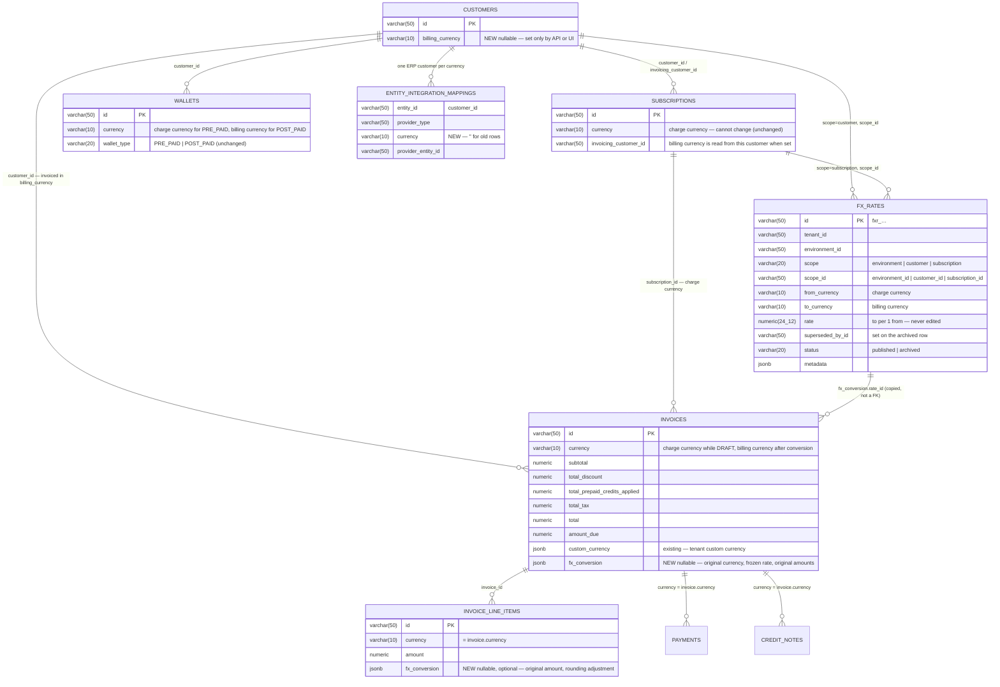
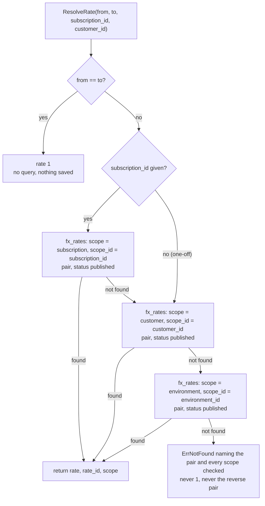
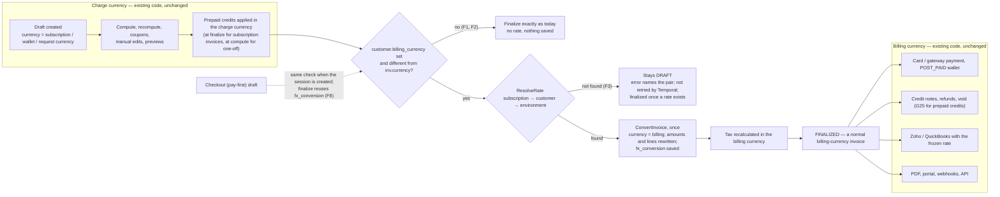
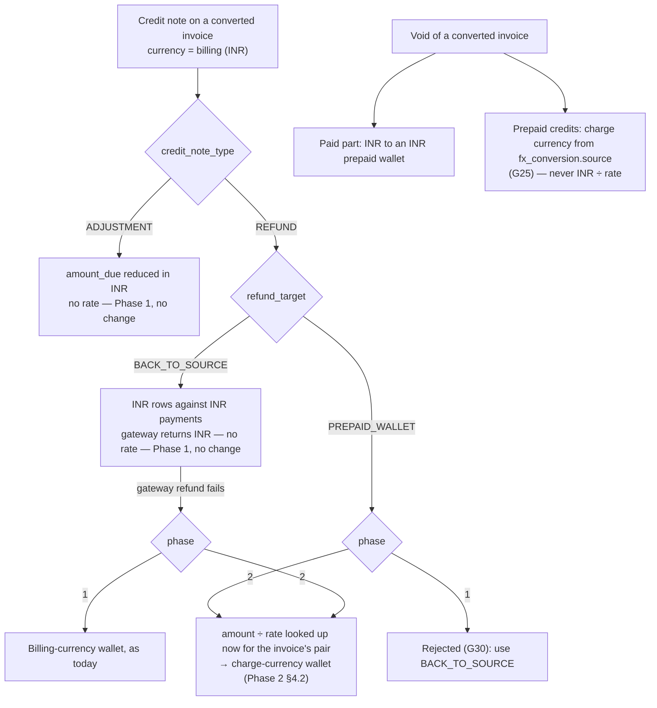
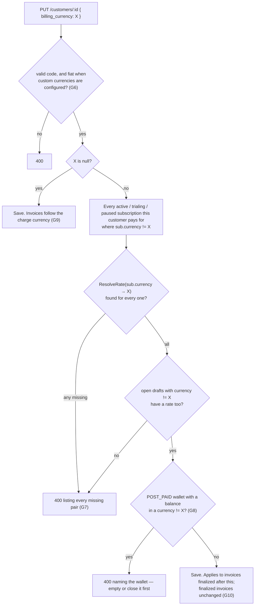
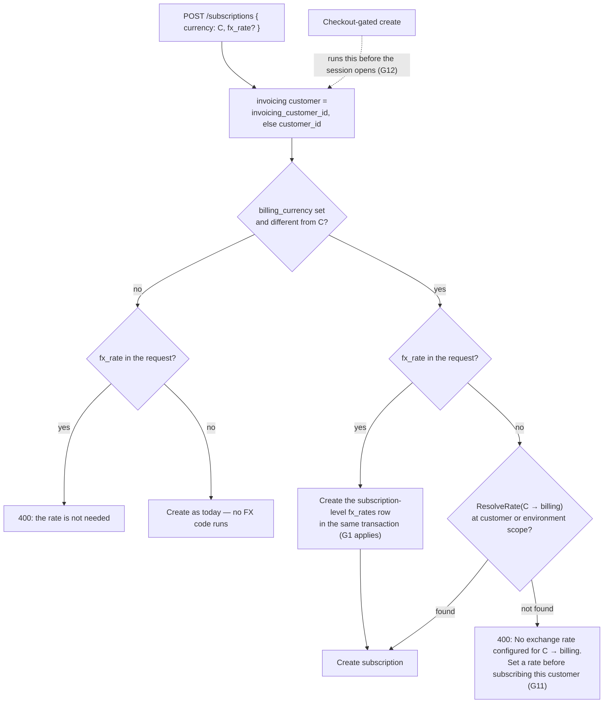
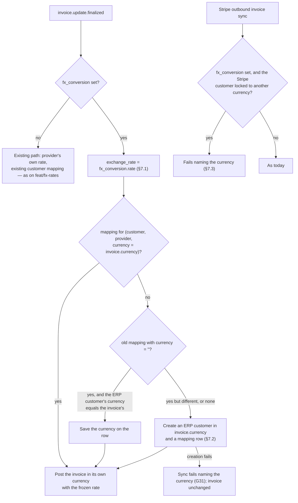

# Adaptive Multi-Currency — Phase 1: Billing Currency and FX Conversion — ERD

Status: **Proposed**
Date: 2026-09-26
Issue: FLE-1383
PRD: [`docs/prds/adaptive-multi-currency-prd.md`](../prds/adaptive-multi-currency-prd.md)
Phase 2: [`2026-09-26-FLE-1383-adaptive-multi-currency-phase2-erd.md`](2026-09-26-FLE-1383-adaptive-multi-currency-phase2-erd.md)

---

## 1. Summary

A customer can have a **billing currency**. Every invoice for that customer is issued in it.

A subscription keeps its own currency, the **charge currency**. Its invoice is built in the charge
currency exactly as today. At finalization, if the billing currency is different, the invoice is
converted once using a rate the tenant configured. The rate is saved on the invoice and never
changes after that.

Plans, prices, subscriptions, wallets, usage and entitlements stay in the charge currency.

**Schema changes**

| Change | Type |
| --- | --- |
| `customers.billing_currency` | New nullable column |
| `fx_rates` | New table |
| `invoices.fx_conversion` | New nullable jsonb |
| `invoice_line_items.fx_conversion` | New nullable jsonb. Optional, see §2.4 and open question 2 |
| `entity_integration_mappings.currency` | New column, default `''` |

**Code changes:** one new step in invoice finalization (§4.2), a rate lookup (§3), guardrails (§5),
new APIs (§6) and one change in ERP sync (§7).

### 1.1 Existing customers are not affected

| Customer | Result | FX code that runs |
| --- | --- | --- |
| No billing currency. This is every customer today | Same as today | None. Finalize reads the customer, finds no billing currency and continues on the existing path |
| Billing currency equals the subscription currency | Same as today | None. Same read, the currencies match |
| Billing currency differs from the subscription currency | Invoice converted at finalization | Rate lookup and conversion |

Conversion starts only when someone sets a billing currency on a customer and it differs from the
currency they are charged in. §1.4 lists every code path this design touches and shows that none
of them behave differently for the first two rows.

### 1.2 Phasing

- **Phase 1:** convert invoices. Every prepaid wallet flow stays as it is.
- **Phase 2:** let money cross the rate through a wallet: top-ups, refunds to a wallet, cash
  refunds of credits.

**Why Phase 1 needs no wallet changes.** Prepaid credits are already applied to an invoice in the
charge currency, before any total is computed
([invoice.go:1121-1141](../../internal/ee/service/invoice.go#L1121)). In this design the draft stays
in the charge currency and conversion runs after that step. So credits are used first, in USD, and
only the remaining USD amount is converted. That is what the PRD asks for, and it needs no new
wallet code.

The new work is money that is paid in one currency and lands in a wallet of another:

| Money movement | Phase |
| --- | --- |
| Prepaid credits reduce a cycle invoice (USD wallet, USD usage) | 1. No change |
| Downgrade or cancellation credit added to the wallet in the charge currency | 1. No change |
| Plan and addon credit grants | 1. No change |
| Customer pays INR to top up a USD wallet | 2 |
| Refund credit note paid into a wallet on an INR invoice | 2 |
| Cash refund of unused credits, purchased or granted | 2 |
| Wallet balance shown in the billing currency | 2 |
| Prepaid balance moved into a postpaid wallet in another currency | 2 |

Phase 1 adds two guards so the Phase 2 movements cannot happen early. G24 blocks cross-currency
top-ups. G30 blocks refund-to-wallet on a converted invoice. Phase 2 removes both.

**Stricter option.** If the team wants customers billed in another currency to have no prepaid
wallet at all, add one guard (G24b): reject creating or using a `PRE_PAID` wallet whose currency
differs from the billing currency. The cost is that such customers cannot receive credit grants,
an immediate downgrade with a credit must wait for period end, and credit notes cannot refund to a
wallet. We do not recommend it, because applying credits before conversion already keeps wallets
safe.

**Is phasing required?** No. Phase 2 does not change the invoice schema or the finalize step. The
split lowers release risk: Phase 2 is the first release where a customer's wallet and their
payment are in different currencies, so it gets its own test pass and release note.

### 1.3 Out of scope

- Live market rates.
- Deriving an `inr → usd` rate from a `usd → inr` rate.
- Paying an invoice in a currency other than the invoice's.
- Changing a finalized invoice.
- Changing a subscription's charge currency.
- A separate tax reference rate (open question 1).

### 1.4 Impact on existing flows

Every code path this design touches, when the new behaviour runs, and what a customer with no
billing currency sees. Rule for implementation: nothing below may change behaviour when
`billing_currency` is NULL. Tests T15 and T45 to T48 check this.

| Code path | New behaviour runs when | Customer with no billing currency |
| --- | --- | --- |
| `performFinalizeInvoiceActions`, step 4 | Billing currency is set and differs from `inv.Currency` | One cached customer read, then the existing path. No `fx_rates` query |
| `RecalculateTaxesOnInvoice` (G21) | `fx_conversion` is set | Unchanged. Runs for subscription invoices only |
| `CreateComputedDraftInvoice` (checkout) | Same as step 4 | Unchanged |
| `CreateInvoice`, one-off (G17, G22) | Billing currency is set and differs from `req.Currency` | Unchanged |
| `validateInvoicePaymentEligibility` (G17) | Draft not yet converted, and billing currency differs from its currency | Unchanged |
| `createSubscription` (G11), checkout create (G12) | Invoicing customer's billing currency differs from `req.Currency` | Unchanged. An `fx_rate` in the request is rejected |
| `CustomerService.Create/Update` (G6 to G9) | Request contains `billing_currency` | Unchanged |
| `CreateWallet` (G23) | `POST_PAID` wallet and billing currency is set | Unchanged |
| `TopUpWallet` purchase, auto top-up (G24) | `PRE_PAID` wallet, billing currency set and different from the wallet's | Unchanged |
| Void (G25) | `fx_conversion` is set | Unchanged. One amount in `inv.Currency` |
| `FinalizeCreditNote`, wallet target (G30) | `fx_conversion` is set | Unchanged |
| Grouped-invoice merge (G20) | Invoicing customer has a billing currency | Unchanged |
| Zoho / QuickBooks rate (§7.1) | `fx_conversion` is set | Provider's rate, as on `feat/fx-rates` |
| Per-currency ERP customer (§7.2) | `fx_conversion` is set | Existing mapping, as today |
| Stripe outbound invoice sync (§7.3) | `fx_conversion` is set | Unchanged |
| Invoice, subscription, customer responses | Always. New fields only | `fx_conversion: null`, `billing: null`, `billing_currency: null` |
| `billing_currency_estimate` on drafts and previews | Billing currency set and different from the draft's | Not returned |
| Repositories | Always. New columns | NULL is saved and read back. `Update` never clears the field |
| `fx_rates` APIs, RBAC entity, webhooks | Only when called | Nothing calls them |
| Migration | Once | Additive columns and one index swap. No backfill. No existing row rewritten |

Two existing behaviours this work does **not** change:

- The case-sensitive currency check at
  [payment_processor.go:739](../../internal/ee/service/payment_processor.go#L739). Fixing it would
  change behaviour for existing customers, so it is a separate cleanup.
- Whether a grouped-invoicing parent can have children in different currencies today. G20 applies
  only when the invoicing customer has a billing currency.

---

## 2. Data model

### 2.1 ERD



### 2.2 `customers.billing_currency`

```go
// ent/schema/customer.go
field.String("billing_currency").
    SchemaType(map[string]string{"postgres": "varchar(10)"}).
    Optional().
    Nillable().
    Comment("currency this customer is invoiced in; null means invoices follow the charge currency"),
```

- Nullable. Only the API or UI sets it. The system never fills it in, and there is no backfill.
- `varchar(10)` and lowercased on write, like the other currency columns.
- It is read from the customer being invoiced, `invoice.customer_id`. For a child subscription
  billed to a parent, the parent's billing currency applies and the parent's customer-level rates
  are used. The child's own `billing_currency` is ignored.

### 2.3 `fx_rates`

```go
// ent/schema/fxrate.go

var (
    Idx_fx_rate_live_key = "idx_fx_rate_live_key"
    Idx_fx_rate_pair     = "idx_fx_rate_pair"
)

// BaseMixin gives tenant_id and status; EnvironmentMixin gives environment_id.
func (FXRate) Mixin() []ent.Mixin {
    return []ent.Mixin{baseMixin.BaseMixin{}, baseMixin.EnvironmentMixin{}}
}

func (FXRate) Fields() []ent.Field {
    return []ent.Field{
        field.String("id").SchemaType(pg("varchar(50)")).Unique().Immutable(),

        field.String("scope").
            GoType(types.FXRateScope("")).
            SchemaType(pg("varchar(20)")).NotEmpty().Immutable(),
        // customer_id, subscription_id, or environment_id for scope=environment. Never empty.
        field.String("scope_id").SchemaType(pg("varchar(50)")).NotEmpty().Immutable(),

        field.String("from_currency").SchemaType(pg("varchar(10)")).NotEmpty().Immutable(),
        field.String("to_currency").SchemaType(pg("varchar(10)")).NotEmpty().Immutable(),

        // to_currency units per 1 from_currency unit. A change is a new row.
        field.Other("rate", decimal.Decimal{}).SchemaType(pg("numeric(24,12)")).Immutable(),

        // Set on the old row when a new rate replaces it.
        field.String("superseded_by_id").SchemaType(pg("varchar(50)")).Optional().Nillable(),

        field.JSON("metadata", map[string]string{}).Optional().SchemaType(pg("jsonb")),
    }
}

func (FXRate) Indexes() []ent.Index {
    return []ent.Index{
        // one live rate per (environment, scope, scope_id, pair)
        index.Fields("tenant_id", "environment_id", "scope", "scope_id", "from_currency", "to_currency").
            Unique().
            StorageKey(Idx_fx_rate_live_key).
            Annotations(entsql.IndexWhere("((status)::text = 'published'::text)")),
        index.Fields("tenant_id", "environment_id", "from_currency", "to_currency", "status").
            StorageKey(Idx_fx_rate_pair),
    }
}
```

```go
// internal/types/fx_rate.go
type FXRateScope string

const (
    FXRateScopeEnvironment  FXRateScope = "environment"
    FXRateScopeCustomer     FXRateScope = "customer"
    FXRateScopeSubscription FXRateScope = "subscription"
)

// internal/types/uuid.go
UUID_PREFIX_FX_RATE = "fxr"
```

**Design choices**

| Choice | Reason |
| --- | --- |
| One table with three scopes | One lookup path, and the `resolve` API returns exactly what finalize uses. A tenant default in `settings` plus overrides in a table would need two lookups and a merge |
| No `effective_from` / `effective_to` | The PRD uses fixed rates. A rate is valid until it is replaced. History is in the archived rows and on each invoice. Date windows can be added later without changing the lookup |
| `rate` is never edited | `PUT` archives the old row and inserts a new one in one transaction, so we always know which rate was live at any time. A rate change cannot reach a finalized invoice, because each invoice keeps its own copy |
| `numeric(24,12)` | Must hold both 25,000 (USD→VND) and 0.00004 (VND→USD). Existing rate columns are too narrow |
| No live-rate or feed columns | Out of scope. A feed later is a change to the lookup, not to this table |
| Partial unique index on published rows | Exactly one live rate per scope and pair. Same pattern as `settings` |

### 2.4 `invoices.fx_conversion` and `invoice_line_items.fx_conversion`

```go
// internal/types/fx_conversion.go

// FXConversion is written once, when a charge-currency draft is converted into the
// billing currency. Source amounts are in ChargeCurrency and exclude tax.
type FXConversion struct {
    ChargeCurrency  string          `json:"charge_currency"`
    BillingCurrency string          `json:"billing_currency"`
    Rate            decimal.Decimal `json:"rate"`     // billing units per 1 charge unit
    RateID          string          `json:"rate_id"`  // fx_rates row used; copied, never re-read
    Scope           FXRateScope     `json:"scope"`    // scope the rate was found at
    ConvertedAt     time.Time       `json:"converted_at"`
    Source          FXSourceAmounts `json:"source"`
}

type FXSourceAmounts struct {
    Subtotal                   decimal.Decimal `json:"subtotal"`
    TotalDiscount              decimal.Decimal `json:"total_discount"`
    TotalPrepaidCreditsApplied decimal.Decimal `json:"total_prepaid_credits_applied"`
    Net                        decimal.Decimal `json:"net"` // subtotal − discount − credits, before tax
}

// Optional. See "Why two columns" below.
type FXLineConversion struct {
    ChargeCurrency              string          `json:"charge_currency"`
    Rate                        decimal.Decimal `json:"rate"`
    SourceAmount                decimal.Decimal `json:"source_amount"`
    SourceLineItemDiscount      decimal.Decimal `json:"source_line_item_discount"`
    SourceInvoiceLevelDiscount  decimal.Decimal `json:"source_invoice_level_discount"`
    SourcePrepaidCreditsApplied decimal.Decimal `json:"source_prepaid_credits_applied"`
    RoundingAdjustment          decimal.Decimal `json:"rounding_adjustment"` // usually 0
}
```

```go
// ent/schema/invoice.go, ent/schema/invoice_line_item.go
field.JSON("fx_conversion", &types.FXConversion{}).Optional().SchemaType(pg("jsonb")),
field.JSON("fx_conversion", &types.FXLineConversion{}).Optional().SchemaType(pg("jsonb")),
```

**Rules**

- NULL means the invoice was never converted. Every reader checks this first.
- Written once, at conversion, in the same transaction as the converted amounts.
- `invoice.currency` is the charge currency while the invoice is a draft and the billing currency
  after conversion. `fx_conversion.charge_currency` keeps the original.
- Source amounts exclude tax.

**Why two columns.** The invoice column is required. The line column is not.

| Reader | Uses the invoice column | Uses the line column |
| --- | --- | --- |
| Finalize retry check (G16) | Yes | No |
| Void: return prepaid credits in the charge currency (G25) | `source.total_prepaid_credits_applied` | No |
| ERP sync rate (§7) | `rate` | No |
| API, webhooks, PDF: "₹8,300 converted from $100 at 83" | Yes | Only to show each line's exact original amount |
| Credit note created from a USD amount (§4.5) | `rate` | No. The limit is checked on the INR line amount |
| Phase 2 top-up stamp and refunds | Yes | No |
| Which line absorbed the rounding difference | No | `rounding_adjustment` |

The line column only lets each line show its exact original amount. Without it, a line's original
amount can be shown as `amount ÷ rate`, which can be off by one unit of rounding on the line that
absorbed the difference, or when the rate is below 1. Keeping or dropping it is open question 2.

**Persistence.** The invoice and line repositories list columns by hand in `Create`,
`CreateWithLineItems` and `Update`, and the in-memory test stores copy fields one by one.
`custom_currency` was lost on write twice because of this
([tenant-custom-currency §4 step 3](2026-08-27-FLE-1201-tenant-custom-currency.md)). Add
`fx_conversion` in all of them, add a round-trip test, and make `Update` keep the value, never
clear it.

**Why a column and not a separate table.** Every reader reads the invoice. Nothing in the PRD
converts a payment or a usage record. The same shape is already used by `custom_currency`.

### 2.5 Relation to tenant custom currency

`invoices.custom_currency` (FLE-1201) converts a tenant-defined unit, for example `mac`, into fiat.
It is set when the draft is created, so the invoice is fiat for its whole life
([invoice.go:299-313](../../internal/ee/service/invoice.go#L299),
[:1086-1100](../../internal/ee/service/invoice.go#L1086)).

`fx_conversion` converts fiat to fiat, at finalization, and the invoice currency changes at that
moment. The two use separate columns and separate code. Merging FX into custom currency would make
every draft carry a live billing-currency amount recomputed on each compute, which the PRD avoids.

| Subscription currency | Customer billing currency | Draft currency | At finalize |
| --- | --- | --- | --- |
| `usd` | none or `usd` | `usd` | As today |
| `usd` | `inr` | `usd` | FX `usd → inr` |
| `mac` (custom) | none | `default_fiat_currency` (`usd`), `custom_currency` set | Custom rate frozen. No FX |
| `mac` (custom) | `inr` | `usd`, `custom_currency` set | Custom rate `mac → usd` frozen, **then** FX `usd → inr` |

The last row is two steps, each saved on its own object. No custom-currency code changes. No tenant
uses this combination today.

### 2.6 `entity_integration_mappings.currency`

Zoho and QuickBooks lock a customer to one currency once it has transactions. Today the mapping
allows one ERP customer per Flexprice customer per provider
([entityintegrationmapping.go:71-74](../../ent/schema/entityintegrationmapping.go#L71)). A customer
whose billing currency changes needs a second ERP customer for the new currency.

```go
field.String("currency").
    SchemaType(pg("varchar(10)")).
    Default("").
    Immutable().
    Comment("currency the provider entity is bound to; empty for entities without a currency and for rows created before FLE-1383"),
```

- The unique index gains `currency`.
- Invoice, plan and price mappings store `''`.
- New customer mappings store the currency they were created for.
- Old customer mappings keep `''` and are handled in §7.2.

---

## 3. Rate lookup

```
ResolveRate(ctx, from, to, subscriptionID, customerID) → (rate, rateID, scope) | ErrNotFound

1. from equals to            → rate 1. No query, nothing saved.

2. Check each scope in order: subscription, customer, environment.
   Skip the subscription scope when there is no subscription (one-off invoices).
       SELECT … FROM fx_rates
        WHERE tenant_id = ctx.TenantID AND environment_id = ctx.EnvironmentID
          AND scope = <scope> AND scope_id = <id for that scope>
          AND from_currency = from AND to_currency = to
          AND status = 'published'
        LIMIT 1                                        -- Idx_fx_rate_live_key
   The first match wins.

3. No match → ierr.NewErrorf("no FX rate configured for %s → %s", from, to).
       WithHintf("Set a rate for %s → %s at the subscription, customer or environment level").
       WithReportableDetails({from, to, scopes_tried: [...ids]}).
       Mark(ierr.ErrNotFound)
```



**Rules**

- At most three indexed lookups. The unique index allows one live row per key, so there is no
  tie-break.
- No reverse lookup. A `usd → inr` rate is never used for `inr → usd`. The error names the
  missing direction.
- Rates are looked up when converting, never copied onto customers or subscriptions. Replacing the
  environment rate changes the next invoice of every customer that has no override. The tax engine
  copies at creation; we deliberately do not.
- No cache.
- `GET /v1/fx-rates/resolve` calls the same function, so a preview always matches the invoice.

---

## 4. Invoice lifecycle

The left side is today's code on charge-currency amounts. The right side is today's code on a
billing-currency invoice. The new parts are the check, the rate lookup and the conversion.



### 4.1 Draft: no change

Every draft is created in the currency its caller passes, as today:

| Entry point | Currency passed | Where |
| --- | --- | --- |
| Subscription billing cycle | `sub.Currency` | [`CreateDraftInvoiceForSubscription`, invoice.go:411-438](../../internal/ee/service/invoice.go#L411) |
| Subscription create or renew, opening invoice | `subscription.Currency` | [invoice.go:2248-2276](../../internal/ee/service/invoice.go#L2248) |
| One-off / API | `req.Currency` | [`CreateInvoice`, invoice.go:346-389](../../internal/ee/service/invoice.go#L346) |
| Wallet top-up | `w.Currency` | [wallet.go:1158-1202](../../internal/ee/service/wallet.go#L1158) |
| Plan change settlement, net charge | `sub.Currency` | [`buildNettedProrationInvoiceRequest`, line_item_proration.go:378-409](../../internal/ee/service/line_item_proration.go#L378) |
| Old plan's usage on plan change | `currentSub.Currency` | [subscription_change_v2.go:1141-1178](../../internal/ee/service/subscription_change_v2.go#L1141) |
| Quantity change proration | `sub.Currency` | [subscription_modification_quantity.go:1018-1052](../../internal/ee/service/subscription_modification_quantity.go#L1018) |

Compute, recompute, coupons, line reconciliation, previews and wallet balance reads all work on
charge-currency amounts and are not changed. A draft has `currency` = charge currency and
`fx_conversion` = NULL.

The API can show a billing-currency estimate on a draft (§6.3). It is calculated on read and never
saved.

### 4.2 Finalization: one new step

In `performFinalizeInvoiceActions`
([invoice.go:1057-1216](../../internal/ee/service/invoice.go#L1057)), which already holds the row
lock:

```
1.  Checkout gate; invoice is still DRAFT                         existing
2.  Freeze the custom-currency rate                               existing
3.  Subscription invoices: apply prepaid credits (wallet debit),  existing, charge currency
    Total = Subtotal − Discount − Credits
── NEW ──────────────────────────────────────────────────────────────────────────
4.  billing := CustomerRepo.Get(inv.CustomerID).BillingCurrency    -- cached in Redis, cleared on update
                                                                     -- customer not found → "" and an Info log (F12)
    if billing is empty, or equals inv.Currency   → go to 7        (F1, F2)
    if inv.FXConversion is already set            → go to 7        (F8: checkout draft, or a retry)
5.  rate := ResolveRate(inv.Currency → billing, inv.SubscriptionID, inv.CustomerID)
    error → mark ierr.ErrInvalidOperation and return. Nothing is written.
            The invoice stays DRAFT.                               (F3, G15)
    check inv.AmountPaid is zero                                   (G17)
6.  ConvertInvoice(inv, lines, rate)                               (§4.3)
    → inv.Currency = billing; all amounts and lines rewritten; fx_conversion saved
── END NEW ──────────────────────────────────────────────────────────────────────
7.  AmountRemaining = AmountDue − AmountPaid; save invoice and lines  existing
8.  RecalculateTaxesOnInvoice                                      existing. Now also runs for any
                                                                   invoice with fx_conversion, not only
                                                                   subscription invoices
9.  Invoice number; zero-total shortcut; auto_completed;           existing
    FINALIZED; publish invoice.update.finalized
```

**Why this order**

- **After prepaid credits and discounts.** They are applied in the charge currency, and only the
  remainder is converted, as the PRD requires. One-off invoices apply credits and coupons at compute
  time instead
  ([`applyCreditsAndCouponsToInvoice`, invoice.go:4877-4917](../../internal/ee/service/invoice.go#L4877)),
  which is also before conversion.
- **Before tax.** Tax is calculated on billing-currency amounts. An INR GST invoice must show INR
  tax, and the `tax_applied` rows sent to the ERPs must be in INR. One-off invoices calculate tax at
  draft time in the charge currency; step 8 recalculates it in the billing currency.
- So the saved source amounts exclude tax, and `source.net` is the taxable base.

**Checkout (pay-first) drafts**

- The customer pays before the invoice is finalized, so the payment link must already be in the
  billing currency.
- `CreateComputedDraftInvoice` runs steps 4 to 6 when the checkout session is created and saves
  `fx_conversion`.
- At finalize, step 4 sees `fx_conversion` and skips conversion.
- The rate is fixed when the customer sees the price. The draft cannot be recomputed or edited after
  that (G18).

**Retries.** Steps 4 to 6 are safe to retry. `fx_conversion` is saved in the same transaction as the
amounts, and step 4 skips conversion when it is already set.

### 4.3 `ConvertInvoice`

```go
// internal/ee/service/fx_convert.go
func ConvertInvoice(inv *invoice.Invoice, lines []*invoice.InvoiceLineItem, r ResolvedRate) error
```

```
conv(x)  = RoundToCurrencyPrecision(x × r.Rate, billing)

for each line:
    amount_b        = conv(amount_c)
    line_disc_b     = conv(line_item_discount_c)
    inv_disc_b      = conv(invoice_level_discount_c)
    prepaid_b       = conv(prepaid_credits_applied_c)
    line_net_b      = amount_b − line_disc_b − inv_disc_b − prepaid_b

net_c     = subtotal_c − total_discount_c − total_prepaid_credits_applied_c
net_b     = conv(net_c)                  ← source of truth: what the customer owes before tax
residual  = net_b − Σ line_net_b
if residual ≠ 0: add it to amount_b of the line with the largest |line_net_b|
                 (record it as that line's rounding_adjustment)

subtotal_b                      = Σ amount_b
total_discount_b                = Σ (line_disc_b + inv_disc_b)
total_prepaid_credits_applied_b = Σ prepaid_b
→ subtotal_b − total_discount_b − total_prepaid_credits_applied_b == net_b, exactly

total_b = net_b (tax is added in step 8); amount_due_b = total_b
if net_c ≠ 0 and net_b == 0 → ErrInternal "rate is too small for the billing currency's precision"   (F5)
```

**How rounding works**

- The net is converted once. That number is what the customer owes before tax.
- Each line is converted and rounded on its own. If the lines do not add up to the net, the
  difference goes to the largest line.
- The lines always add up to the total. The PDF, the portal and the ERPs all add up lines, so they
  always match the saved total.
- This is the same rule `calculateTaxBreakdown` already uses for tax.

**Example.** Three lines, `usd → jpy` at 149.37. JPY has no decimals.

| | Source | × 149.37 | Rounded |
| --- | --- | --- | --- |
| Line A | 33.33 | 4978.50 | 4979 |
| Line B | 33.33 | 4978.50 | 4979 |
| Line C | 33.34 | 4979.99 | 4980 |
| Sum of lines | 100.00 | | 14938 |
| **Net** | 100.00 | 14937.00 | **14937** |

The difference is −1, so line C becomes 4979. The lines now add up to 14937. For currencies with two
decimals the difference is usually zero, and at most ±0.01.

**What is converted**

| Field | Converted |
| --- | --- |
| `subtotal`, `total_discount`, `total_prepaid_credits_applied`, `total`, `amount_due` | Yes |
| Line `amount`, `line_item_discount`, `invoice_level_discount`, `prepaid_credits_applied` | Yes |
| `total_tax` | Recalculated in step 8 |
| `amount_paid`, `amount_remaining` | No. `amount_paid` must be 0 when converting (G17), so `amount_remaining` = `amount_due` after step 7 |
| `adjustment_amount`, `refunded_amount` | No. Zero on a draft, in the billing currency afterwards |
| Line `quantity` | No |
| Line `price_unit_amount` (price-unit feature) | No. It is in the price unit, not a currency |

### 4.4 After finalization

A converted invoice is a normal INR invoice. Code after finalization needs no FX logic:

| Flow | Behaviour | Why it already works |
| --- | --- | --- |
| Card or gateway payment | Charges INR | Payment currency must equal invoice currency, checked in three places ([payment.go:249](../../internal/ee/service/payment.go#L249), [payment_processor.go:641](../../internal/ee/service/payment_processor.go#L641), [:739](../../internal/ee/service/payment_processor.go#L739)) |
| `POST_PAID` wallet payment | Only an INR postpaid wallet can pay | `GetWalletsForPayment` matches `inv.Currency`. G23 keeps postpaid wallets in the billing currency |
| `PRE_PAID` wallet | Never pays invoices. Already applied in step 3 | `GetWalletsForPayment` only picks postpaid wallets |
| Balance of a USD prepaid wallet | Counts the draft while it is USD. Stops counting it once it is INR, by which time the wallet was already debited in step 3 | `GetUnpaidInvoicesToBePaid` matches `inv.Currency` |
| Adjustment and refund credit notes | INR, limited by INR amounts. See §4.5 | `Currency: inv.Currency` ([dto/creditnote.go:91](../../internal/api/dto/creditnote.go#L91)) |
| Refund to source | INR through the gateway. See §4.5 | `row.Currency = inv.Currency` |
| Void | Prepaid credits must go back in the charge currency (G25) | The only flow that needs a change |
| ERP sync | INR invoice with the frozen rate | §7 |
| Recalculating a finalized invoice | Voids it and creates a new charge-currency draft, which converts at its own finalize | [`RecalculateInvoice`, invoice.go:3883](../../internal/ee/service/invoice.go#L3883). `RecalculateInvoiceV2` works on drafts only |

A customer with USD and EUR subscriptions gets two INR invoices, each converted on its own. Never a
mixed-currency invoice.

### 4.5 Credit notes and refunds

- A credit note is always in its invoice's currency. A converted invoice is INR, so its credit notes
  are INR.
- The existing refund limits apply unchanged, in INR.
- No new columns on `credit_notes`, `credit_note_line_items` or `refunds`.
- Only one path converts: a refund into a prepaid wallet, in Phase 2.

| Path | Currency and limit | Rate used | Phase |
| --- | --- | --- | --- |
| Adjustment credit note (unpaid invoice) | INR. Reduces `amount_due`. Limit: `total − adjustment_amount − amount_paid` | None | 1, no change |
| Refund credit note, `BACK_TO_SOURCE` | INR rows against INR payments. Limit: `amount_paid − refunded_amount`. Gateway returns INR | None | 1, no change |
| Refund credit note, `PREPAID_WALLET` | Phase 1: rejected (G30). Phase 2: `amount ÷ rate`, credited to the charge-currency wallet | Rate looked up at refund time ([Phase 2 §4.2](2026-09-26-FLE-1383-adaptive-multi-currency-phase2-erd.md)) | 1 rejects, 2 allows |
| Gateway refund fails, falls back to a wallet | Phase 1: billing-currency wallet, as today. Phase 2: same conversion as the row above | Phase 2 §4.3 | 1 and 2 |
| Void | Paid part in INR to an INR wallet. Prepaid credits in the charge currency from `fx_conversion.source` (G25) | None. Uses saved amounts | 1 |



**Note on the PRD wording.** The PRD says a back-to-source refund uses "the rate resolved at refund
time". In this design a back-to-source refund needs no rate. The invoice, the payment and the credit
note are all in INR, and the gateway returns INR. Converting at a new rate could ask the gateway for
more than it captured, or return less than was paid. While rates are fixed, both readings give the
same numbers.

**Creating a credit note from a USD amount.** Support may think "refund one month, $100", while the
credit note is in INR.

- The credit note line request accepts an optional `source_amount`.
- The service converts it at the invoice's frozen rate, never a new rate, into the INR `amount`.
- That INR amount is saved and checked against the existing per-line limit.
- The credit note response includes the invoice's `fx_conversion`, read from the invoice, not saved
  again.
- Credit notes have no ERP sync or PDF today. If added, they use the invoice's frozen rate.

---

## 5. Guardrails

All checks run in the service layer. They return `ierr.ErrValidation`, or `ErrNotFound` for a
missing rate. The hint names the currency pair and the IDs involved.

### 5.1 Configuring rates

| # | Rule | Where |
| --- | --- | --- |
| G1 | Input checks: `from ≠ to`; `rate > 0`; both codes are valid. When custom currencies are configured, a custom code may be `from` but never `to`. `scope_id` must exist in this tenant and environment and be the right type. For `scope = subscription`, the subscription's currency must equal `from_currency` | `FXRateService.Create` |
| G2 | One live rate per scope and pair. A second `POST` returns `409` with the existing id. Use `PUT` to change a rate | `Idx_fx_rate_live_key`, plus a pre-check for a clear error |
| G3 | `PUT` never edits a rate. It archives the old row, sets `superseded_by_id`, and inserts the new one in one transaction. This applies even to rates never used | `FXRateService.Update` |
| G4 | `DELETE` is refused if any live subscription or open draft would be left with no rate for its pair. The error lists up to 20 of them. Add a replacement first. A rate that is overridden everywhere it applies can be deleted | `FXRateService.Delete`, using the same lookup with that row excluded |
| G5 | Rates never cross tenants or environments. A staging rate never applies in production | Mixins and query filters |

### 5.2 Setting or changing a billing currency

| # | Rule | Where |
| --- | --- | --- |
| G6 | Must be a valid currency code. If custom currencies are configured, it must be a fiat currency, not a custom code, because invoices are fiat | `CustomerService.Create/Update` |
| G7 | Before saving, check every active, trialing or paused subscription this customer pays for, as the subscriber or as the invoicing customer, whose currency differs from the new value. A rate must exist for each. Do the same for open drafts. If any are missing, reject and list every missing pair, for example *"No FX rate configured for USD → INR (subscription subs_…), EUR → INR (subscription subs_…)"* | `CustomerService.Update` |
| G8 | Reject if the customer has a `POST_PAID` wallet with a balance in another currency. That wallet could never pay an invoice again. Empty or close it first. `PRE_PAID` wallets are not checked; they stay in the charge currency | `CustomerService.Update` |
| G9 | Setting it back to null is allowed. Invoices return to the charge currency | — |
| G10 | The change applies to invoices finalized after it. Finalized invoices never change. Open drafts use the value at their own finalize | Only step 4 reads `billing_currency` |



### 5.3 Subscriptions

| # | Rule | Where |
| --- | --- | --- |
| G11 | **Create.** Find the invoicing customer (the customer, if there is none). If it has a billing currency different from the subscription currency, a rate must exist at customer or environment scope, or the request must include `fx_rate` (§6.2), which creates a subscription-level rate in the same transaction. Otherwise the subscription is not created: *"No exchange rate configured for USD → INR. Set a rate before subscribing this customer to a USD plan."* Placed next to the existing `EnforceCurrency` check ([subscription.go:123-130](../../internal/ee/service/subscription.go#L123)) | `createSubscription` |
| G12 | Checkout-gated creation runs G11 before the session opens, so a customer is never shown a price we cannot invoice | `CheckoutSessionService` |
| G13 | A subscription's currency cannot change ([subscription.go:57-62](../../ent/schema/subscription.go#L57)). Plan change v2 requires the target plan in the same currency. Plan change v1 creates a new subscription, so it goes through G11 | Existing |
| G14 | Plan change, addon attach and quantity change need no new check. Their invoices are charge-currency drafts that convert at finalize. G4 makes sure the rate still exists | Existing flow |



### 5.4 Invoices

| # | Rule | Where |
| --- | --- | --- |
| G15 | **No rate at finalize.** Finalize fails, the invoice stays `DRAFT`, nothing is written, and the error names the pair and the scopes checked. Never use a rate of 1 and never guess. Logged at `Error` with `invoice_id`, `from`, `to`. The error is marked `ErrInvalidOperation`, so `FinalizeInvoiceActivity` does not retry it ([invoice_activities.go:163-169](../../internal/temporal/activities/invoice/invoice_activities.go#L163)). The scheduled finalizer (`IsFinalizationDue`) picks the draft up again once a rate exists | Step 5 |
| G16 | **Convert once.** If `fx_conversion` is set, skip. It is saved under the row lock, in the same transaction as the amounts | Step 4 |
| G17 | **No payment before conversion.** `amount_paid` must be 0 when a draft converts. Two ways this could break, both blocked. (1) A one-off invoice created with `amount_paid > 0` or a paid status, for a customer whose billing currency differs, is rejected at creation. (2) A payment recorded against a draft. Today this is allowed: payment checks only look at paid, voided and currency ([payment.go:228-260](../../internal/ee/service/payment.go#L228)). It is now rejected when the draft is not yet converted and the customer's billing currency differs: *"Finalize the invoice first; it will be issued in INR."* Checkout drafts are already converted and take payment normally | `CreateInvoice`; `validateInvoicePaymentEligibility` |
| G18 | A converted checkout draft cannot be recomputed or edited (`RecalculateInvoiceV2`, manual line edits, `ComputeInvoice`). It can be voided | Those entry points, when `fx_conversion` is set |
| G19 | `ConvertInvoice` checks: `amount_paid` is 0; lines add up to the net; `subtotal − discount − credits = net`; a non-zero net never becomes zero (F5); an all-zero invoice, such as a trial start, converts to zeros | `ConvertInvoice` |
| G20 | **One charge currency per invoice.** The grouped-invoicing merge ([billing.go:1870-1900](../../internal/ee/service/billing.go#L1870)) adds every child's lines to the parent with no currency check. When the invoicing customer has a billing currency, a child in a different currency is left out of the parent invoice, logged, and billed on its own invoice. Groups of customers without a billing currency are not affected | Grouped-invoice merge |
| G21 | **Tax.** Tax is recalculated in the billing currency and replaces the charge-currency `tax_applied` rows. Tax associations are found by entity, not by currency ([`PrepareTaxRatesForInvoice`, tax.go:972](../../internal/ee/service/tax.go#L972)), and are percentages, so nothing needs converting. The currency passed in only sets the default inclusive or exclusive behaviour for associations without one ([invoice.go:4033-4041](../../internal/ee/service/invoice.go#L4033)). After conversion that is the billing currency. This is intended; do not change it back to the charge currency | Step 8 |
| G22 | **One-off invoice API.** The request currency is the charge currency. For a customer billed in INR, a USD request produces an INR invoice. The request cannot override the billing currency. One-off invoices finalize immediately, so a missing rate fails the create call | `CreateInvoice` |

### 5.5 Wallets (Phase 1)

| # | Rule | Where |
| --- | --- | --- |
| G23 | A `POST_PAID` wallet must be in the billing currency when one is set. It pays finalized invoices, and those are in the billing currency. Checked on wallet create, and by G8 when the billing currency changes | `CreateWallet` |
| G24 | **Phase 1 only.** A purchased top-up on a `PRE_PAID` wallet whose currency differs from the billing currency is rejected: *"Top-ups in a currency other than the billing currency arrive with Phase 2."* Free credits, credit grants, proration credits and refund fallbacks are not purchases and are allowed. Auto top-up checks the same condition and skips with an Info log instead of failing ([`triggerAutoTopup`, wallet.go:4235](../../internal/ee/service/wallet.go#L4235)). The low-balance alert still fires. Removed in Phase 2 | `TopUpWallet` purchase path ([wallet.go:1158](../../internal/ee/service/wallet.go#L1158)); `triggerAutoTopup` |
| G25 | **Void of a converted invoice** returns two amounts separately. The paid part (`amount_paid − refunded_amount`) goes back in the billing currency, as today. The prepaid credits go back in the charge currency to the wallet they came from, using `fx_conversion.source.total_prepaid_credits_applied`, never the INR amount divided by the rate. Today both go back as one amount in the invoice currency ([invoice.go:1444-1452](../../internal/ee/service/invoice.go#L1444)). This is the only flow after finalization that needs a change | `voidInvoice`; `PrepareRefundsForVoidedInvoice` takes a currency per row |
| G26 | Prepaid credits are applied before conversion (§4.2, step 3 runs before step 4). No wallet code converts anything in Phase 1 | Existing order |
| G27 | Proration and cancellation credits go to a `PRE_PAID` wallet in the subscription currency, as today ([wallet.go:3103](../../internal/ee/service/wallet.go#L3103)) | Existing |

### 5.6 Payments, credit notes, refunds

| # | Rule | Where |
| --- | --- | --- |
| G28 | Payment currency must equal invoice currency. No change. The check at [payment_processor.go:739](../../internal/ee/service/payment_processor.go#L739) is case-sensitive while the other two are not. We leave it; changing it would affect existing customers | Existing |
| G29 | Credit notes on a converted invoice are in the billing currency, with the existing limits. No change | Existing |
| G30 | **Phase 1 only.** A refund credit note with `refund_target = PREPAID_WALLET` on a converted invoice is rejected; use `BACK_TO_SOURCE`. Today it would create an INR wallet that the customer's USD usage can never draw from. Phase 2 sends it to the charge-currency wallet. If a gateway refund fails, the existing fallback to a billing-currency wallet stays, so money is never lost. Phase 2 changes the fallback too | `FinalizeCreditNote` |

### 5.7 Integrations

| # | Rule | Where |
| --- | --- | --- |
| G31 | An invoice syncs in its own currency with its frozen rate. Nothing converts during sync. The ERP customer must be in the invoice currency (§7.2). If it is not, and a new ERP customer in that currency cannot be created, the sync fails and names the currency | Zoho / QuickBooks invoice sync |

---

## 6. API

Same pattern as `/taxes/rates` ([router.go:527-545](../../internal/api/router.go#L527)): a
`v1Private` group, writes gated on a new `types.EntityFXRate`, and `@x-scope` on every handler.

### 6.1 FX rates

```
POST   /v1/fx-rates              create                                   write
GET    /v1/fx-rates              list — from, to, scope, scope_id, status read
POST   /v1/fx-rates/search       filter body, paginated                   read   (@x-scope "read")
GET    /v1/fx-rates/:id          get                                      read
PUT    /v1/fx-rates/:id          replace — archives :id, returns new row  write
DELETE /v1/fx-rates/:id          archive, checked by G4                   delete
GET    /v1/fx-rates/resolve      from, to, customer_id?, subscription_id? read
```

```jsonc
// POST /v1/fx-rates
{
  "scope": "customer",                 // environment | customer | subscription
  "scope_id": "cust_01J…",             // omitted for environment
  "from_currency": "usd",
  "to_currency": "inr",
  "rate": "83.000000",
  "metadata": { "source": "Q4 contract" }
}
// 201
{
  "id": "fxr_01J…", "scope": "customer", "scope_id": "cust_01J…",
  "from_currency": "usd", "to_currency": "inr", "rate": "83",
  "status": "published", "superseded_by_id": null,
  "created_at": "…", "updated_at": "…", "metadata": { … }
}

// PUT /v1/fx-rates/fxr_01J…   { "rate": "85" }
// 200 → the NEW row. The old row is archived with superseded_by_id set.

// GET /v1/fx-rates/resolve?from=usd&to=inr&customer_id=cust_01J…&subscription_id=subs_01J…
// 200
{ "rate": "83", "rate_id": "fxr_01J…", "scope": "customer", "from_currency": "usd", "to_currency": "inr" }
// 404
{ "error": "no FX rate configured for usd → inr",
  "hint": "Set a rate for usd → inr at the subscription, customer or environment level",
  "details": { "scopes_tried": ["subscription:subs_01J…", "customer:cust_01J…", "environment:env_01J…"] } }

// DELETE blocked by G4 → 409
{ "error": "fx rate fxr_01J… is still required",
  "details": { "dependants": [ { "subscription_id": "subs_01J…", "customer_id": "cust_01J…", "pair": "usd→inr" } ] } }
```

- `resolve` shows which rate a customer will actually get. It calls the same function as finalize.
- Webhooks: `fx_rate.created`, `fx_rate.updated` (the new row, with `supersedes`), `fx_rate.deleted`.
  Add them to `internal/types/webhook.go` with payload builders in
  `internal/webhook/payload/factory.go`.

### 6.2 Customers and subscriptions

```jsonc
// POST /v1/customers, PUT /v1/customers/:id — new optional field
{ "billing_currency": "inr" }            // null clears it (G9)
// Customer response
{ "id": "cust_…", "billing_currency": "inr", … }
// 400 from G7
{ "error": "billing currency cannot be set to inr",
  "hint": "No FX rate configured for usd → inr (subscription subs_01J…). Set a rate first.",
  "details": { "missing": [ { "from": "usd", "to": "inr", "subscription_id": "subs_01J…" } ] } }
```

```jsonc
// POST /v1/subscriptions — new optional field. Creates a subscription-level rate in the same transaction.
{ "customer_id": "cust_…", "plan_id": "plan_…", "currency": "usd",
  "fx_rate": { "rate": "84.5" } }   // from = subscription currency, to = customer's billing currency

// Subscription response: new block, calculated on read, not saved. Null when no conversion applies.
{ "id": "subs_…", "currency": "usd",
  "billing": { "billing_currency": "inr", "fx_rate": "84.5", "fx_rate_id": "fxr_…", "scope": "subscription" } }
```

- `fx_rate` on create exists because a subscription-level rate cannot be created before the
  subscription exists. It is rejected when the customer has no billing currency, or when the billing
  currency equals the subscription currency.
- The `billing` block needs a customer read and a rate lookup, so it is returned only on
  `GET /v1/subscriptions/:id`, not on list or search.
- When a customer or subscription is deleted, its scoped `fx_rates` rows are archived in the same
  operation.

### 6.3 Invoices

```jsonc
// GET /v1/invoices/:id — converted invoice
{
  "id": "inv_…", "currency": "inr", "subtotal": "8300.00", "total": "9794.00", "amount_due": "9794.00",
  "fx_conversion": {
    "charge_currency": "usd", "billing_currency": "inr", "rate": "83", "rate_id": "fxr_…",
    "scope": "customer", "converted_at": "2026-10-01T00:05:12Z",
    "source": { "subtotal": "100.00", "total_discount": "0", "total_prepaid_credits_applied": "0", "net": "100.00" }
  },
  "line_items": [
    { "amount": "8300.00", "currency": "inr",
      "fx_conversion": { "charge_currency": "usd", "rate": "83", "source_amount": "100.00", "rounding_adjustment": "0" } }
  ]
}

// GET /v1/invoices/:id — draft of a customer billed in another currency (nothing saved)
{ "id": "inv_…", "invoice_status": "DRAFT", "currency": "usd", "total": "100.00",
  "billing_currency_estimate": { "currency": "inr", "rate": "83", "total": "8300.00", "resolvable": true } }
// … or, when no rate exists:
{ "billing_currency_estimate": { "currency": "inr", "resolvable": false, "missing": { "from": "usd", "to": "inr" } } }
```

`billing_currency_estimate` lets the dashboard warn that a draft will fail to finalize. It is
returned only when the customer's billing currency differs from the draft's currency. The same
applies to `GetPreviewInvoice` ([invoice.go:2363](../../internal/ee/service/invoice.go#L2363)) and
subscription previews.

**Where the frozen rate is shown.** Every surface reads the same `fx_conversion`.

| Surface | Shows | How |
| --- | --- | --- |
| `GET /v1/invoices/:id`, list, search | `fx_conversion` on the invoice, and on each line if kept | `InvoiceResponse` and `InvoiceLineItemResponse` gain the field |
| Invoice webhooks: `invoice.update.finalized`, `invoice.update.payment`, `invoice.update.voided`, `invoice.update` | Same block | The payload builder wraps the `GetInvoice` response ([payload/invoice.go:27-72](../../internal/webhook/payload/invoice.go#L27)), so the new field appears with no builder change |
| Invoice PDF | The original amount and the rate, for example *"₹8,300.00 (converted from $100.00 at 83.00)"*, and a note naming the pair | `pdf.InvoiceData` ([domain/pdf/model.go:11](../../internal/domain/pdf/model.go#L11)) gains `ChargeCurrency`, `FXRate`, `SourceSubtotal`, `SourceNet`, filled where the builder maps totals ([invoice.go:3147-3186](../../internal/ee/service/invoice.go#L3147)). Shown only when `FXRate` is set |
| Customer portal | Same as the PDF | Reads the API |
| Zoho, QuickBooks | Invoice in its own currency with `exchange_rate` = the frozen rate | §7.1 |

The PDF line matters most for Phase 2 top-ups: an INR invoice that does not say "$300.00 of credits"
does not tell the customer what they bought.

The invoice list filter `currency` filters on the saved (billing) currency. A new filter
`charge_currency` reads `fx_conversion->>'charge_currency'`.

### 6.4 Permissions and MCP

Add `types.EntityFXRate` in [rbac.go:72-106](../../internal/types/rbac.go#L72). Roles use wildcards,
so `roles.json` does not change. `@x-scope "read"` on `search` and `resolve`, `"write"` on create
and update, `"delete"` on delete.

---

## 7. Integration sync



### 7.1 Send the frozen rate

- On `feat/fx-rates`, Zoho and QuickBooks already receive the invoice currency and a rate. The rate
  comes from the ERP itself (Zoho `settings/currencies`, QuickBooks `exchangerate`).
- After this change, a converted invoice sends its own frozen rate instead:

```
invoice.fx_conversion is set  → exchange_rate = fx_conversion.rate    (Zoho exchange_rate, QBO ExchangeRate)
otherwise                     → ERP's own rate, as today              (invoices never converted)
```

- One branch in `ResolveInvoiceCurrency` (Zoho) and one around `GetExchangeRate` (QuickBooks).
- The fallback is required. No invoice that exists today has `fx_conversion`.
- **Release note:** for converted invoices, the ERP ledger rate becomes the tenant's configured rate,
  not the ERP's market rate. A tenant who reconciles against the ERP's rate will see it change on the
  first converted invoice. The GST reference rate (open question 1) is the same topic on the tax side.

### 7.2 One ERP customer per currency

Both ERPs lock a customer to one currency once it has transactions. With `currency` on the mapping
(§2.6), invoice sync finds the ERP customer like this:

```
1. Mapping for (customer, provider, currency = invoice.currency)   → use it
2. Otherwise an old mapping with currency = ''                     → read the ERP customer's currency
       same as the invoice's → save the currency on the row, use it
       different             → go to 3
3. Otherwise create an ERP customer in invoice.currency and a mapping row with that currency
```

- Step 2 upgrades old rows as they are used and never posts to the wrong currency.
- The new ERP customer's name includes the currency, for example *"Acme Corp (INR)"*, so a
  bookkeeper can tell them apart.
- `GetOrCreateZohoCustomer` and `GetOrCreateQuickBooksCustomer` already take a currency on
  `feat/fx-rates`. The change is in the mapping lookup only.
- **This runs only for invoices with `fx_conversion`.** Other invoices find their ERP customer
  exactly as today. Customers who already bill in two currencies without this feature keep their
  current behaviour.

### 7.3 Stripe outbound invoice sync

- `SyncInvoiceToStripe` runs on `invoice.update.finalized` and creates the invoice in Stripe against
  the customer's Stripe id, in the line items' currency
  ([stripe/invoice_sync.go:49-140](../../internal/integration/stripe/invoice_sync.go#L49)).
- Stripe locks a customer to one currency once it has an invoice. A converted INR invoice for a
  customer whose Stripe invoices are in USD is rejected by Stripe.
- Phase 1 does not create per-currency Stripe customers. The sync fails and names the currency. The
  invoice is unchanged.
- Tenants using Stripe outbound sync should set a billing currency only on customers with no Stripe
  invoice history, until per-currency Stripe customers are added.
- No effect on invoices without `fx_conversion`.

---

## 8. Failure modes

| # | Situation | Result |
| --- | --- | --- |
| F1 | Billing currency equals charge currency | Skip. No rate, nothing saved |
| F2 | Customer has no billing currency | Skip. Invoice in the charge currency, as today |
| F3 | No rate at any scope at finalize | Finalize fails, draft stays, error names the pair and scopes, logged at `Error`. Rare after G4, G7 and G11, but this is the final check |
| F4 | No rate at subscription create, billing-currency change or one-off create | Rejected before anything is written, naming the pair |
| F5 | A non-zero net converts to zero | `ErrInternal`: the rate is too small for the billing currency's precision. Finalize fails |
| F6 | Rate replaced while a draft is open | The draft uses the rate that is live at its finalize. Checkout drafts keep the rate shown to the customer |
| F7 | Rate replaced after finalization | No effect. The invoice has its own copy |
| F8 | Finalize retried after conversion | `fx_conversion` is set, so it is reused. Never looked up or converted again |
| F9 | Void of a converted invoice | Prepaid credits returned in the charge currency from the saved amounts. Paid part in the billing currency (G25) |
| F10 | Finalized converted invoice recalculated | Voided (F9) and replaced by a new charge-currency draft that converts at its own finalize |
| F11 | ERP customer in another currency, and creating a new one fails | Sync fails, naming the currency. Invoice unchanged |
| F12 | Customer deleted after the draft was created | Treated as no billing currency, Info log, invoice finalizes in the charge currency |
| F13 | Payment recorded against a draft not yet converted, for a customer billed in another currency | Rejected before anything is written (G17). Finalize first, then pay in the billing currency |
| F14 | Stripe sync of a converted invoice for a Stripe customer locked to another currency | Sync fails naming the currency (§7.3). Nothing else changes |

---

## 9. Test plan

Extend `invoice_test.go`, `subscription_test.go`, `customer_test.go`, `wallet_test.go` and
`refund_test.go`. Add `fx_rate_test.go` and `fx_convert_test.go`.

**Rate lookup**

| # | Case | Expected |
| --- | --- | --- |
| T1 | `from == to` | Rate 1, no query |
| T2 | Environment rate only | Found at environment scope |
| T3 | Environment and customer rates | Customer rate wins |
| T4 | Environment, customer and subscription rates | Subscription rate wins |
| T5 | Only an archived row | Not found |
| T6 | Same tenant, other environment | Not found at any scope |
| T7 | Only the reverse pair exists | Not found. Error names the requested direction |
| T8 | No subscription id (one-off) | Subscription scope skipped, customer rate wins |

**Conversion**

| # | Case | Expected |
| --- | --- | --- |
| T9 | Lines add up exactly | No rounding adjustment |
| T10 | Difference of ±1 (JPY example) | Largest line absorbs it; all checks pass |
| T11 | Three-decimal currency (KWD) | Rounded to 3 decimals; all checks pass |
| T12 | Negative line (credit line on a settlement invoice) | Size used to pick the largest line; sign kept |
| T13 | Discounts and prepaid credits present | `subtotal − discount − credits == net` after conversion |
| T14 | Rate too small for the precision | `ErrInternal`, nothing written |

**Lifecycle**

| # | Case | Expected |
| --- | --- | --- |
| T15 | No billing currency | No `fx_rates` query (checked on the repo mock). Invoice unchanged |
| T16 | Billing currency equals charge currency | Same as T15 |
| T17 | Different billing currency, rate exists | Invoice in the billing currency, `fx_conversion` saved, tax in the billing currency |
| T18 | Different billing currency, no rate | Finalize fails, invoice still DRAFT, nothing partly written |
| T19 | Finalize retried after T17 | Same row, no second conversion (F8) |
| T20 | Checkout draft | Converted at session creation; finalize reuses it; recompute rejected (G18) |
| T21 | One-off with `amount_paid > 0`, customer billed in another currency | Rejected at creation (G17) |
| T22 | USD prepaid wallet, USD subscription, INR billing | Credits debited in USD at step 3; remainder converted; wallet balance = before − credits; wallet balance read is correct before and after finalize |
| T23 | Void of T22's invoice | USD credits back to the USD wallet from the saved amounts; paid INR to an INR wallet |
| T24 | Two subscriptions (USD, EUR), INR billing | Two INR invoices, each with its own `fx_conversion` |
| T25 | Custom-currency subscription (`mac`), INR billing | `custom_currency` frozen `mac → usd`, then `fx_conversion` `usd → inr` |
| T26 | Rate replaced between compute and finalize | Draft uses the new rate; a finalized invoice does not change |

**Guardrails**

| # | Case | Expected |
| --- | --- | --- |
| T27 | Subscription create, different currency, no rate | Rejected, pair named |
| T28 | Same with `fx_rate` in the request | Created; subscription-level rate exists |
| T29 | Set billing currency, an active subscription has no rate | Rejected, all missing pairs listed |
| T30 | Set billing currency, funded POST_PAID wallet in another currency | Rejected (G8) |
| T31 | Create POST_PAID wallet not in the billing currency | Rejected (G23) |
| T32 | Purchased top-up on a USD PRE_PAID wallet, INR billing | Rejected in Phase 1 (G24) |
| T33 | Refund credit note to a wallet on a converted invoice | Rejected in Phase 1 (G30); `BACK_TO_SOURCE` works in INR |
| T34 | Delete the only rate a live subscription needs | 409 listing the subscription (G4). Deleting an overridden rate works |
| T35 | `resolve` and finalize on the same data | Same rate and scope |
| T45 | Offline payment on a USD draft of a customer billed in INR | Rejected (G17). The same call for a customer with no billing currency works as today |
| T46 | Finalize with no rate, through `FinalizeInvoiceActivity` | Non-retryable error; invoice DRAFT; finalized by `IsFinalizationDue` after a rate is added |
| T47 | Auto top-up on a USD wallet of a customer billed in INR | Skipped with an Info log; alert still recorded; no error |
| T48 | Every row of §1.4 for a customer with no billing currency | No new branch runs, checked per row with a spy on `fx_rates` and the customer read |

**Credit notes**

| # | Case | Expected |
| --- | --- | --- |
| T40 | Adjustment credit note on a converted invoice | INR; `amount_due` reduced in INR; limit checked in INR |
| T41 | Refund credit note, `BACK_TO_SOURCE`, invoice paid ₹8,300 | One INR gateway row for ₹8,300; no rate looked up |
| T42 | Refund credit note with `source_amount: 50.00` on a line converted at 83 | Saved `amount` ₹4,150.00 from the frozen rate, even if the live rate is now 85 |
| T43 | `source_amount` larger than the line | Rejected by the existing per-line limit |
| T44 | Credit note response | Includes the invoice's `fx_conversion`; nothing new saved |

**Integration sync**

| # | Case | Expected |
| --- | --- | --- |
| T36 | Converted invoice → Zoho / QuickBooks | Invoice's rate sent, not the ERP's |
| T37 | Invoice never converted | ERP's rate, as today |
| T38 | Customer mapped in USD, INR invoice | New ERP customer created and mapped with `currency = inr` |
| T39 | Old mapping whose ERP currency matches the invoice | Currency saved on the row, mapping reused |

---

## 10. Migration and rollout

### 10.1 Migration

| Step | Change | Reversible |
| --- | --- | --- |
| 1 | `CREATE TABLE fx_rates` with `Idx_fx_rate_live_key` (partial, `status = 'published'`) and `Idx_fx_rate_pair` | Yes. Nothing reads it |
| 2 | `ALTER TABLE customers ADD COLUMN billing_currency varchar(10) NULL` | Yes. Nullable and unused until set |
| 3 | `ALTER TABLE invoices ADD COLUMN fx_conversion jsonb NULL`, same on `invoice_line_items` if kept | Yes |
| 4 | `ALTER TABLE entity_integration_mappings ADD COLUMN currency varchar(10) NOT NULL DEFAULT ''`, and recreate the unique index with it. Ent does not drop the old index, so write the drop by hand as `V5__settings_unique_published_only.up.sql` did | Yes |
| 5 | Deploy the code. Nothing changes for any customer until a `billing_currency` is set | Setting a billing currency is what changes that customer's next invoice |

- No backfill.
- Run `make generate-ent` and `make generate-migration`, then check the SQL is only additive
  statements and one index swap.
- Build the new unique index on `entity_integration_mappings` with
  `CREATE UNIQUE INDEX CONCURRENTLY` before dropping the old one.
- `ADD COLUMN … NULL` does not rewrite the table in Postgres, so nothing locks `customers` or
  `invoices` for long.

### 10.2 Phase 1 PRs, in order

1. **Types, schema, migration.** `FXRateScope`, `FXConversion`, `UUID_PREFIX_FX_RATE`,
   `EntityFXRate`; the schema changes; repository field lists and in-memory stores; round-trip
   tests. No behaviour change.
2. **FX rate service, repository, API.** CRUD, replace (G3), `resolve`, G1, G2, G4, G5, webhooks,
   RBAC.
3. **Customer billing currency.** DTO field, G6 to G9, `customer.updated` payload.
4. **Conversion.** `ConvertInvoice` and tests T9 to T14; finalize steps 4 to 6; step 8 change (G21);
   `billing_currency_estimate`; G15 to G19, G22.
5. **Subscription create check and inline rate.** G11, G12, `billing` block on the response.
6. **Checkout drafts.** Convert at session creation; G18.
7. **Wallet and refund guards.** G23, G24, G25, G30.
8. **Display.** PDF template and portal read `fx_conversion`.
9. **Integration sync.** Send the frozen rate; per-currency mapping (§7). Merge `feat/fx-rates`
   first, since this builds on it.
10. **SDKs and dashboard.** Run `make swagger` and `make sdk-all` after PRs 2, 3 and 4 so the SDKs
    and the MCP server include the new APIs and fields. Dashboard: rate list with a scope picker,
    `resolve` preview, billing-currency field that shows the G7 error as a list, and a draft banner
    from `billing_currency_estimate`.

PRs 1 to 3 can go to production before PR 4. They change nothing on their own and let tenants set up
rates early. PR 4 is the release.

---

## 11. Open questions

1. **Tax reference rate.** Indian GST may require the INR value on an invoice to use a government
   reference rate instead of the commercial rate. If so, `FXConversion` gets a `reference_rate`,
   step 8 uses it for the taxable base, and the commercial rate still sets `amount_due`. The schema
   allows it; the PDF layout would need a new line. Needs a finance contact at a launch customer
   before Phase 2.
2. **Keep the line-level `fx_conversion`?** No flow needs it (§2.4). It only lets each line show its
   exact original amount. Dropping it removes one jsonb column on `invoice_line_items`, the line
   repository changes and part of the round-trip tests. The rounding adjustment would then move to
   the invoice snapshot as `rounding_adjustment` and `rounding_line_item_id`, and line originals
   would be shown as `amount ÷ rate`. Recommendation: drop it, unless per-line exact originals are a
   product requirement.
3. **`auto_invoice_threshold`** is compared with unbilled usage in the charge currency, which is
   correct. Its API docs should say it is not in the billing currency.
4. **Gateway customers.** Razorpay and Stripe can take a payment in any supported currency. Stripe
   Billing customers lock their currency, but Flexprice, not Stripe Billing, drives payments for
   converted invoices. Confirm this for the checkout and saved-card flows.
5. **Analytics.** Revenue analytics add `TotalCost` across items without checking currency, and
   label the sum with the first subscription's currency. This feature neither fixes nor worsens that.
   A reporting currency using `fx_rates` is the later fix.
6. **Plan change v1 excess credit.** `OpeningInvoiceAdjustmentAmount` applies only to fixed lines and
   logs any excess ([billing.go:309-321](../../internal/ee/service/billing.go#L309)). This is not
   related to FX. Noted so it is not blamed on conversion.

---

## 12. References

| Topic | Location |
| --- | --- |
| Finalize path | [`performFinalizeInvoiceActions`, invoice.go:1057-1216](../../internal/ee/service/invoice.go#L1057) |
| Prepaid credits at finalize | [invoice.go:1121-1141](../../internal/ee/service/invoice.go#L1121); [`ApplyCreditsToInvoice`, credit_adjustment.go:207-345](../../internal/ee/service/credit_adjustment.go#L207); [`GetWalletsForCreditAdjustment`, wallet_payment.go:221-259](../../internal/ee/service/wallet_payment.go#L221) |
| Postpaid wallet payments | [`GetWalletsForPayment`, wallet_payment.go:124-218](../../internal/ee/service/wallet_payment.go#L124) |
| Draft creation | [`CreateEmptyDraftInvoice`, invoice.go:185-343](../../internal/ee/service/invoice.go#L185) |
| Checkout drafts | [`CreateComputedDraftInvoice`, invoice.go:391](../../internal/ee/service/invoice.go#L391) |
| Void refund amount | [invoice.go:1444-1452](../../internal/ee/service/invoice.go#L1444); [`PrepareRefundsForVoidedInvoice`, refund.go:84](../../internal/ee/service/refund.go#L84) |
| Refund to wallet or source | [refund.go:286-392](../../internal/ee/service/refund.go#L286); [`EnsurePrepaidWallet`, wallet.go:295](../../internal/ee/service/wallet.go#L295) |
| Proration credit wallet | [`TopUpWalletForProratedCharge`, wallet.go:3103-3210](../../internal/ee/service/wallet.go#L3103); [`Settle`, line_item_proration.go:280-347](../../internal/ee/service/line_item_proration.go#L280) |
| Subscription create checks | [`createSubscription`, subscription.go:74-140](../../internal/ee/service/subscription.go#L74) |
| Wallet balance | [`GetWalletBalance`, wallet.go:1697-1840](../../internal/ee/service/wallet.go#L1697); [`GetUnpaidInvoicesToBePaid`, invoice.go:2617-2708](../../internal/ee/service/invoice.go#L2617) |
| Custom currency | [`internal/types/custom_currency.go`](../../internal/types/custom_currency.go); [`model.go:302-398`](../../internal/domain/invoice/model.go#L302); [design](2026-08-27-FLE-1201-tenant-custom-currency.md) |
| Currency helpers | [`currency.go:85` `IsMatchingCurrency`, `:93` `ValidateCurrencyCode`, `:137` `RoundToCurrencyPrecision`](../../internal/types/currency.go#L85) |
| Partial unique index example | [`ent/schema/settings.go:59-61`](../../ent/schema/settings.go#L59); [`V5__settings_unique_published_only.up.sql`](../../migrations/postgres/V5__settings_unique_published_only.up.sql) |
| Router example | [router.go:527-545](../../internal/api/router.go#L527) |
| ERP mapping key | [entityintegrationmapping.go:71-76](../../ent/schema/entityintegrationmapping.go#L71) |
| Zoho / QuickBooks currency on `feat/fx-rates` | `zoho/client.go` `ResolveInvoiceCurrency`; `quickbooks/client.go` `GetExchangeRate`; `quickbooks/customer.go` `SyncCustomerToQuickBooks` |
| Refund ledger design | [refund-architecture-erd](2026-08-28-refund-architecture-erd.md) |
| Earlier dropped draft | `git show 855fd554c^:docs/design/2026-09-22-billing-currency-and-fx-conversion-erd.md` on `feat/fx-rates` |
