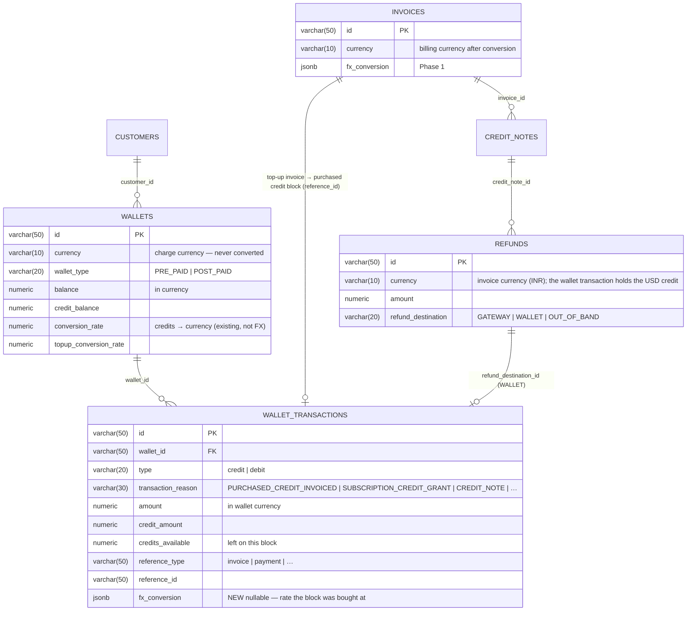
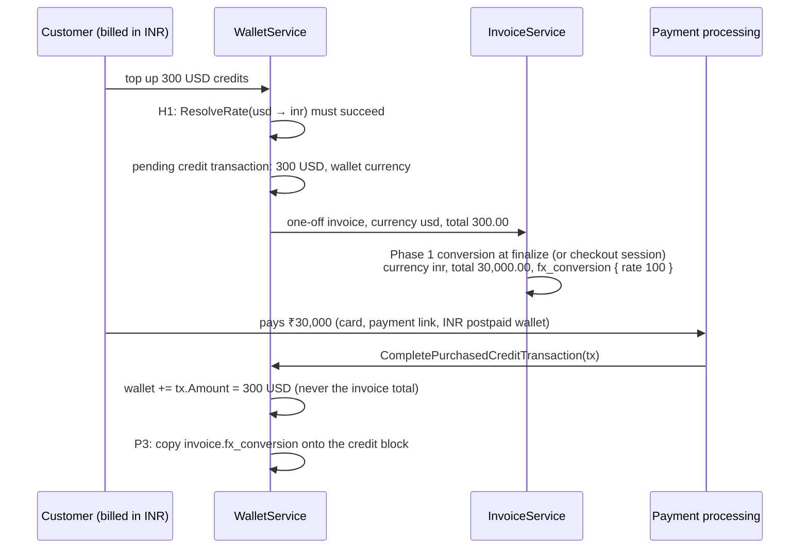
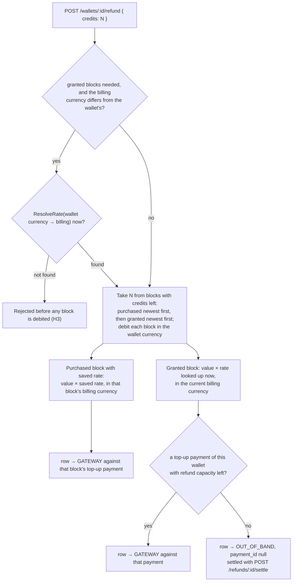
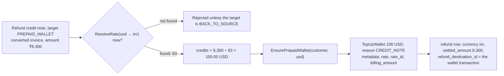
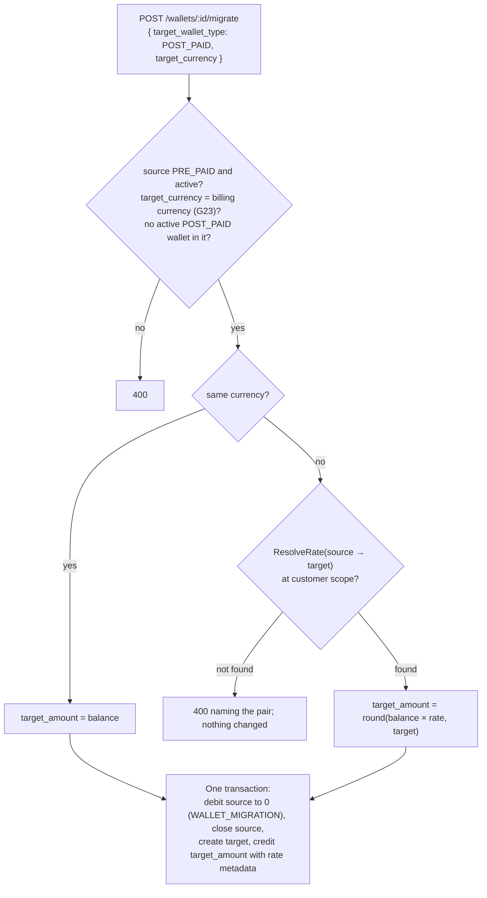

# Adaptive Multi-Currency — Phase 2: Prepaid Wallets Across the Rate — ERD

Status: **Proposed. Depends on Phase 1 being in production**
Date: 2026-09-26
Issue: FLE-1383
PRD: [`docs/prds/adaptive-multi-currency-prd.md`](../prds/adaptive-multi-currency-prd.md)
Phase 1: [`2026-09-26-FLE-1383-adaptive-multi-currency-phase1-erd.md`](2026-09-26-FLE-1383-adaptive-multi-currency-phase1-erd.md)

---

## 1. Summary

Phase 1 converts invoices and leaves every wallet flow unchanged. It adds two guards that stop money
from crossing the rate through a wallet: G24 and G30. Phase 2 removes those guards and lets a
customer billed in one currency buy, spend, get refunds for and see credits held in another.

| Capability | Phase 1 | Phase 2 |
| --- | --- | --- |
| Prepaid credits reduce a cycle invoice in the charge currency, before conversion | Works, no change | No change |
| Downgrade, cancellation and grant credits go to the charge-currency wallet | Works, no change | No change |
| Customer billed in INR buys credits for a USD wallet | Blocked (G24) | §3 |
| Rate saved on the purchased credit block | — | §2 |
| Cash refund of unused credits: purchased at the saved rate, granted at today's rate | — | §4.1 |
| Refund credit note paid into a wallet, on a converted invoice | Blocked (G30) | §4.2 |
| Failed gateway refund falls back to the charge-currency wallet | Falls back to a billing-currency wallet | §4.3 |
| Wallet balance shown in the billing currency | — | §5 |
| Prepaid balance moved into a postpaid wallet in another currency | — | §6 |

**Scope of change**

- One new jsonb column: `wallet_transactions.fx_conversion`.
- No change to `invoices`, `customers` or `fx_rates`, and no change to the finalize step.
- Two guards removed, one refund fallback rerouted, four service changes, three new endpoints.
- Every conversion uses the Phase 1 rate lookup. Where a rate is already frozen, the frozen value is
  used.

**Main rule: a wallet balance is never converted.** Credits go in and come out in the wallet's
currency. The rate applies to the money on the other side of the wallet, such as the top-up invoice
or the refund, and is saved next to it.

**Existing customers are not affected.** Every Phase 2 path runs only when `fx_conversion` is set,
or when a billing currency is set and differs from the wallet's currency. The refund and migrate
endpoints are new and only run when called. For a customer with no billing currency they use a rate
of 1 and change nothing else. See Phase 1 §1.4.

---

## 2. Data model

### 2.1 ERD



### 2.2 `wallet_transactions.fx_conversion`

```go
// ent/schema/wallettransaction.go
field.JSON("fx_conversion", &types.FXTopupConversion{}).Optional().SchemaType(pg("jsonb")),
```

```go
// internal/types/fx_conversion.go

// FXTopupConversion is saved on a purchased credit block whose top-up invoice was converted.
// The transaction's amounts stay in the wallet currency. This records what the customer
// paid and at what rate, for refunds.
type FXTopupConversion struct {
    BillingCurrency string          `json:"billing_currency"`
    Rate            decimal.Decimal `json:"rate"`        // billing units per 1 wallet-currency unit
    RateID          string          `json:"rate_id"`
    PaidAmount      decimal.Decimal `json:"paid_amount"` // in BillingCurrency, the top-up invoice net before tax
    InvoiceID       string          `json:"invoice_id"`
    ConvertedAt     time.Time       `json:"converted_at"`
}
```

- Saved once, when a purchased-credit transaction completes after its invoice is paid. It is a copy
  of the invoice's `fx_conversion`.
- NULL on every block not bought across a rate: granted credits, proration credits, and top-ups in
  the same currency. Refunds of those blocks use the rate looked up at refund time (§4.1).
- `wallet_transactions` already acts as the credit block. `credits_available`, `expiry_date` and
  `priority` live there, and debits consume blocks by expiry
  ([`docs/prds/debit-wallet.md`](../prds/debit-wallet.md)).
- Add the field to the repository `Create` and the in-memory store. `Update` never clears it.

---

## 3. Buying credits across the rate

### 3.1 How it works

A top-up already creates a one-off invoice in the wallet currency for
`credits × topup_conversion_rate`
([wallet.go:1158-1202](../../internal/ee/service/wallet.go#L1158)). The invoice is finalized
immediately, or held as a checkout draft for pay-first. When it is paid,
`CompletePurchasedCreditTransactionWithRetry` adds the credits to the wallet
([payment_processor.go:782-803](../../internal/ee/service/payment_processor.go#L782)).

With Phase 1 in place and G24 removed, this already gives the PRD's result:

```
Customer billed in INR buys 300 USD of credits. Rate 100.

1. Top-up invoice: currency usd, total 300.00                         existing
2. Finalize (or checkout session for pay-first):
       Phase 1 conversion → currency inr, total 30,000.00,
       fx_conversion { charge usd, rate 100, source.net 300.00 }       Phase 1
3. Customer pays ₹30,000 by card, payment link or INR postpaid wallet  existing
4. CompletePurchasedCreditTransaction adds 300 USD to the wallet       existing
5. NEW: copy the invoice's fx_conversion onto the credit block          Phase 2
```

The credits added in step 4 come from the pending transaction created in step 1.
`completePurchasedCreditTransaction` adds `tx.Amount` and `tx.CreditAmount`
([wallet.go:1296-1420](../../internal/ee/service/wallet.go#L1296)), never the invoice total. That is
why converting the invoice in step 2 does not change the credits. T2 tests this.



### 3.2 Changes

| # | Change | Where |
| --- | --- | --- |
| P1 | Remove G24 | `TopUpWallet` purchase path |
| P2 | A rate `wallet currency → billing currency` must exist when the top-up is requested. Otherwise reject and name the pair, before any pending transaction is written | `TopUpWallet` |
| P3 | Copy `fx_conversion` from the invoice onto the purchased credit block | `CompletePurchasedCreditTransaction` |
| P4 | The top-up response and the wallet transaction API include `fx_conversion` and the converted invoice total, so the caller sees both "300 USD credits" and "₹30,000 due" | DTOs |
| P5 | Auto top-up and saved-card top-up use the same path. Their cool-off and validation rules check the wallet, not the invoice currency, so they are unaffected | — |

**The rate is fixed when the customer sees the price.** It is frozen when the invoice converts: at
finalize for an immediate top-up, at session creation for pay-first. A rate change between seeing
₹30,000 and paying cannot change what the customer pays. This is the same rule as any invoice
(Phase 1 F6).

**Tax.** If tax applies, it is calculated on the converted amount (Phase 1 step 8), so the INR
invoice can total more than `credits × rate`. `paid_amount` on the block is the amount before tax,
which is the value of the credits.

---

## 4. Refunds

### 4.1 Cash refund of unused credits

**What exists today:** nothing refunds wallet credits as cash.

- `POST /v1/wallets/:id/terminate` debits the remaining balance as `WALLET_TERMINATION` and closes
  the wallet. No money is returned ([wallet.go:1845](../../internal/ee/service/wallet.go#L1845)).
- `POST /v1/wallets/:id/debit` is a manual debit with no money movement.
- The refund ledger only refunds invoice payments.
- `OUT_OF_BAND` exists as an enum value but nothing creates it
  ([refund-architecture-erd §8.3](2026-08-28-refund-architecture-erd.md)).

So this endpoint is new, for purchased and granted credits alike.

**Decision (2026-09-26): granted credits can be refunded as cash, at the rate looked up at refund
time.** The PRD says unused credits are refunded "at the rate the credits were bought at". Only
purchased credits have such a rate.

| Credit block | Rate used | Reason |
| --- | --- | --- |
| Purchased, with a saved rate (`PURCHASED_CREDIT_INVOICED`) | The block's `fx_conversion.rate` | The customer paid a known amount and gets that back |
| Purchased, no saved rate (same-currency top-up) | None. Refund in the wallet currency | Nothing was converted |
| Granted, proration, credit note, bonus | `ResolveRate(wallet currency → billing currency)` now, at customer or environment scope | Nobody paid for them, so there is no purchase rate. Today's configured rate is the value returned |

```
RefundCredits(wallet, credits):
  blocks := blocks with credits_available > 0,
            purchased first (newest first), then granted (newest first)
  if granted blocks are needed and the billing currency differs from the wallet's:
      rate_now := ResolveRate(wallet.currency → billing_currency)
      not found → reject, naming the pair, before any block is debited
  for each block until `credits` is covered:
      take   := min(block.credits_available, remaining)
      debit take from the block, in the wallet currency (reason WALLET_REFUND)
      value  := take × wallet.conversion_rate                               -- wallet currency
      owed   += purchased with saved rate : value × block.fx_conversion.rate   in the block's billing currency
                otherwise                  : value × rate_now                  in the current billing currency
                                              (rate_now = 1 when there is no billing currency
                                               or it equals the wallet's)
  → one refund row per block
```



**Where the money comes from.** Purchased blocks go first because they have a payment behind them.

| Refund row for | `payment_id` | Destination | How it settles |
| --- | --- | --- | --- |
| Purchased block | That block's top-up payment | `GATEWAY` | Like any refund row: gateway adapter, webhook, wallet fallback on failure |
| Granted block, while a top-up payment of this wallet still has refund capacity | That payment | `GATEWAY` | The gateway refunds against the payment |
| Granted block, no payment capacity left | `NULL` | `OUT_OF_BAND` | An operator sends the money and records it with `POST /v1/refunds/:id/settle { "reference": "…" }` |

- This follows the refund ledger's existing rule: spread across payments up to their capacity, then
  one row for the rest. The rest goes out of band instead of back to a wallet, because sending a
  wallet refund back to a wallet makes no sense.
- If a gateway refund row fails, it falls back to the wallet as today. The money stays with the
  customer.
- A purchased block paid in a currency other than the customer's current billing currency is refunded
  in the currency it was paid in. The saved `billing_currency` on the block covers this. Granted
  blocks are refunded in the current billing currency.
- Endpoint: `POST /v1/wallets/:id/refund` with `{ "credits": "200" }` or `{ "all": true }`. The
  response lists the refund rows with their block, rate and destination.
- The saved rate on blocks must ship first (§10, step 1). The endpoint can ship later.

### 4.2 Refund credit note into a wallet, on a converted invoice

Phase 1 rejects this (G30). Phase 2 handles it:

```
settleToWallet(row) on an invoice with fx_conversion:
  rate     := ResolveRate(fx.charge_currency → inv.currency, inv.subscription_id, inv.customer_id)
              the invoice's own pair, looked up now (PRD: "the rate resolved at refund time")
  credits  := RoundToCurrencyPrecision(row.amount ÷ rate, fx.charge_currency)
  wallet   := EnsurePrepaidWallet(inv.customer_id, fx.charge_currency)
  TopUpWallet(wallet, credits, reason CREDIT_NOTE, reference row)
  the refund row stays in the invoice currency; row.settled_amount = row.amount;
  refund_destination_id = the wallet transaction, whose metadata records { rate, rate_id, billing_amount }
```



- While rates stay fixed, the rate found equals the invoice's frozen rate, so the customer gets back
  exactly what they were billed in USD (₹8,300 ÷ 83 = $100).
- If the rate was replaced, the customer is refunded at today's rate. The PRD accepts this.
- If no rate exists, finalizing the credit note is rejected and names the pair, unless the target is
  `BACK_TO_SOURCE`. A refund never goes to a wallet in the wrong currency.
- We divide by the forward rate (`usd → inr`) instead of looking up `inr → usd`. The refund reverses
  the invoice's conversion, so it uses the same pair. A reverse lookup would force tenants to
  configure both directions, and the two rates might not match.

### 4.3 Failed gateway refund

`refundToWalletAsFallbackToFailure` writes a wallet row in the invoice currency. For a converted
invoice, Phase 2 sends it through §4.2 instead, so a failed INR gateway refund becomes USD credits
the customer can use, not an INR wallet they cannot. Same code, same rate rule.

### 4.4 Void

Handled in Phase 1 (G25): prepaid credits on a voided converted invoice go back in the charge
currency, from the saved amounts. No change in Phase 2. Listed here so all refund paths are in one
place.

---

## 5. Balance in the billing currency

Display only. `GET /v1/wallets/:id/balance/real-time` and the customer portal gain:

```jsonc
{ "wallet_id": "wallet_…", "currency": "usd", "real_time_balance": "212.40",
  "billing_currency_estimate": { "currency": "inr", "rate": "83", "balance": "17629.20", "resolvable": true } }
```

- Calculated on read: real-time balance × the rate for `wallet currency → billing currency` at
  customer or environment scope.
- Not returned when the customer has no billing currency, or it equals the wallet's.
- `resolvable: false` when no rate exists.
- Never saved and never used in any calculation.
- The wallet's `balance`, `credit_balance`, alerts and auto top-up thresholds stay in the wallet
  currency.

---

## 6. Moving a prepaid balance into a postpaid wallet

The PRD allows closing a prepaid wallet and moving its balance into a new postpaid wallet, converting
once if the currencies differ. No such operation exists today.

```
POST /v1/wallets/:id/migrate   { "target_wallet_type": "POST_PAID", "target_currency": "inr" }

1. Checks:
   - the source is PRE_PAID and active
   - target_currency equals the customer's billing currency (Phase 1 G23)
   - the customer has no active POST_PAID wallet in that currency (PRD: one per currency)
2. Same currency   → move the balance 1:1
   Different       → rate := ResolveRate(source currency → target_currency), customer scope
                     not found → reject, naming the pair
                     target_amount := RoundToCurrencyPrecision(balance × rate, target_currency)
3. In one transaction:
   - debit the source to zero with a new reason WALLET_MIGRATION
     (not WALLET_TERMINATION, so a move and a write-off look different in the ledger)
   - close the source, as TerminateWallet does
   - create the target and credit target_amount (reason WALLET_MIGRATION,
     metadata { source_wallet_id, rate, rate_id })
4. Saved rates on purchased blocks are not carried over. After the move, the balance is a postpaid
   balance in the billing currency and its refunds need no rate.
```



This is the only place in either phase where a wallet balance is converted. It is an explicit action
by an operator, recorded as a move between two wallets. No wallet is edited in place.

---

## 7. Guardrails

| # | Rule |
| --- | --- |
| H1 | A top-up whose invoice will convert needs a rate when it is requested (P2). No pending transaction is written otherwise |
| H2 | The rate on a purchased block is saved once, when the purchase completes, copied from the invoice. It is never recalculated or edited. A block without a saved rate uses the refund rules in §4.1 |
| H3 | Any block with credits left can be refunded as cash: purchased first at its saved rate, then granted at the rate looked up now. If granted credits need a rate and none exists, the refund is rejected before any block is debited. Rows with no payment capacity are `OUT_OF_BAND` and settle only through the settle endpoint |
| H4 | A refund credit note into a wallet, on a converted invoice, uses the invoice's pair looked up at refund time and divides by the forward rate. No rate means rejected, unless the target is `BACK_TO_SOURCE` |
| H5 | The failed-gateway fallback for a converted invoice goes to the charge-currency wallet through H4 |
| H6 | Migration targets the billing currency only, allows one active postpaid wallet per currency, needs a rate when the currencies differ, and closes the source fully in one transaction |
| H7 | `billing_currency_estimate` on a balance is calculated on read, never saved and never used in any calculation |
| H8 | Phase 1 G23 (postpaid wallets in the billing currency) and G25 (void returns prepaid credits in the charge currency) still apply |

**Small leftover amounts.** The PRD's "write off wallet dust" case does not come up here. Credits
reduce usage in the charge currency with no rate involved, and the only rounding from a rate happens
on the invoice, where Phase 1 `ConvertInvoice` absorbs it. Tiny wallet leftovers are handled by the
existing debit logic, unchanged.

---

## 8. API summary

```
Guard G24 removed                          buying credits for a wallet in another currency is allowed
POST    /v1/wallets/:id/top-up             response gains invoice.fx_conversion and the converted total
GET     /v1/wallets/:id/transactions       rows gain fx_conversion
GET     /v1/wallets/:id/balance/real-time  gains billing_currency_estimate
POST    /v1/wallets/:id/refund             NEW: cash refund of unused credits, purchased and granted (§4.1)
POST    /v1/refunds/:id/settle             NEW: mark an OUT_OF_BAND refund row as settled (§4.1)
POST    /v1/wallets/:id/migrate            NEW: prepaid to postpaid (§6)
POST    /v1/credit-notes … refund_target   PREPAID_WALLET accepted on converted invoices (§4.2)
```

Webhooks: `wallet.transaction.created` payloads include `fx_conversion`. `refund.created` and
`refund.succeeded` keep their shape. No new event types.

---

## 9. Test plan

| # | Case | Expected |
| --- | --- | --- |
| T1 | Customer billed in INR buys $300 for a USD wallet, rate 100 | INR invoice for ₹30,000 with `fx_conversion`; wallet +$300; block saved with `{rate 100, paid 30000, inr}` |
| T2 | Same, pay-first checkout | Payment link in INR for ₹30,000; rate fixed at session creation; wallet +$300 after payment |
| T3 | Same, no rate | Top-up rejected before any transaction is written (H1) |
| T4 | Same-currency top-up (INR wallet, INR billing) | No `fx_conversion`, no saved rate, unchanged path |
| T5 | $330 of usage against the $300 wallet at cycle end | $300 debited at finalize (Phase 1 step 3); $30 converts to ₹3,000; total paid ₹33,000 (PRD example) |
| T6 | Refund 200 of the 300 credits | ₹20,000 refund row against the top-up payment; wallet −$200 (PRD example) |
| T7 | Two purchases at rates 100 and 110, refund covers both | Newest block at 110, the rest at 100; two refund rows |
| T8 | Granted block only, current rate 83, a top-up payment with capacity exists | INR value at 83 as a `GATEWAY` row against that payment |
| T8b | Granted block only, no top-up payment | One `OUT_OF_BAND` row, `payment_id = NULL`, pending until settled |
| T8c | Granted block, no rate | Rejected before any debit |
| T8d | Purchased and granted blocks, refund covers both | Purchased first at its saved rate, granted at today's rate; two rows |
| T9 | Refund credit note into a wallet, ₹8,300 invoice frozen at 83, current rate 83 | $100 credited |
| T10 | Same, current rate replaced by 85 | ₹8,300 ÷ 85 credited; metadata records 85 |
| T11 | Same, no rate | Rejected unless `BACK_TO_SOURCE` |
| T12 | Gateway refund fails on a converted invoice | Fallback lands in the USD wallet at the §4.2 rate |
| T13 | Balance read, USD wallet, INR billing | Estimate equals balance × rate. Not returned when there is no billing currency or it matches |
| T14 | Move $212.40 prepaid into an INR postpaid wallet at 83 | Source closed at 0; target ₹17,629.20; one transaction. Rejected if an INR postpaid wallet already exists |
| T15 | Move with no rate | Rejected naming the pair; nothing changed |
| T16 | All Phase 1 tests | Still pass. Phase 2 must not touch the finalize path |

---

## 10. PRs, in order

1. **Saved rate on credit blocks.** Schema, types, repository, copy in
   `CompletePurchasedCreditTransaction`. Tests T1, T4.
2. **Remove G24, add H1.** Top-up rate check and response fields. Tests T2, T3, T5.
3. **Refund credit note into a wallet.** §4.2 and §4.3, remove G30. Tests T9 to T12.
4. **Balance estimate.** §5. Test T13.
5. **Cash refund of unused credits.** §4.1 endpoint. Tests T6 to T8d. Can ship later.
6. **Prepaid to postpaid move.** §6. Tests T14, T15. Can ship later.

**Release note for PR 2:** this is the first release where a customer's wallet and their payment
are in different currencies. Point confused customers to the top-up invoice line that reads
*"$300.00 of credits at 100.00"*.

---

## 11. Open questions

1. **Who can call the cash refund endpoint, and can gateways refund part of an old payment?**
   Razorpay and Chargebee have refund adapters. Stripe and Moyasar do not (refund ERD §8.7), so a
   refund there falls back to the wallet, which defeats the purpose of a cash refund. The endpoint
   may need to be limited to supported gateways at launch.
2. **Refunding granted credits against a purchase payment.** Decided: granted credits can be refunded
   at today's rate. The open part is accounting. A `GATEWAY` row for a granted block partly refunds a
   top-up payment whose purchased credits may already be used, so the books show "refunded ₹4,150 of
   top-up invoice X". If finance prefers to keep granted refunds off purchase payments, every granted
   refund goes `OUT_OF_BAND`. A `funding` flag on the endpoint (`topup_payments` or `out_of_band`)
   supports both. The default needs confirmation from the launch customer's finance contact.
3. **Estimate rate scope.** The balance estimate uses customer or environment scope, because a wallet
   is not tied to one subscription. A customer with only subscription-level rates sees an estimate at
   a different rate from their invoices. Acceptable for a display value; say so in the API docs.
