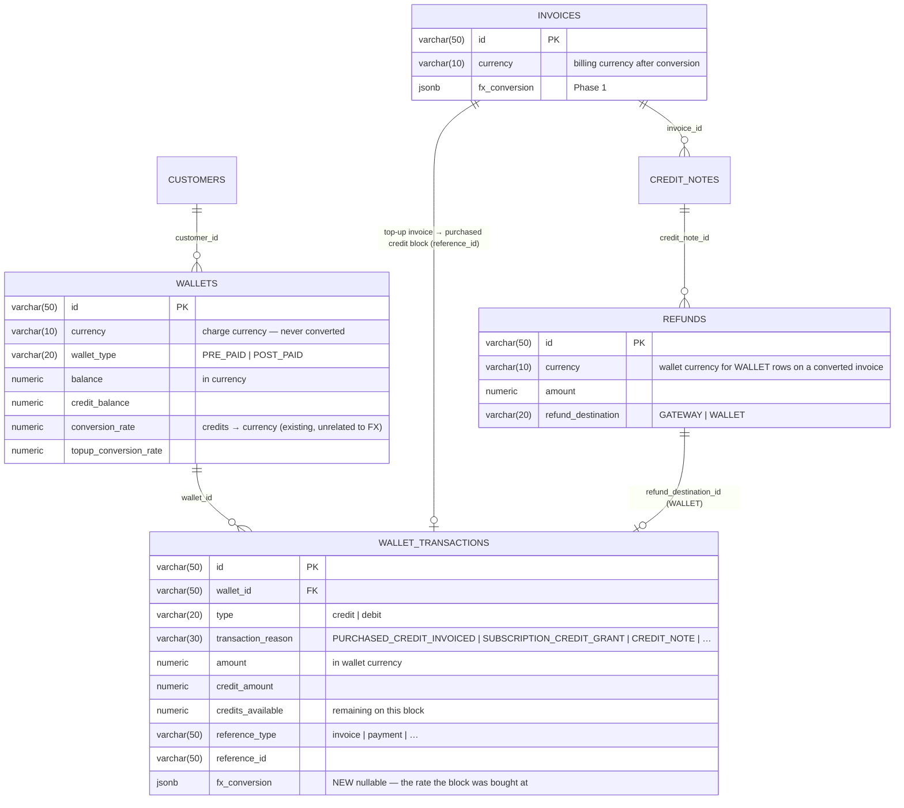

# Adaptive Multi-Currency — Phase 2: Prepaid Wallets Across the Rate — ERD

Status: **Proposed — depends on Phase 1 in production**
Date: 2026-09-26
Issue: FLE-1383
PRD: [`docs/prds/adaptive-multi-currency-prd.md`](../prds/adaptive-multi-currency-prd.md)
Phase 1: [`2026-09-26-FLE-1383-adaptive-multi-currency-phase1-erd.md`](2026-09-26-FLE-1383-adaptive-multi-currency-phase1-erd.md)

---

## 1. Scope

Phase 1 converts invoices and leaves every wallet path untouched, with two guards that stop money
from crossing the rate through a wallet (Phase 1 G24, G30). Phase 2 lifts those guards and adds the
four things that let a customer billed in one currency **buy, spend, be refunded for and see**
credits held in another:

| | Phase 1 | Phase 2 |
| --- | --- | --- |
| Prepaid credits offset a cycle invoice in the charge currency, before conversion | ✅ unchanged behaviour | unchanged |
| Downgrade / cancellation / grant credits land in the charge-currency wallet | ✅ unchanged behaviour | unchanged |
| Purchased top-up of a USD wallet by an INR-billed customer | ❌ G24 | ✅ §3 |
| Rate stamped on the purchased credit block | | ✅ §2 |
| Refund of unused credits — purchased at the stamped rate, granted at the rate resolved at refund time | | ✅ §4.1 |
| Refund credit note → wallet on a converted invoice | ❌ G30 | ✅ §4.2 |
| Gateway-failure refund fallback lands in the charge-currency wallet | billing-currency wallet | ✅ §4.3 |
| Balance shown in the billing currency | | ✅ §5 |
| Prepaid → postpaid migration with conversion | | ✅ §6 |

**No schema change on `invoices`, `customers` or `fx_rates`, and no change to the finalize step.**
Phase 2 is one jsonb column on `wallet_transactions`, one guard removed, one guard rerouted and
four service changes. Every conversion it performs uses the Phase 1 resolver and, where a rate has
already been frozen, the frozen value rather than a fresh resolution.

**The one invariant Phase 2 adds:** *a wallet balance is never touched by a rate.* Credits go in
and come out in the wallet's currency. The rate is applied to the money on the other side of the
wallet — the top-up invoice, the refund — and recorded next to it.

**Inertness.** Every Phase 2 path fires on `fx_conversion != nil` (stamp, credit-note wallet leg,
fallback reroute) or on a set billing currency that differs from the wallet's (H1, the balance
estimate). The two new endpoints — refund and migrate — are opt-in operations that do not exist
today; for a customer with no billing currency they run with a rate of 1 and change nothing else.
A customer with `billing_currency = NULL` sees no behaviour change from Phase 2, as from Phase 1
(Phase 1 §1.4).

---

## 2. Data model

### 2.1 ERD



### 2.2 `wallet_transactions.fx_conversion`

```go
// ent/schema/wallettransaction.go
field.JSON("fx_conversion", &types.FXTopupConversion{}).Optional().SchemaType(pg("jsonb")),
```

```go
// internal/types/fx_conversion.go
// FXTopupConversion is stamped on a purchased credit block whose top-up invoice was
// converted. Amount fields on the transaction stay in the wallet currency; this records
// what the customer paid and at what rate, for refunds.
type FXTopupConversion struct {
    BillingCurrency string          `json:"billing_currency"`
    Rate            decimal.Decimal `json:"rate"`             // billing units per 1 wallet-currency unit
    RateID          string          `json:"rate_id"`
    PaidAmount      decimal.Decimal `json:"paid_amount"`      // in BillingCurrency, = topup invoice total (pre-tax net)
    InvoiceID       string          `json:"invoice_id"`
    ConvertedAt     time.Time       `json:"converted_at"`
}
```

Written once, by the code that completes a purchased-credit transaction after its invoice is paid,
by copying the invoice's `fx_conversion`. It is NULL on every block that was not bought across a
rate — granted credits, proration credits, same-currency purchases. A refund of such a block has
no bought-at rate to honour, so it converts at the rate that resolves at refund time (§4.1). `wallet_transactions` is already the credit
block: `credits_available`, `expiry_date` and `priority` live there, and the expiry-aware debit
walks blocks ([`docs/prds/debit-wallet.md`](../prds/debit-wallet.md)); the stamp joins them.

Repository `Create` and the in-memory store need the field added; `Update` never clears it.

---

## 3. Purchased top-up across the rate

### 3.1 What already happens

A top-up builds a one-off invoice in `w.Currency` for `credits × topup_conversion_rate`
([wallet.go:1158-1202](../../internal/ee/service/wallet.go#L1158)); the invoice is created, computed
and — for one-off invoices — finalized immediately, or held as a computed draft behind a checkout
session for pay-first. When the invoice is paid,
`CompletePurchasedCreditTransactionWithRetry` credits the wallet with the purchased credits
([payment_processor.go:782-803](../../internal/ee/service/payment_processor.go#L782)).

With Phase 1 in place, and G24 lifted, that path **already produces the PRD's outcome** with no
change to its arithmetic:

```
customer billed in INR buys 300 USD of credits, rate 100

1. top-up invoice: currency usd, total 300.00                       existing
2. finalize (or checkout-session create for pay-first):
       Phase 1 step 4–6 → currency inr, total 30,000.00,
       fx_conversion { charge usd, rate 100, source.net 300.00 }    Phase 1
3. customer pays ₹30,000 — card, link or INR postpaid wallet        existing
4. CompletePurchasedCreditTransaction credits 300 USD to the wallet existing
5. NEW: copy the invoice's fx_conversion onto the credit block       Phase 2
```

The credit amount at step 4 is read from the pending transaction created at step 1 —
`completePurchasedCreditTransaction` adds `tx.Amount` and `tx.CreditAmount` to the wallet
([wallet.go:1296-1420](../../internal/ee/service/wallet.go#L1296)) — never from the invoice total,
which is why conversion at step 2 does not distort it. That is worth a test (T2 below) because it
is the whole feature.

### 3.2 The changes

| # | Change | Where |
| --- | --- | --- |
| P1 | Remove G24 | `TopUpWallet` purchase path |
| P2 | Rate must resolve at top-up request time, `w.Currency → billing_currency`, else the top-up is rejected naming the pair — a top-up that cannot be invoiced must fail before a pending transaction is written | `TopUpWallet`, before creating the pending credit transaction |
| P3 | Stamp `fx_conversion` on the purchased credit block when the invoice carries one | `CompletePurchasedCreditTransaction` |
| P4 | Top-up response and `wallet_transaction` API include `fx_conversion` and the invoice's converted total, so the caller sees both *"300 USD credits"* and *"₹30,000 due"* | DTOs |
| P5 | Auto top-up and saved-card top-up go through the same path; the cool-off and validation designs are unaffected because they gate on the wallet, not on the invoice currency | — |

**Rate at top-up, not at payment.** The rate is frozen when the invoice converts — at finalize for
an immediate top-up, at session creation for pay-first — which is when the customer is shown the
INR figure. A rate change between the customer seeing ₹30,000 and paying it cannot change what they
pay. That is the same rule as any invoice (Phase 1 F6).

**Tax on a top-up.** Tax, if configured, is computed on the converted net at Phase 1 step 8, so the
INR invoice may total more than `credits × rate`. `fx_conversion.paid_amount` on the block records
the pre-tax net — the value of the credits — not the tax-inclusive total.

---

## 4. Refunds

### 4.1 Unused credits — purchased at the stamped rate, granted at today's rate

Nothing refunds wallet credits to cash today. `POST /v1/wallets/:id/terminate` debits the remaining
balance as `WALLET_TERMINATION` and closes the wallet without returning money
([wallet.go:1845](../../internal/ee/service/wallet.go#L1845)); `POST /v1/wallets/:id/debit` is a
manual balance debit with no money movement; the refund ledger only refunds invoice payments; and
`OUT_OF_BAND` is an enum value nothing produces ([refund-architecture-erd §8.3](2026-08-28-refund-architecture-erd.md)).
So this endpoint is new for purchased and granted credits alike.

**Decision (2026-09-26): granted credits are cash-refundable, at the rate resolved at refund time.**
PRD: *"Refunds of unused credits use the rate the credits were bought at"* — which only a purchased
block has. Two rate sources, one rule each:

| Block | Rate | Why |
| --- | --- | --- |
| Purchased (`PURCHASED_CREDIT_INVOICED`, stamped) | `fx_conversion.rate` on the block | The customer paid a known amount; they get that back |
| Purchased, unstamped (same-currency top-up) | none — refund in the wallet currency | Nothing was converted |
| Granted, proration, credit-note, bonus | `ResolveRate(wallet.currency → billing_currency)` **now**, customer / environment scope | Nobody paid for them, so there is no bought-at rate; the commercial rate today is the value the tenant is choosing to give back |

```
RefundCredits(wallet, credits):
  blocks := credit blocks with credits_available > 0,
            purchased first (newest first), then granted (newest first)
  for each block until `credits` is allocated:
      take    := min(block.credits_available, remaining)
      debit take from the block (wallet currency; reason WALLET_REFUND)
      value   := take × wallet.conversion_rate                        -- wallet currency
      owed    += purchased & stamped : value × block.fx_conversion.rate   in block.fx_conversion.billing_currency
                 otherwise          : value × rate_now                    in customer.billing_currency
                                       (rate_now = 1 when no billing currency or it equals the wallet's;
                                        no rate resolvable → the whole refund is rejected naming the pair,
                                        before any block is debited)
  → one refund row per block
```

Purchased blocks go first because they are the ones with cash behind them, which decides where the
money can come from:

| Row for | `payment_id` | Destination | Settles |
| --- | --- | --- | --- |
| Purchased block | the top-up invoice's payment | `GATEWAY` | as any refund row: adapter, webhook, fallback on failure |
| Granted block, while the wallet's top-up payments still have refund capacity | that payment | `GATEWAY` | the gateway does not care what a charge "was for"; this is the practical cash path |
| Granted block beyond any payment's capacity | `NULL` | **`OUT_OF_BAND`** | an operator moves the money and records it: `POST /v1/refunds/:id/settle { "reference": "…" }` — the first producer of `OUT_OF_BAND` rows and the settle endpoint the refund ERD deferred |

That is the refund ledger's existing shape — allocate across payments bounded by capacity, then a
single row for whatever no payment can cover — with the remainder going out of band instead of back
into a wallet, which for a wallet refund would be circular. A failed gateway row on a converted
wallet still falls back to the wallet as today; it is the customer's money and the fallback keeps
it on the books.

A purchased block whose top-up was paid in a currency other than the customer's *current* billing
currency refunds in the currency it was paid in — the stamp carries `billing_currency` for exactly
this case. Granted blocks refund in the current billing currency.

Ships as `POST /v1/wallets/:id/refund` with `{ "credits": "200" }` (or `"all": true`); the
response lists the refund rows with their block, rate and destination. The stamp must land first
(§10 step 1); the endpoint can trail.

### 4.2 Refund credit note → wallet on a converted invoice

Phase 1 G30 rejected this. Phase 2 routes it:

```
settleToWallet(row) on an invoice with fx_conversion:
  rate     := ResolveRate(fx.charge_currency ← inv.currency, inv.subscription_id, inv.customer_id)
              — i.e. the same pair as the invoice, resolved NOW (PRD: "the rate resolved at refund time")
  credits  := RoundToCurrencyPrecision(row.amount ÷ rate, fx.charge_currency)
  wallet   := EnsurePrepaidWallet(inv.customer_id, fx.charge_currency)
  TopUpWallet(wallet, credits, reason credit_note, reference row)
  row.currency stays the invoice currency; row.settled_amount = row.amount;
  refund_destination_id = the wallet transaction, whose metadata records { rate, rate_id, billing_amount }
```

While rates are fixed the resolved rate equals the invoice's frozen one, so the customer gets back
exactly the charge-currency value they were billed for (₹8,300 ÷ 83 = $100). If the rate has been
superseded, the PRD accepts the deviation — the customer is refunded at today's commercial rate.
If no rate resolves, the credit-note finalize is rejected naming the pair, unless the target is
`BACK_TO_SOURCE`; a refund is never silently sent to a wallet in the wrong currency.

**Why divide by the forward rate rather than look up the reverse pair.** The invoice was converted
`usd → inr` at 83; the refund reverses that conversion. Looking up `inr → usd` would require the
tenant to configure both directions for every pair and would net to a different number whenever
the two are not exact inverses. Reversal uses the pair it reverses.

### 4.3 Gateway-failure fallback

`refundToWalletAsFallbackToFailure` writes a wallet row in the invoice currency. For a converted
invoice, Phase 2 routes it through §4.2 as well, so a failed INR gateway refund becomes USD
credits, not an INR wallet the customer cannot spend. Same code path, same rate rule.

### 4.4 Void — already handled in Phase 1

Phase 1 G25 returns the prepaid portion of a voided converted invoice in the charge currency from
the snapshot. Nothing changes here; listed so the four refund paths are in one place.

---

## 5. Balance in the billing currency

Display only. `GET /v1/wallets/:id/balance/real-time` and the customer portal gain:

```jsonc
{ "wallet_id": "wallet_…", "currency": "usd", "real_time_balance": "212.40",
  "billing_currency_estimate": { "currency": "inr", "rate": "83", "balance": "17629.20", "resolvable": true } }
```

Computed on read from the real-time balance and the rate resolving now for
`wallet.currency → customer.billing_currency` at customer / environment scope; absent when the
customer has no billing currency or it equals the wallet's; `resolvable: false` when no rate exists.
Never stored, never used in any arithmetic — it is the PRD's *"a balance can still be shown in the
billing currency for convenience"*, and nothing else. The wallet's own `balance`, `credit_balance`,
alerts and auto-top-up thresholds stay in the wallet currency.

---

## 6. Prepaid → postpaid migration with conversion

PRD: closing a prepaid wallet and moving its balance into a new postpaid wallet in a chosen
currency, converting once at the configured rate when the currencies differ. There is no migration
operation today; this is new.

```
POST /v1/wallets/:id/migrate   { "target_wallet_type": "POST_PAID", "target_currency": "inr" }

1. source must be PRE_PAID and active; target_currency must equal the customer's billing currency
   (Phase 1 G23 — a postpaid wallet is in the billing currency) and no active POST_PAID wallet
   may exist in it (PRD: one active postpaid wallet per currency)
2. same currency   → move balance 1:1
   different       → rate := ResolveRate(source.currency → target_currency, customer scope);
                     none → reject naming the pair
                     target_amount := RoundToCurrencyPrecision(balance × rate, target_currency)
3. one transaction: debit source to zero (new reason `WALLET_MIGRATION`, not `WALLET_TERMINATION`,
   so a write-off and a move are distinguishable in the ledger), close source the way
   `TerminateWallet` does, create target, credit target_amount (reason `WALLET_MIGRATION`,
   metadata { source_wallet_id, rate, rate_id })
4. purchased blocks' stamps are not carried: after migration the balance is a postpaid balance in
   the billing currency and refunds from it need no rate
```

This is the only place in either phase where a wallet balance meets a rate, and it is an explicit,
operator-triggered, audited move between two wallets — not an in-place edit.

---

## 7. Guardrails — Phase 2

| # | Rule |
| --- | --- |
| H1 | A top-up whose invoice would convert requires a resolvable rate at request time (P2). No pending transaction is written otherwise |
| H2 | The stamp is written once, on completion, from the invoice's snapshot; it is never re-derived or edited. A block without a stamp is refunded at the wallet's `conversion_rate` alone |
| H3 | Every block with `credits_available > 0` is cash-refundable: purchased first at the stamped rate, then granted at the rate resolved now. A granted-credit refund with no resolvable rate is rejected before any block is debited. Rows beyond payment capacity are `OUT_OF_BAND` and settle only through the settle endpoint |
| H4 | Credit-note refund to a wallet on a converted invoice uses the invoice's pair, resolved at refund time, dividing by the forward rate; no rate → rejected unless `BACK_TO_SOURCE` |
| H5 | The fallback wallet row for a converted invoice goes to the charge-currency wallet via H4 |
| H6 | Migration targets the billing currency only; one active postpaid wallet per currency; rate required when currencies differ; the source is closed, never left half-drained |
| H7 | `billing_currency_estimate` on a balance is computed, never stored, never compared against anything |
| H8 | Phase 1 G23 (postpaid wallets in the billing currency) and G25 (void returns the charge-currency snapshot) remain in force |

Dust: the PRD's "wallet leftover dust is written off" does not arise here — credits offset usage in
the charge currency with no rate involved, and the only rate-induced rounding is absorbed on the
invoice by Phase 1's `ConvertInvoice`. Sub-unit wallet residue is the existing expiry-aware debit's
concern and is unchanged.

---

## 8. API summary

```
DELETE  guard G24                          top-up purchase on a non-billing-currency wallet is allowed
POST    /v1/wallets/:id/top-up             response gains invoice.fx_conversion + converted total
GET     /v1/wallets/:id/transactions       rows gain fx_conversion
GET     /v1/wallets/:id/balance/real-time  gains billing_currency_estimate
POST    /v1/wallets/:id/refund             NEW — refund unused credits, purchased and granted (§4.1)
POST    /v1/refunds/:id/settle             NEW — record an OUT_OF_BAND row as settled (§4.1)
POST    /v1/wallets/:id/migrate            NEW — prepaid → postpaid (§6)
POST    /v1/credit-notes … refund_target   PREPAID_WALLET accepted on converted invoices (§4.2)
```

Webhooks: `wallet.transaction.created` payloads carry `fx_conversion`; `refund.created` /
`refund.succeeded` unchanged in shape. No new event types.

---

## 9. Test matrix

| # | Case | Expect |
| --- | --- | --- |
| T1 | INR-billed customer tops up a USD wallet, rate 100, $300 | INR invoice ₹30,000 with `fx_conversion`; wallet +$300; block stamped `{rate 100, paid 30000, inr}` |
| T2 | Same, pay-first checkout | link in INR for ₹30,000; rate frozen at session creation; wallet +$300 on payment |
| T3 | Same, no rate | top-up rejected before any transaction is written (H1) |
| T4 | Same-currency top-up (INR wallet, INR billing) | no `fx_conversion`, block unstamped, unchanged path |
| T5 | $330 usage against the $300 wallet, cycle close | $300 debited at finalize (Phase 1 step 3); $30 converts to ₹3,000; total paid ₹33,000 (PRD worked example) |
| T6 | Refund 200 of the 300 credits | ₹20,000 refund row against the top-up payment; wallet −$200 (PRD worked example) |
| T7 | Two purchases at rates 100 and 110, refund spans both | newest block at 110, remainder at 100; two refund rows |
| T8 | Granted block only, current rate 83, top-up payment with capacity | ₹ value at 83 as a `GATEWAY` row against that payment |
| T8b | Granted block only, no top-up payment | one `OUT_OF_BAND` row, `payment_id = NULL`, pending until settled |
| T8c | Granted block, no resolvable rate | rejected before any debit |
| T8d | Purchased and granted blocks, refund spans both | purchased first at the stamp, granted at today's rate; two rows |
| T9 | Refund CN to wallet on a ₹8,300 invoice frozen at 83, current rate 83 | $100 credited |
| T10 | Same, current rate superseded to 85 | ₹8,300 ÷ 85 credited; metadata records 85 |
| T11 | Same, no rate | rejected unless `BACK_TO_SOURCE` |
| T12 | Gateway refund fails on a converted invoice | fallback lands in the USD wallet at the §4.2 rate |
| T13 | Balance read, USD wallet, INR billing | estimate present and equal to balance × rate; absent for NULL / equal billing currency |
| T14 | Migrate $212.40 prepaid → INR postpaid at 83 | source closed at 0; target ₹17,629.20; one transaction; rejected if an INR postpaid wallet already exists |
| T15 | Migrate with no rate | rejected naming the pair; nothing changed |
| T16 | Every Phase 1 test | still green — Phase 2 must not touch the finalize path |

---

## 10. Sequencing

1. **Stamp** — schema, types, repository, `CompletePurchasedCreditTransaction` copy; T1, T4.
2. **Lift G24 + H1** — top-up rate check and response; T2, T3, T5.
3. **Credit-note refund to wallet** — §4.2, §4.3, lift G30; T9–T12.
4. **Balance estimate** — §5; T13.
5. **Refund unused credits** — §4.1 endpoint; T6–T8. Can trail.
6. **Migration** — §6; T14–T15. Can trail.

Release note for step 2: this is the first release in which a customer's wallet balance and their
gateway charge are in different currencies. Document the top-up invoice's source line
(*"$300.00 of credits at 100.00"*) as the thing to point a confused customer at.

---

## 11. Open questions

1. **Refund of unused credits — who may call it, and does the gateway support partial refunds
   against a months-old payment?** Razorpay and Chargebee adapters exist; Stripe and Moyasar do
   not (refund ERD §8.7), so a refund on those falls back to the wallet, which for an unused-credit
   refund is circular. The endpoint may need to be gateway-gated at launch.
2. **Refunding granted credits against a purchase payment.** Decided: granted credits are
   refundable at today's rate. The open part is accounting, not product: a `GATEWAY` row for a
   granted block partially refunds a top-up payment whose purchased credits may have been fully
   consumed, so the books read "refunded ₹4,150 of top-up invoice X". If finance wants granted
   refunds kept off purchase payments, the middle row of the §4.1 destination table is dropped and
   every granted refund is `OUT_OF_BAND`. One flag on the endpoint (`funding: topup_payments |
   out_of_band`) covers both; default to be confirmed with the launch customer's finance contact.
3. **Estimate rate scope.** The balance estimate resolves at customer / environment scope because a
   wallet is not tied to one subscription. A customer with subscription-scoped rates only sees an
   estimate at the customer or environment rate, which may differ from what their invoice will use.
   Acceptable for a display figure; say so in the API doc.
